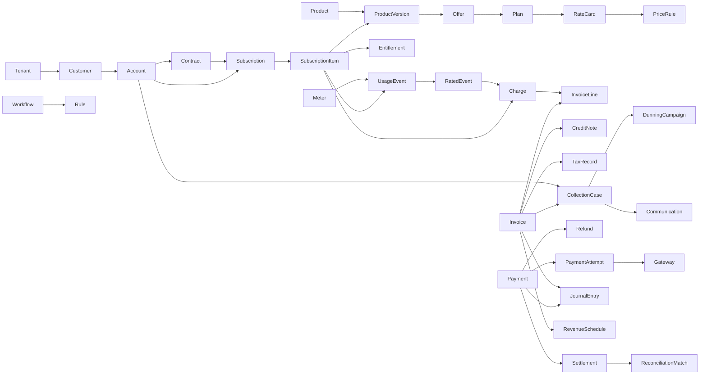

# SUB-0004 — Domain Model

**Document ID:** SUB-0004
**Title:** Domain Model
**Version:** 0.1 (Draft)
**Status:** Draft
**Owner:** Principal Software Architect
**Reviewers:** Data Architect, Billing Architect, Payments Architect, Revenue Accounting SME
**Created Date:** 2026-09-23
**Last Updated:** 2026-09-23
**Dependencies:** [SUB-0001](SUB-0001_Product_Requirements_Document.md), [SUB-0003](SUB-0003_MVP_Scope_Release_Strategy.md)
**Related Documents:** [SUB-0005 State Machine Specification](SUB-0005_State_Machine_Specification.md), [SUB-0006 Revenue Lifecycle Graph Specification](SUB-0006_Revenue_Lifecycle_Graph_Specification.md), SUB-0012 Data Architecture & ERD (planned), [SUB-GLOSSARY](SUB-GLOSSARY.md)

## 1. Modeling principles

1. A commercial promise, a consumption fact, a calculated charge, a legal invoice, a movement of money, and an accounting entry are distinct facts with distinct lifecycles — they are never collapsed into one status field.
2. Every aggregate carries a platform-generated primary key, a tenant key, a business key where humans need one, a version for optimistic concurrency, and standard audit fields.
3. Activated commercial configuration and posted financial facts are immutable; corrections create a new version, adjustment, or reversal (PRIN-05, SUB-0000).
4. Cross-context references use stable identifiers and published contracts, never shared mutable objects.
5. Provider-specific state is translated at an adapter boundary; it never becomes canonical domain state.
6. Money uses currency-aware, fixed-precision value objects; time periods have explicit inclusive/exclusive boundaries.
7. The Revenue Lifecycle Graph (SUB-0006) is derived from these authoritative entities and their events; it is never a second source of financial truth.

## 2. Bounded contexts

| Context | Responsibility | Representative entities |
|---|---|---|
| Identity & Tenant | Tenant lifecycle, users, roles, permissions | Tenant, User, Role |
| Customer | Parties and billing accounts | Customer, Account, Contact |
| Catalog | Product hierarchy and commercial packaging | Product, ProductVersion, Offer, Plan |
| Pricing | Rate cards, rules, calculation | RateCard, PriceRule |
| Contracting | Negotiated terms (R2) | Contract, ContractAmendment |
| Subscription | Lifecycle and entitlements | Subscription, SubscriptionItem, Entitlement |
| Metering & Rating | Usage capture and deterministic pricing | Meter, UsageEvent, RatedEvent, Charge |
| Billing | Invoice assembly and correction | Invoice, InvoiceLine, CreditNote |
| Payments | Provider-neutral payment execution | Payment, PaymentAttempt, PaymentMethod, Gateway, Refund |
| Collections | Risk, dunning, case management | CollectionCase, DunningCampaign, Communication |
| Tax evidence | Jurisdictional tax facts | TaxRecord |
| Revenue & Accounting | Recognition and ledger | RevenueSchedule, JournalEntry, Settlement, ReconciliationMatch |
| Workflow & Rules | Automation | Workflow, Rule |
| Audit & Governance | Evidence | AuditEvent |

## 3. Aggregate roots

`Tenant`, `Customer`, `Account`, `Product`, `Offer`, `Plan`, `RateCard`, `Contract`, `Subscription`, `Meter`, `UsageEvent`, `RatingRun` (internal to Charge production), `Invoice`, `CreditNote`, `Payment`, `Refund`, `CollectionCase`, `DunningCampaign`, `RevenueSchedule`, `JournalEntry`, `Settlement`, `Workflow`, `Rule`, `AuditEvent` are aggregate roots. `ProductVersion`, `SubscriptionItem`, `PriceRule`, `InvoiceLine`, `PaymentAttempt`, `RatedEvent`, `Charge`, `Entitlement`, `ContractAmendment`, `TaxRecord`, `ReconciliationMatch`, `Communication` are children/members of the roots above and never independently addressable across a tenant boundary.

## 4. Domain relationship diagram

Arrows indicate "is authoritatively related to," not necessarily physical foreign-key direction (finalized in SUB-0012).

## 5. Entity catalog

Each entity lists: **Purpose · PK · Tenant key · Business key · Attributes · Relationships · Invariants · Lifecycle · Ownership · Mutability · Audit fields.**

### 5.1 Identity & Tenant

**Tenant**
- Purpose: security/configuration/data-isolation boundary for one merchant organization.
- PK: `tenant_id`. Tenant key: is the tenant (self-scoping). Business key: `tenant_slug` (globally unique).
- Attributes: name, locale, default timezone, default currency, retention policy, data-residency region (reserved).
- Relationships: owns all tenant-scoped aggregates.
- Invariants: `tenant_slug` globally unique; every owned record carries `tenant_id`.
- Lifecycle: `PROVISIONING → ACTIVE → SUSPENDED → CLOSED` (SUB-0005).
- Ownership: Identity & Tenant context.
- Mutability: settings mutable with audit; closure is not deletion.
- Audit fields: `created_at`, `created_by`, `updated_at`, `updated_by`, `row_version`.

**User**
- Purpose: authenticated human or service identity.
- PK: `user_id`. Tenant key: via `UserMembership` (a user may span tenants). Business key: identity-provider subject.
- Attributes: non-secret profile fields; no credential storage (delegated to IdP).
- Relationships: 1..* `UserMembership` → Tenant, Role.
- Invariants: no plaintext credential ever stored.
- Lifecycle: `INVITED → ACTIVE → DISABLED`.
- Ownership: Identity & Tenant.
- Mutability: profile mutable; membership changes audited.
- Audit fields: standard.

**Role**
- Purpose: named permission bundle, tenant-scoped or platform-defined.
- PK: `role_id`. Tenant key: `tenant_id` (nullable for platform-defined roles). Business key: `role_code`.
- Attributes: permission bindings, optional ABAC policy reference.
- Relationships: bound to `UserMembership`.
- Invariants: a role's permission set is versioned; a change is audited.
- Lifecycle: `DRAFT → ACTIVE → RETIRED`.
- Ownership: Identity & Tenant.
- Mutability: mutable while draft; active roles change via new version.
- Audit fields: standard.

### 5.2 Customer

**Customer**
- Purpose: party receiving or buying value.
- PK: `customer_id`. Tenant key: `tenant_id`. Business key: `customer_number` (tenant-scoped).
- Attributes: display name, party type, external references, segment.
- Relationships: 1..* `Account`.
- Invariants: financially referenced customers are not hard-deleted (pseudonymization only, per SUB-0014 privacy controls).
- Lifecycle: `PROSPECT → ACTIVE → SUSPENDED → CLOSED`.
- Ownership: Customer context.
- Mutability: profile mutable; financial history immutable regardless of profile changes.
- Audit fields: standard.

**Account**
- Purpose: commercial/receivables boundary owning subscriptions, invoices, balance, terms.
- PK: `account_id`. Tenant key: `tenant_id`. Business key: `account_number`.
- Attributes: currency, legal-entity reference (reserved), payment terms, invoice-grouping policy.
- Relationships: Customer 1; Subscription, Invoice, CollectionCase 0..*.
- Invariants: an invoice/subscription belongs to exactly one account; currency change cannot rewrite existing documents.
- Lifecycle: `ACTIVE → ON_HOLD → CLOSED`.
- Ownership: Customer context.
- Mutability: mutable configuration; financial references survive closure.
- Audit fields: standard.

**Contact**
- Purpose: named person/role reachable for a customer/account.
- PK: `contact_id`. Tenant key: `tenant_id`. Business key: optional external reference.
- Attributes: purpose (billing/technical/legal), email/phone, consent evidence reference.
- Relationships: belongs to Customer or Account.
- Invariants: consent/suppression state honored before any communication (SUB-0009 Collections, SUB-0014 privacy).
- Lifecycle: `ACTIVE → SUPPRESSED → INACTIVE`.
- Ownership: Customer context.
- Mutability: mutable with audit.
- Audit fields: standard.

### 5.3 Catalog

**Product**
- Purpose: stable identity for something offered; mutable definition lives only in ProductVersion.
- PK: `product_id`. Tenant key: `tenant_id`. Business key: `product_code`.
- Attributes: family/portfolio reference, product type.
- Relationships: 1..* `ProductVersion`.
- Invariants: identity never changes; all mutable attributes live in versions.
- Lifecycle: `DRAFT → ACTIVE → RETIRED`.
- Ownership: Catalog context.
- Mutability: identity immutable; versions carry change.
- Audit fields: standard.

**ProductVersion**
- Purpose: immutable, effective-dated definition of a product at a point in time.
- PK: `product_version_id`. Tenant key: `tenant_id`. Business key: `product_id` + version.
- Attributes: effective range, attributes, tax/accounting classification.
- Relationships: Product 1; Offer 0..*.
- Invariants: immutable once published; active effective ranges for the same selection key never overlap.
- Lifecycle: `DRAFT → IN_REVIEW → ACTIVE → RETIRED`.
- Ownership: Catalog context.
- Mutability: mutable only in `DRAFT`; publication freezes it.
- Audit fields: standard + publication approval reference.

**Offer** / **Plan**
- Purpose: market/channel/segment-specific sellable packaging (Offer) and recurring commercial configuration chosen by a subscriber (Plan).
- PK: `offer_id` / `plan_id`. Tenant key: `tenant_id`. Business key: `offer_code`/`plan_code` + version.
- Attributes: market, segment, channel, currency, cadence, trial/renewal policy.
- Relationships: ProductVersion 1..*; Plan → RateCard 1..*.
- Invariants: published dependencies resolve only to published compatible versions.
- Lifecycle: `DRAFT → IN_REVIEW → ACTIVE → RETIRED`.
- Ownership: Catalog context.
- Mutability: immutable once active; new version supersedes.
- Audit fields: standard.

### 5.4 Pricing

**RateCard**
- Purpose: effective-dated set of price rules for a plan.
- PK: `rate_card_id`. Tenant key: `tenant_id`. Business key: plan + version.
- Attributes: currency, effective range, precedence, content checksum.
- Relationships: Plan 1; PriceRule 1..*.
- Invariants: activation is atomic and immutable; maker-checker approval required above policy threshold (SUB-0007).
- Lifecycle: `DRAFT → VALIDATED → SIMULATED → PENDING_APPROVAL → ACTIVE → RETIRED`.
- Ownership: Pricing context.
- Mutability: mutable only pre-activation.
- Audit fields: standard + approval evidence.

**PriceRule**
- Purpose: one charge-producing rule (tier, discount, allowance, cap) within a rate card.
- PK: `price_rule_id`. Tenant key: `tenant_id`. Business key: RateCard + sequence/version.
- Attributes: condition, operation, tier/matrix reference, trace label.
- Relationships: RateCard 1.
- Invariants: tier bounds are complete, ordered, non-overlapping; no arbitrary code execution (SUB-0007 typed AST).
- Lifecycle: retired with parent RateCard.
- Ownership: Pricing context.
- Mutability: immutable once parent RateCard is active.
- Audit fields: standard.

### 5.5 Contracting (Release 2)

**Contract** / **ContractAmendment**
- Purpose: formal negotiated agreement (Contract) and its non-destructive changes (ContractAmendment).
- PK: `contract_id` / `amendment_id`. Tenant key: `tenant_id`. Business key: `contract_number` / `amendment_number`.
- Attributes: parties, term, minimum commitment, payment terms, negotiated pricing reference, notice period.
- Relationships: Account 1; Subscription 0..*; ContractAmendment 0..*.
- Invariants: amendments never destroy original contract history.
- Lifecycle: `DRAFT → IN_REVIEW → ACTIVE → EXPIRED → TERMINATED` (Contract); `DRAFT → APPROVED → EFFECTIVE → SUPERSEDED → WITHDRAWN` (Amendment).
- Ownership: Contracting context (R2).
- Mutability: immutable once active except via Amendment.
- Audit fields: standard + approval evidence.

### 5.6 Subscription

**Subscription**
- Purpose: effective-dated agreement to receive an offer/plan under captured terms.
- PK: `subscription_id`. Tenant key: `tenant_id`. Business key: `subscription_number`.
- Attributes: account reference, plan snapshot, dates, billing anchor, state, version.
- Relationships: Account 1; Contract 0..1 (R2); SubscriptionItem 1..*.
- Invariants: full state machine in SUB-0005; commercial snapshot preserved regardless of later catalog changes.
- Lifecycle: SUB-0005 §"Subscription."
- Ownership: Subscription context.
- Mutability: state changes via commands with idempotency and optimistic concurrency; history never erased.
- Audit fields: standard + change history.

**SubscriptionItem**
- Purpose: one subscribed product/component with quantity and service dates.
- PK: `subscription_item_id`. Tenant key: `tenant_id`. Business key: Subscription + item number.
- Attributes: product version reference, price rule snapshot, quantity, service period.
- Relationships: Subscription 1; ProductVersion 1; Charge 0..*; Entitlement 0..*.
- Invariants: an item cannot be active outside its subscription's service interval; price is pinned by snapshot.
- Lifecycle: `PENDING → ACTIVE → PAUSED → ENDED`.
- Ownership: Subscription context.
- Mutability: a change closes the prior interval and opens a successor; never edits in place.
- Audit fields: standard.

**Entitlement**
- Purpose: what a subscriber may access, distinct from billing.
- PK: `entitlement_id`. Tenant key: `tenant_id`. Business key: `entitlement_key`.
- Attributes: feature/resource, quantity, validity period.
- Relationships: SubscriptionItem 1.
- Invariants: entitlement state changes independently of billing state, though typically driven by it.
- Lifecycle: `PENDING → ACTIVE → SUSPENDED → EXPIRED → REVOKED`.
- Ownership: Subscription context (R2 for enforcement APIs).
- Mutability: mutable with audit.
- Audit fields: standard.

### 5.7 Metering & Rating

**Meter**
- Purpose: definition of a measurable unit, dimensions, aggregation, correction policy.
- PK: `meter_id`. Tenant key: `tenant_id`. Business key: `meter_code` + version.
- Attributes: unit, dimension schema, aggregation function, late/correction policy.
- Relationships: UsageEvent 0..*; PriceRule 0..*.
- Invariants: unit and scale are fixed per version.
- Lifecycle: `DRAFT → ACTIVE → RETIRED`.
- Ownership: Metering & Rating context.
- Mutability: immutable once active; new version for changes.
- Audit fields: standard.

**UsageEvent**
- Purpose: immutable statement that a measurable event occurred.
- PK: `usage_event_id`. Tenant key: `tenant_id`. Business key: `(tenant_id, source, source_event_id)` unique.
- Attributes: event time, received time, quantity, dimensions, subscription item reference, schema version, disposition.
- Relationships: Meter 1; SubscriptionItem 1; RatedEvent 0..1.
- Invariants: event time never changes; corrections reference the original, never overwrite it (INV — never lose accepted usage).
- Lifecycle: `RECEIVED → ACCEPTED | REJECTED | QUARANTINED`, then `UNRATED → RATED` for accepted events.
- Ownership: Metering & Rating context.
- Mutability: immutable after acceptance.
- Audit fields: standard (append-only, no update fields).

**RatedEvent**
- Purpose: deterministic pricing result for one usage event or aggregate.
- PK: `rated_event_id`. Tenant key: `tenant_id`. Business key: deterministic input + purpose + version key.
- Attributes: amount, rate rule/version, calculation trace reference.
- Relationships: UsageEvent 1; Charge 1.
- Invariants: identical canonical input and engine version produce identical output (SUB-0007).
- Lifecycle: `RATED → ADJUSTED → REVERSED`.
- Ownership: Metering & Rating context.
- Mutability: immutable; corrections create linked adjustment/reversal.
- Audit fields: standard.

**Charge**
- Purpose: billable economic fact from subscription, usage, or adjustment logic.
- PK: `charge_id`. Tenant key: `tenant_id`. Business key: `charge_number`.
- Attributes: source type/id, service period, amount/currency, tax/accounting classification, trace reference.
- Relationships: SubscriptionItem 1; RatedEvent 0..1; InvoiceLine 0..1.
- Invariants: one active billing inclusion per charge unless explicit split-allocation.
- Lifecycle: `PENDING → BILLABLE → BILLED → ADJUSTED → REVERSED`.
- Ownership: Metering & Rating context.
- Mutability: immutable once billed.
- Audit fields: standard.

### 5.8 Billing

**Invoice**
- Purpose: legal demand for payment.
- PK: `invoice_id`. Tenant key: `tenant_id`. Business key: `invoice_number` (assigned only at posting).
- Attributes: account, dates, terms, currency, totals, document/receivable/delivery state (SUB-0005).
- Relationships: Account 1; InvoiceLine 1..*; CreditNote 0..*; JournalEntry 0..*; RevenueSchedule 0..* (R2).
- Invariants: full state machine in SUB-0005; posted lines/totals are immutable.
- Lifecycle: SUB-0005 §"Invoice."
- Ownership: Billing context.
- Mutability: draft mutable; posted immutable.
- Audit fields: standard + finalization evidence.

**InvoiceLine**
- Purpose: one billed amount on an invoice.
- PK: `invoice_line_id`. Tenant key: `tenant_id`. Business key: Invoice + line number.
- Attributes: charge reference, service period, quantity, rate, discount, tax, amount, trace reference.
- Relationships: Invoice 1; Charge 0..1.
- Invariants: immutable once the parent invoice posts.
- Lifecycle: draft → posted (via parent).
- Ownership: Billing context.
- Mutability: immutable post-posting; corrected only via CreditNote.
- Audit fields: standard.

**CreditNote**
- Purpose: corrective document for a posted invoice.
- PK: `credit_note_id`. Tenant key: `tenant_id`. Business key: `credit_note_number`.
- Attributes: original invoice reference, reason, totals, effective date.
- Relationships: Invoice 1; CreditNoteLine 1..*.
- Invariants: cannot exceed eligible uncredited amount without explicit account-credit policy.
- Lifecycle: `DRAFT → ISSUED → APPLIED → VOIDED` (SUB-0005).
- Ownership: Billing context.
- Mutability: immutable once issued.
- Audit fields: standard + reason code (mandatory).

### 5.9 Payments

**Payment**
- Purpose: logical intent/movement to satisfy receivables, provider-neutral.
- PK: `payment_id`. Tenant key: `tenant_id`. Business key: `payment_number`.
- Attributes: account, intended amount/currency, method reference, purpose (invoice set).
- Relationships: Account 1; PaymentAttempt 1..*; Refund 0..*; JournalEntry 0..*.
- Invariants: one logical payment has one intended amount/currency; full state machine in SUB-0005.
- Lifecycle: SUB-0005 §"Payment."
- Ownership: Payments context.
- Mutability: state transitions only; no field-level edit of a settled payment.
- Audit fields: standard.

**PaymentAttempt**
- Purpose: one interaction with one provider/rail for a payment.
- PK: `attempt_id`. Tenant key: `tenant_id`. Business key: Payment + attempt number.
- Attributes: gateway reference, idempotency reference, provider reference, amount, canonical reason.
- Relationships: Payment 1; Gateway 1.
- Invariants: unique provider idempotency reference per gateway account; state machine in SUB-0005.
- Lifecycle: SUB-0005 §"Payment Attempt."
- Ownership: Payments context.
- Mutability: append-only transition history.
- Audit fields: standard.

**PaymentMethod**
- Purpose: tokenized reference to a subscriber's payment instrument.
- PK: `payment_method_id`. Tenant key: `tenant_id`. Business key: provider token mapping.
- Attributes: account reference, provider, type, safe display fields, mandate/expiry, fingerprint hash.
- Relationships: Account 1; Payment 0..*.
- Invariants: no raw PAN/CVV/bank credential ever stored (SUB-0014).
- Lifecycle: `PENDING → ACTIVE → EXPIRING | FAILED → REVOKED`.
- Ownership: Payments context.
- Mutability: mutable state transitions; revocation is not deletion.
- Audit fields: standard.

**Gateway**
- Purpose: configured provider/merchant-account routing target.
- PK: `gateway_id`. Tenant key: `tenant_id`. Business key: `gateway_code`.
- Attributes: connector reference, merchant account reference, supported currencies/methods.
- Relationships: PaymentAttempt 0..*.
- Invariants: credentials referenced via secrets manager, never stored directly.
- Lifecycle: `ACTIVE → DEGRADED → DISABLED`.
- Ownership: Payments context.
- Mutability: configuration mutable with audit.
- Audit fields: standard.

**Refund**
- Purpose: governed return of settled funds.
- PK: `refund_id`. Tenant key: `tenant_id`. Business key: `refund_number`.
- Attributes: payment/allocation reference, amount, reason, provider attempts.
- Relationships: Payment 1.
- Invariants: cumulative refunds cannot exceed refundable succeeded amount; full state machine in SUB-0005.
- Lifecycle: SUB-0005 §"Refund."
- Ownership: Payments context.
- Mutability: append-only transition history.
- Audit fields: standard + reason code (mandatory) + approval evidence above threshold.

### 5.10 Collections

**CollectionCase**
- Purpose: managed work to prevent or resolve delinquency.
- PK: `collection_case_id`. Tenant key: `tenant_id`. Business key: `case_number`.
- Attributes: account, invoice set, risk assessment reference, stage, next action.
- Relationships: Account 1; Invoice 1..*; DunningCampaign 0..1; Communication 0..*.
- Invariants: full state machine in SUB-0005; actions satisfy contact policy, consent, quiet hours.
- Lifecycle: SUB-0005 §"Collection Case."
- Ownership: Collections context.
- Mutability: mutable with audit; resolved cases reactivate only on new eligible balance.
- Audit fields: standard.

**DunningCampaign**
- Purpose: configurable retry/contact schedule and stop rules.
- PK: `campaign_id`. Tenant key: `tenant_id`. Business key: `campaign_code` + version.
- Attributes: eligibility, retry/contact schedule, stop rules.
- Relationships: CollectionCase 0..*.
- Invariants: policy simulation required before activation (SUB-0009).
- Lifecycle: `DRAFT → ACTIVE → PAUSED → RETIRED`.
- Ownership: Collections context.
- Mutability: immutable once active; new version for changes.
- Audit fields: standard.

**Communication**
- Purpose: one delivery request/outcome for a template-driven message.
- PK: `communication_id`. Tenant key: `tenant_id`. Business key: `communication_number`.
- Attributes: case/account reference, channel, template/version, recipient reference, legal basis.
- Relationships: CollectionCase or Account 1.
- Invariants: consent/suppression evaluated before send; no provider secret stored.
- Lifecycle: `QUEUED → SENT → DELIVERED | FAILED | SUPPRESSED`.
- Ownership: Collections context.
- Mutability: append-only status history.
- Audit fields: standard.

### 5.11 Tax evidence

**TaxRecord**
- Purpose: reproducible evidence of a tax determination applied to a document/line.
- PK: `tax_record_id`. Tenant key: `tenant_id`. Business key: provider reference.
- Attributes: jurisdiction, category, inputs hash, rate/amount, provider/version, timestamp.
- Relationships: Invoice or InvoiceLine 1.
- Invariants: a posted result remains reproducible from stored inputs.
- Lifecycle: `QUOTED → COMMITTED → VOIDED | FAILED`.
- Ownership: Billing context (evidence); Integration context (provider call).
- Mutability: immutable once committed.
- Audit fields: standard.

### 5.12 Revenue & Accounting

**RevenueSchedule** (Enterprise)
- Purpose: recognition schedule for a performance obligation.
- PK: `revenue_schedule_id`. Tenant key: `tenant_id`. Business key: source obligation + version.
- Attributes: performance obligation reference, allocation, recognition pattern.
- Relationships: Invoice/Subscription 1.
- Invariants: immutable auditability; contract modifications create linked adjustment.
- Lifecycle: `DRAFT → ACTIVE → COMPLETE → ADJUSTED`.
- Ownership: Revenue & Accounting context.
- Mutability: immutable once active except via linked adjustment.
- Audit fields: standard.

**JournalEntry**
- Purpose: one balanced accounting posting line from a business event.
- PK: `journal_entry_id`. Tenant key: `tenant_id`. Business key: transaction + line number.
- Attributes: ledger account, debit/credit amount, source document reference, posting date.
- Relationships: Invoice, Payment, or Refund 1.
- Invariants: debits equal credits per currency per transaction; immutable after posting.
- Lifecycle: `POSTED` (immutable); corrections via reversing entry.
- Ownership: Revenue & Accounting context.
- Mutability: none after posting.
- Audit fields: standard (append-only).

**Settlement**
- Purpose: proof of provider/bank payout, distinct from customer payment success.
- PK: `settlement_id`. Tenant key: `tenant_id`. Business key: gateway/provider settlement ID.
- Attributes: period, gross, fees, net, currency, payout reference.
- Relationships: Payment 0..*.
- Invariants: settlement truth is separate from and never overrides canonical payment state.
- Lifecycle: `EXPECTED → RECEIVED → RECONCILED → EXCEPTION`.
- Ownership: Revenue & Accounting context.
- Mutability: append-only.
- Audit fields: standard.

**ReconciliationMatch**
- Purpose: evidence linking a payment/settlement/journal set as matched.
- PK: `match_id`. Tenant key: `tenant_id`. Business key: `match_number`.
- Attributes: source/target typed references, amount/date confidence, rule applied.
- Relationships: Settlement, Payment, JournalEntry.
- Invariants: a match is proposed before confirmed; rejected matches retain evidence.
- Lifecycle: `PROPOSED → MATCHED → REJECTED → REVERSED`.
- Ownership: Revenue & Accounting context.
- Mutability: append-only.
- Audit fields: standard.

### 5.13 Workflow & Rules

**Workflow**
- Purpose: event-triggered visual automation definition.
- PK: `workflow_id`. Tenant key: `tenant_id`. Business key: `workflow_code` + version.
- Attributes: trigger, steps, timeouts, policies.
- Relationships: Rule 0..*.
- Invariants: a workflow including a financially material action requires maker-checker on publish.
- Lifecycle: `DRAFT → ACTIVE → PAUSED → RETIRED`.
- Ownership: Workflow & Rules context.
- Mutability: immutable once active; new version for changes.
- Audit fields: standard.

**Rule**
- Purpose: reusable condition/decision expression used by pricing, workflow, or collections policy.
- PK: `rule_id`. Tenant key: `tenant_id`. Business key: `rule_code` + version.
- Attributes: type, expression/decision table, effective period, checksum.
- Relationships: referenced by Workflow, PriceRule, DunningCampaign.
- Invariants: no arbitrary code execution; typed and bounded (SUB-0007 §14 equivalent).
- Lifecycle: `DRAFT → ACTIVE → RETIRED`.
- Ownership: Workflow & Rules context.
- Mutability: immutable once active.
- Audit fields: standard.

### 5.14 Audit & Governance

**AuditEvent**
- Purpose: append-only evidence of a material mutation, human or AI-originated.
- PK: `audit_event_id`. Tenant key: `tenant_id`. Business key: none (immutable event identity).
- Attributes: actor, action, target type/id, reason, correlation/causation ID, before/after safe reference, AI-specific fields where applicable (model, prompt/context reference, policy, approval, outcome — SUB-0016).
- Relationships: references any aggregate.
- Invariants: append-only; no secret or raw credential ever recorded; maker cannot approve own request when separation-of-duties applies.
- Lifecycle: immutable, permanent (subject to legal retention policy).
- Ownership: Audit & Governance context.
- Mutability: none.
- Audit fields: is itself the audit record.

## 6. Cross-context consistency rules

- **Single transaction:** aggregate change, idempotency outcome, audit record, and outbox event commit together (SUB-0013).
- **Process manager/saga:** a subscription change spanning billing schedule and notification, or an invoice-to-collection flow spanning payment and receivables, coordinates through published events, never a distributed transaction.
- **No distributed transaction** with external providers, search, analytics, email, warehouse, or ERP.
- **Reconciliation** is explicit for every asynchronous process, with retry policy, dead-letter/quarantine state, and an operator-visible query.

## Decisions Requiring Product Owner Approval

None new; entity scope follows SUB-0003's capability classification directly.
