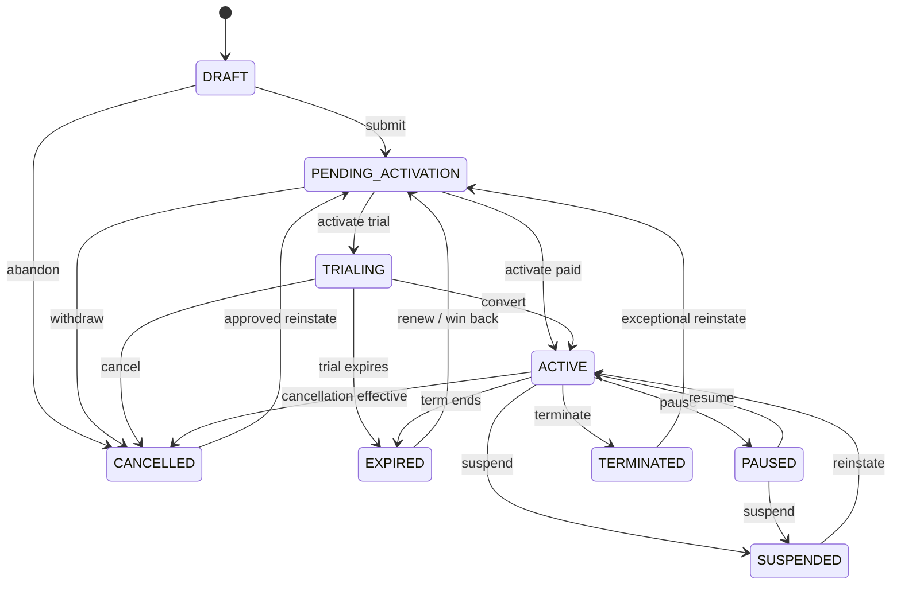
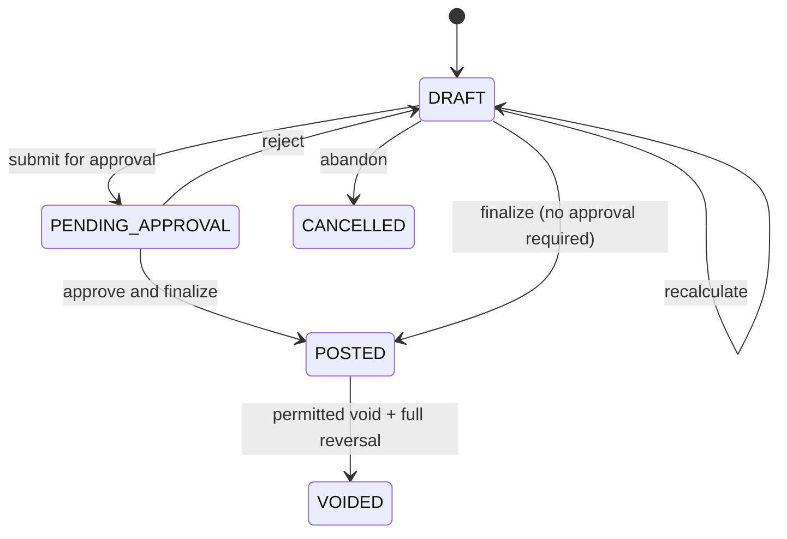
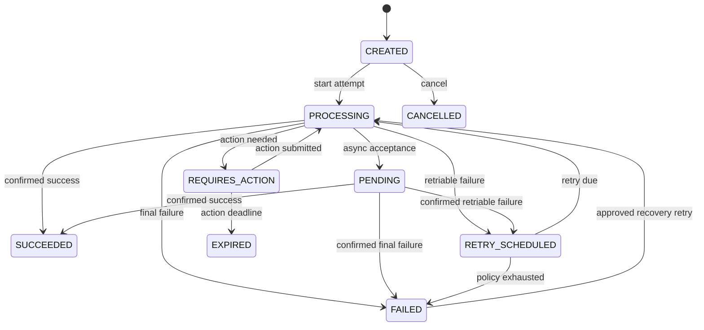
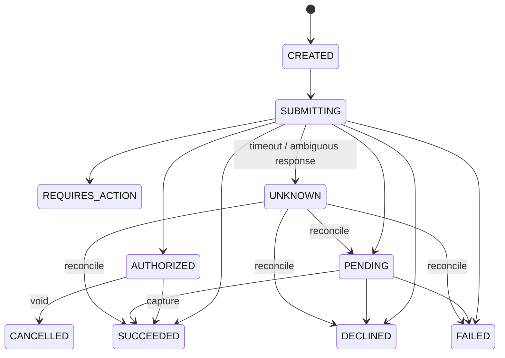
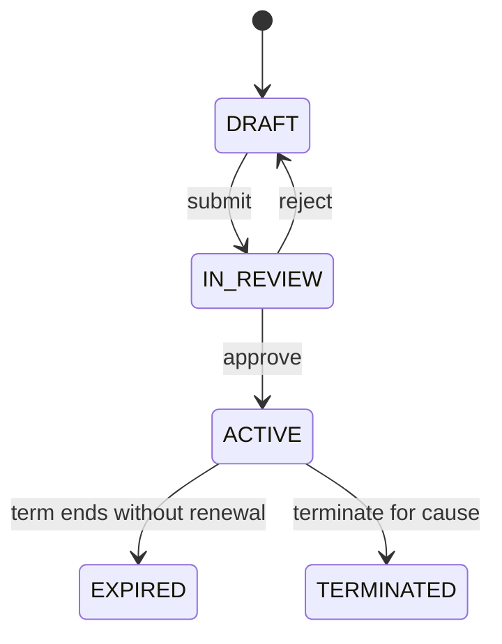
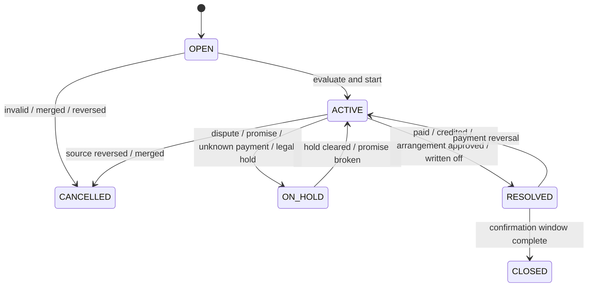
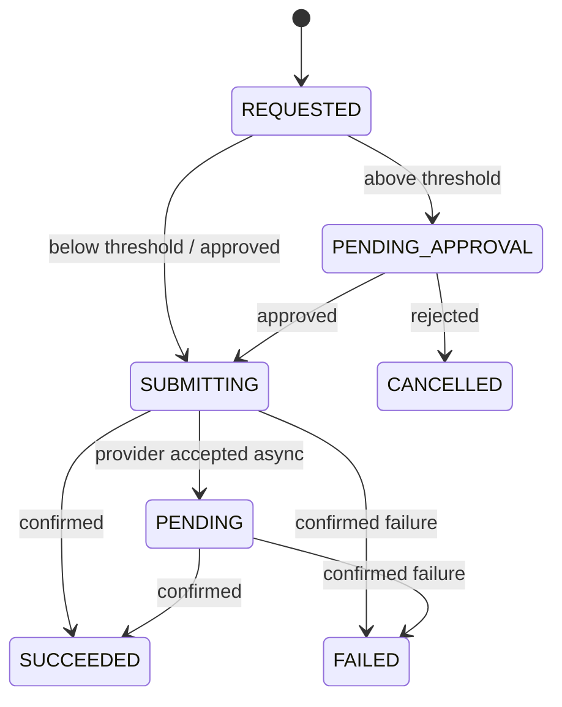
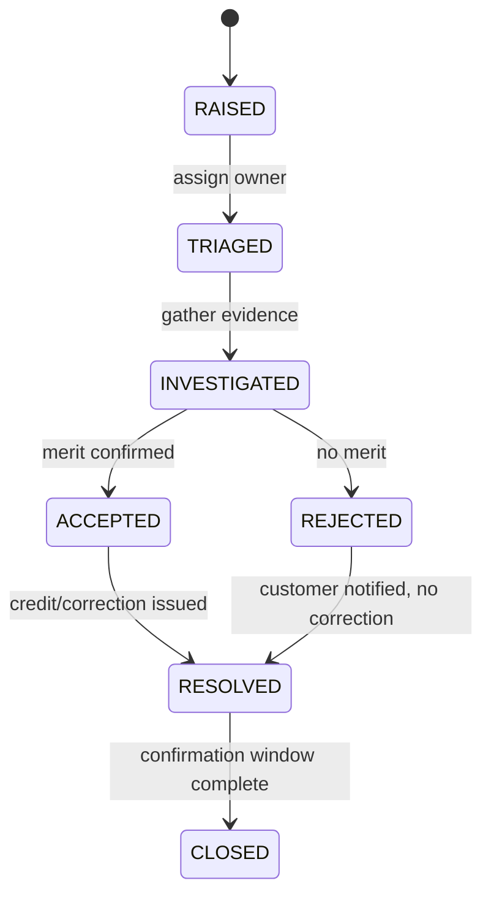
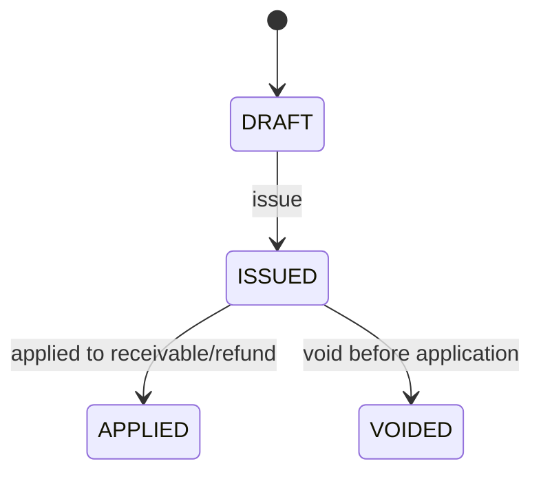
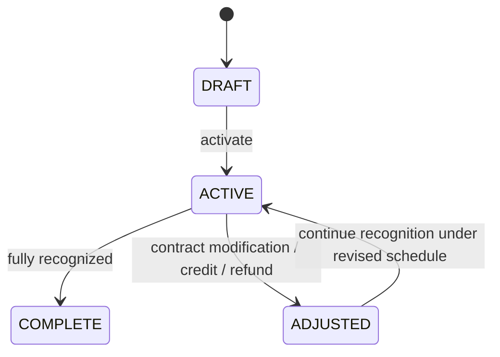

# SUB-0005 — State Machine Specification

**Document ID:** SUB-0005
**Title:** State Machine Specification
**Version:** 0.1 (Draft)
**Status:** Draft
**Owner:** Principal Software Architect
**Reviewers:** Billing Architect, Payments Architect, Revenue Accounting SME, QA/Test Architect
**Created Date:** 2026-09-23
**Last Updated:** 2026-09-23
**Dependencies:** [SUB-0004 Domain Model](SUB-0004_Domain_Model.md)
**Related Documents:** [SUB-0006 Revenue Lifecycle Graph Specification](SUB-0006_Revenue_Lifecycle_Graph_Specification.md), SUB-0007 Pricing & Rating Engine Specification (planned), SUB-0008 Billing & Invoicing Specification (planned), SUB-0009 Payments & Collections Specification (planned), SUB-0010 Accounting & Revenue Specification (planned)

## 1. Conventions

Every state machine in this document states: states, valid transitions, explicitly named invalid transitions, trigger, actor, preconditions, postconditions, side effects, emitted event, audit entry, and compensation/reversal logic where applicable. A transition not listed as valid is invalid by default — invalid transitions are named only where the omission would otherwise be ambiguous to a reader.

All emitted events follow the naming and envelope convention fixed in SUB-0013. All audit entries follow the `AuditEvent` shape fixed in SUB-0004 §5.14.

## 2. Subscription

### 2.1 States

`DRAFT`, `PENDING_ACTIVATION`, `TRIALING`, `ACTIVE`, `PAUSED`, `SUSPENDED`, `CANCELLED`, `TERMINATED`, `EXPIRED`. `CANCELLED`/`TERMINATED`/`EXPIRED` are terminal; reinstatement opens a new service interval via an explicit transition rather than reopening history.

### 2.2 Diagram

### 2.3 Transition table

| Transition | Trigger | Actor | Preconditions | Postconditions | Side effects | Emitted event | Audit | Compensation |
|---|---|---|---|---|---|---|---|---|
| Submit (Draft→Pending Activation) | Command | Billing Admin / API | Valid account, plan, dates, items, currency | Commercial snapshot frozen | First-bill preview computed | `subscription.created.v1` | Full command record | Delete draft (no financial effect exists yet) |
| Activate (Pending Activation→Trialing/Active) | Command or scheduler | Billing Admin / scheduler | Effective time reached; prerequisites satisfied | Service starts; schedules created | Advance charges created if policy allows | `subscription.activated.v1` | Full record | None (idempotent replay only) |
| Pause (Active→Paused) | Command | Billing Admin / Subscriber | Pause policy allows; max duration/frequency respected | Billability per explicit policy | Item intervals adjusted per policy | `subscription.paused.v1` | Full record | Resume reverses service effect, not billing history |
| Suspend (Active/Paused→Suspended) | Command | Billing Admin / Collections | Authorized reason; policy/notice satisfied | Access restricted per policy | Open AR/collection activity unaffected | `subscription.suspended.v1` | Full record + reason code | Reinstate |
| Cancel (→Cancelled) | Command | Subscriber / Billing Admin | Contract/policy/law allow; impact disclosed | Ends at effective time | Final usage/credits/fees resolved | `subscription.cancelled.v1` | Full record + reason code | Approved reinstate opens new interval |
| Terminate (→Terminated) | Command | Finance Controller (elevated) | Exceptional reason; elevated authorization | Immediate/scheduled close | Termination economics applied per policy | `subscription.terminated.v1` | Full record + approval evidence | Exceptional reinstate only |
| Expire (→Expired) | Scheduler | System | Term boundary reached; no renewal | Service interval ends | Final arrears run permitted | `subscription.expired.v1` | Full record | Renew/win-back |

### 2.4 Invalid transitions (illustrative)

`Draft → Active` directly (must pass through Pending Activation); `Cancelled → Active` directly (must re-enter via Pending Activation reinstate); any transition that would leave a subscription without at least one active/future item outside draft/terminal states.

## 3. Invoice

### 3.1 States (document dimension)

`DRAFT`, `PENDING_APPROVAL`, `POSTED`, `VOIDED`, `CANCELLED`. Receivable state (`OPEN`/`PARTIALLY_PAID`/`PAID`/`DISPUTED`/`WRITTEN_OFF`/`REVERSED`) and delivery state (`NOT_REQUESTED`/`QUEUED`/`SENT`/`DELIVERED`/`FAILED`/`SUPPRESSED`) are separate dimensions, never merged into the document state.

### 3.2 Diagram (document dimension)

### 3.3 Transition table

| Transition | Trigger | Actor | Preconditions | Postconditions | Side effects | Emitted event | Audit | Compensation |
|---|---|---|---|---|---|---|---|---|
| Finalize (Draft/Pending Approval→Posted) | Command | Billing Admin (idempotent) | Approval satisfied; blockers cleared (tax quote, addresses) | Number allocated; lines/totals frozen | Receivable + balanced journal created atomically | `invoice.finalized.v1` | Full record + idempotency reference | None — corrections use CreditNote, never a state reversal |
| Void (Posted→Voided) | Command | Finance Controller | Jurisdiction/policy allow; allocations resolved first | Document has no continuing effect | Full reversal posting | `invoice.voided.v1` | Full record + reason code | Compensating reversal is the void itself |
| Receivable: partial/full allocation | Payment/credit success | System | Allocation within available/open amount | Receivable state updates | None to document lines | `invoice.partially_paid.v1` / `invoice.paid.v1` | Allocation record | Allocation reversal reopens receivable |
| Receivable: dispute accepted | Command | Support/Finance | Eligible amount/reason | Disputed amount held | Collection hold on disputed scope | `invoice.disputed.v1` | Full record + reason | Dispute resolution updates state |

### 3.4 Invalid transitions

Editing a `POSTED` line through any interface; `Voided → Posted` (void is terminal); skipping `PENDING_APPROVAL` when policy requires it.

## 4. Payment

### 4.1 States

`CREATED`, `PROCESSING`, `REQUIRES_ACTION`, `PENDING`, `RETRY_SCHEDULED`, `SUCCEEDED`, `FAILED`, `CANCELLED`, `EXPIRED`.

### 4.2 Diagram

### 4.3 Transition table

| Transition | Trigger | Actor | Preconditions | Postconditions | Side effects | Emitted event | Audit | Compensation |
|---|---|---|---|---|---|---|---|---|
| Start attempt (Created→Processing) | Command | System/scheduler | Valid amount/method/policy | Attempt created before external I/O | Provider call issued outside DB transaction | `payment.attempted.v1` | Full record | Ambiguous outcome → Unknown attempt state (§5) |
| Confirm success (→Succeeded) | Provider callback/poll | System | Authenticated evidence; amount/currency match | Canonical success recorded | Allocation triggered idempotently | `payment.succeeded.v1` | Full record + evidence reference | Chargeback creates a distinct reversal fact, never edits this record |
| Retry (Retry Scheduled→Processing) | Scheduler | System | Canonical reason permits retry; policy/consent/mandate checked | New attempt created | — | `payment.retry_scheduled.v1` then `payment.attempted.v1` | Full record | — |
| Final failure (→Failed) | Provider/policy | System | Non-retriable reason or exhausted policy | Payment exhausted | Collections notified | `payment.failed.v1` | Full record + canonical reason | Approved recovery retry (exceptional) |

### 4.4 Invalid transitions

Any transition into `Succeeded` without authenticated provider evidence; launching a new attempt while a prior attempt is `UNKNOWN` (must reconcile first, §5).

## 5. Payment Attempt

### 5.1 States

`CREATED`, `SUBMITTING`, `REQUIRES_ACTION`, `PENDING`, `AUTHORIZED`, `SUCCEEDED`, `DECLINED`, `FAILED`, `CANCELLED`, `UNKNOWN`, `EXPIRED`.

### 5.2 Diagram

### 5.3 Transition table

| Transition | Trigger | Actor | Preconditions | Postconditions | Side effects | Emitted event | Audit | Compensation |
|---|---|---|---|---|---|---|---|---|
| Submit (Created→Submitting) | Command | System | Idempotency reference allocated | Persisted before external call | Provider request issued | `payment.attempted.v1` | Full record | — |
| Ambiguous outcome (Submitting→Unknown) | Timeout/transport failure | System | No reliable outcome known | Attempt marked Unknown | Reconciliation job scheduled | `payment.reconciliation_required.v1` | Full record | Reconcile using same provider idempotency reference |
| Reconcile (Unknown→terminal state) | Reconciliation job | System | Provider query returns definitive result | Attempt resolves to actual outcome | Downstream payment/allocation updated accordingly | Matching terminal event | Full record + reconciliation evidence | — |

### 5.4 Invalid transitions

A second attempt launched under a new idempotency reference while an existing attempt is `UNKNOWN` for the same payment.

## 6. Contract (Release 2)

### 6.1 States

`DRAFT`, `IN_REVIEW`, `ACTIVE`, `EXPIRED`, `TERMINATED`.

### 6.2 Diagram

### 6.3 Transition table

| Transition | Trigger | Actor | Preconditions | Postconditions | Side effects | Emitted event | Audit | Compensation |
|---|---|---|---|---|---|---|---|---|
| Approve (In Review→Active) | Command | Finance Controller / Legal | Terms validated; approval policy satisfied | Contract governs linked subscriptions | Subscription creation permitted against contract | `contract.activated.v1` | Full record + approval evidence | — |
| Amend | Command | Sales / Finance Controller | ContractAmendment approved | New effective terms apply prospectively | Original contract history preserved | `contract.amended.v1` | Full record | — |
| Terminate | Command | Finance Controller (elevated) | Cause documented; approval satisfied | Linked subscriptions evaluated per termination policy | Termination economics applied | `contract.terminated.v1` | Full record + approval evidence | None — terminal |

## 7. Collection Case

### 7.1 States

`OPEN`, `ACTIVE`, `ON_HOLD`, `RESOLVED`, `CLOSED`, `CANCELLED`.

### 7.2 Diagram

### 7.3 Transition table

| Transition | Trigger | Actor | Preconditions | Postconditions | Side effects | Emitted event | Audit | Compensation |
|---|---|---|---|---|---|---|---|---|
| Start (Open→Active) | Trigger evaluation | System | Collectible/preventive eligibility | Stage/action calculated | Next Best Action recommended | `collection.case_activated.v1` | Full record | — |
| Place hold (Active→On Hold) | Command/system | System/Collections Analyst | Allowed hold reason and scope | Actions suppressed for scope | Scheduled actions cancelled/suspended | `collection.case_held.v1` | Full record + reason | Release hold |
| Resolve (→Resolved) | Payment/credit/write-off | System | Resolution condition met | Balance considered resolved | Future actions cancelled | `collection.case_resolved.v1` | Full record | Payment reversal reactivates |
| Close (Resolved→Closed) | Confirmation window elapsed | System | Reconciliation complete | No further action expected | — | `collection.case_closed.v1` | Full record | — |

### 7.4 Invalid transitions

Executing a scheduled action while the case is `ON_HOLD` for the scope that action covers; closing directly from `ACTIVE`/`ON_HOLD` without passing through `RESOLVED`.

## 8. Refund

### 8.1 States

`REQUESTED`, `PENDING_APPROVAL`, `SUBMITTING`, `PENDING`, `SUCCEEDED`, `FAILED`, `CANCELLED`.

### 8.2 Diagram

### 8.3 Transition table

| Transition | Trigger | Actor | Preconditions | Postconditions | Side effects | Emitted event | Audit | Compensation |
|---|---|---|---|---|---|---|---|---|
| Request (→Requested) | Command | Billing Admin / Finance Controller | Refundable amount available; reason provided | Refund created | Approval routing evaluated | `payment.refund_requested.v1` | Full record + reason (mandatory) | Cancel before submission |
| Approve (Pending Approval→Submitting) | Command | Finance Controller | Approval threshold policy satisfied; not self-approved | Provider submission authorized | — | Approval decision recorded | Full record + approval evidence | — |
| Confirm success (→Succeeded) | Provider callback | System | Authenticated evidence | Refund posted | Balanced reversal posting; receivable/credit effect applied | `refund.succeeded.v1` | Full record | — |

### 8.4 Invalid transitions

Cumulative succeeded/pending refunds exceeding the refundable succeeded payment amount; submitting without required approval above threshold.

## 9. Dispute

### 9.1 States

`RAISED`, `TRIAGED`, `INVESTIGATED`, `ACCEPTED`, `REJECTED`, `RESOLVED`, `CLOSED`.

### 9.2 Diagram

### 9.3 Transition table

| Transition | Trigger | Actor | Preconditions | Postconditions | Side effects | Emitted event | Audit | Compensation |
|---|---|---|---|---|---|---|---|---|
| Raise (→Raised) | Subscriber/Support command | Subscriber / Customer Support | Valid target (invoice/charge/usage/tax/payment) and reason | Dispute case created | Affected invoice's disputed amount held (SUB-0008) | `invoice.disputed.v1` (invoice-scoped) or a dedicated `dispute.raised.v1` | Full record | — |
| Accept (Investigated→Accepted) | Command | Billing Admin / Finance Controller | Evidence supports the claim | Correction path authorized | Triggers CreditNote or usage correction | `dispute.accepted.v1` | Full record + evidence reference | — |
| Reject (Investigated→Rejected) | Command | Billing Admin / Finance Controller | Evidence does not support the claim | No correction issued | Collection hold released for the disputed scope | `dispute.rejected.v1` | Full record + reason | Subscriber may escalate (new dispute or manual review) |
| Resolve (→Resolved) | System | — | Correction posted or rejection communicated | Dispute considered resolved | — | `dispute.resolved.v1` (also `invoice.dispute_resolved.v1` for invoice-scoped disputes) | Full record | — |

### 9.4 Invalid transitions

Skipping `INVESTIGATED` before `ACCEPTED`/`REJECTED` for any dispute above a de-minimis auto-resolution threshold defined by tenant policy; closing without a resolution recorded.

## 10. Credit Note

### 10.1 States

`DRAFT`, `ISSUED`, `APPLIED`, `VOIDED`.

### 10.2 Diagram

### 10.3 Transition table

| Transition | Trigger | Actor | Preconditions | Postconditions | Side effects | Emitted event | Audit | Compensation |
|---|---|---|---|---|---|---|---|---|
| Issue (Draft→Issued) | Command | Billing Admin / Finance Controller | Reason, amount, tax limits validated; approval if above threshold | Corrective document posted | Balanced reversal/credit journal entries created | `invoice.credited.v1` | Full record + reason (mandatory) | — |
| Apply (Issued→Applied) | System (allocation) | System | Eligible receivable or refund target exists | Receivable reduced or account credit created | Allocation record created | `payment.allocated.v1` (credit-sourced) | Full record | Allocation reversal |
| Void (Issued→Voided) | Command | Finance Controller | Not yet applied; policy allows | No continuing effect | — | `credit_note.voided.v1` | Full record + reason | — |

## 11. Revenue Schedule (Enterprise)

### 11.1 States

`DRAFT`, `ACTIVE`, `COMPLETE`, `ADJUSTED`.

### 11.2 Diagram

### 11.3 Transition table

| Transition | Trigger | Actor | Preconditions | Postconditions | Side effects | Emitted event | Audit | Compensation |
|---|---|---|---|---|---|---|---|---|
| Activate (Draft→Active) | System (invoice posting / contract activation) | System | Performance obligation and allocation defined | Recognition begins per pattern | Deferred revenue journal entries scheduled | `revenue_schedule.activated.v1` | Full record | — |
| Adjust (Active→Adjusted) | Contract modification, credit, refund | System / Revenue Accountant | Linked source event exists | Revised schedule takes effect prospectively | New/reversed schedule lines; original entries never rewritten | `revenue_schedule.adjusted.v1` | Full record + source event reference | — |
| Complete (Active→Complete) | System | System | All scheduled amounts recognized | No further postings expected | — | `revenue_schedule.completed.v1` | Full record | — |

## 12. Cross-state-machine consistency rules

1. No state machine's transition directly edits another's aggregate; coordination is via published events and explicit command calls (SUB-0004 §6).
2. Every state machine's terminal states are reachable only through an explicit, audited transition — never inferred from the absence of activity.
3. Every compensation/reversal path creates a new linked record; none rewrites a prior record in place (PRIN-05).

## Decisions Requiring Product Owner Approval

| ID | Decision needed | Status |
|---|---|---|
| DEC-011 | De-minimis auto-resolution threshold for Dispute (§9.4) | Open |
| DEC-012 | Refund approval threshold amount(s) by currency (§8) | Open |
