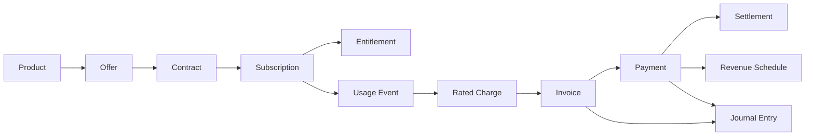
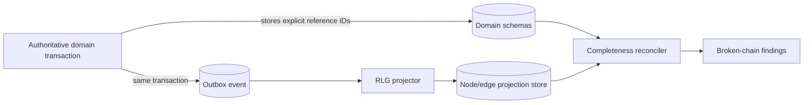

# SUB-0006 — Revenue Lifecycle Graph Specification

**Document ID:** SUB-0006
**Title:** Revenue Lifecycle Graph Specification
**Version:** 0.1 (Draft)
**Status:** Draft
**Owner:** Principal Software Architect
**Reviewers:** Data Architect, Revenue Accounting SME, QA/Test Architect
**Created Date:** 2026-09-23
**Last Updated:** 2026-09-23
**Dependencies:** [SUB-0004 Domain Model](SUB-0004_Domain_Model.md), [SUB-0005 State Machine Specification](SUB-0005_State_Machine_Specification.md)
**Related Documents:** SUB-0012 Data Architecture & ERD (planned), SUB-0013 API & Event Contracts (planned)

## 1. Product intent

The Revenue Lifecycle Graph (RLG) is the platform's primary differentiator (SUB-0000 §6). It answers two classes of question without inventing financial facts:

- **Forward:** what did this product offer, contract, or usage event eventually produce?
- **Backward:** which commercial rule and source event caused this invoice line, payment, settlement, or journal entry?

The graph is a rebuildable, access-controlled projection of authoritative domain records (SUB-0004). It is never a second source of financial truth (PRIN-06, PRIN-13).

## 2. Canonical lifecycle chain



Not every path contains every node — a flat recurring, non-usage subscription has no Usage/Rated Charge node; an unpaid invoice has no Payment node yet; Contract and Entitlement nodes exist only once Release 2 capabilities (SUB-0003) are active for a tenant. Completeness is evaluated against the expected path for the applicable business scenario (§8), never assumed universally required.

## 3. Node types

| Node type | Source aggregate (SUB-0004) | Identity |
|---|---|---|
| Product | Product / ProductVersion | `(tenant_id, product_id, version?)` |
| Offer | Offer / Plan | `(tenant_id, offer_id, version)` |
| Contract | Contract | `(tenant_id, contract_id)` |
| Subscription | Subscription / SubscriptionItem | `(tenant_id, subscription_id)` |
| Entitlement | Entitlement | `(tenant_id, entitlement_id)` |
| Usage Event | UsageEvent | `(tenant_id, usage_event_id)` |
| Rated Charge | RatedEvent / Charge | `(tenant_id, charge_id)` |
| Invoice | Invoice / InvoiceLine | `(tenant_id, invoice_id, line_id?)` |
| Payment | Payment / PaymentAttempt | `(tenant_id, payment_id)` |
| Settlement | Settlement | `(tenant_id, settlement_id)` |
| Revenue Schedule | RevenueSchedule | `(tenant_id, revenue_schedule_id)` |
| Journal Entry | JournalEntry | `(tenant_id, journal_entry_id)` |

Every node additionally carries: `node_type`, `business_key`, `occurred_at`, `effective_at`, `state` (labeled as projected), `amount_minor`/`currency` where applicable, `source_context`, `source_event_id`, `projected_at`, `classification` (SUB-0014 data class).

## 4. Edge types

| Edge type | From → to | Meaning |
|---|---|---|
| `PACKAGED_AS` | Product → Offer | Published catalog relationship |
| `GOVERNED_BY` | Offer/Subscription → Contract | Negotiated terms apply |
| `SELECTED_BY` | Offer → Subscription | Subscription captured the offered version |
| `GRANTS` | Subscription → Entitlement | Access granted by subscribed item |
| `MEASURED_BY` | Subscription → Usage Event | Usage attribution |
| `RATED_AS` | Usage Event → Rated Charge | Deterministic rating result |
| `GENERATES` | Subscription → Rated Charge | Recurring/seat/one-time charge without usage |
| `BILLED_ON` | Rated Charge → Invoice | Charge included on a legal document |
| `ALLOCATED_TO` | Payment → Invoice | Monetary application |
| `SETTLED_BY` | Payment → Settlement | Bank/provider settlement evidence |
| `RECOGNIZED_BY` | Invoice/Payment → Revenue Schedule | Recognition linkage (Enterprise) |
| `POSTED_BY` | Invoice/Payment/Refund → Journal Entry | Balanced accounting effect |
| `CORRECTS` | Correction → original record | Non-destructive correction |
| `REVERSES` | Reversal → original financial record | Full or partial reversal |
| `SUPERSEDES` | New version → prior version | Effective-dated succession |

Every edge stores `tenant_id`, `edge_type`, typed source/target IDs, the authoritative relationship/event ID that produced it, validity timestamps, and projection timestamp.

## 5. Identifiers and cardinality

- Node identity is `(tenant_id, node_type, node_id, version?)`; immutable financial documents (Invoice, JournalEntry) use version/line as part of identity so a correction adds a node rather than mutating one.
- Cardinality: Product 1→N Offer; Offer 1→N Subscription (over time, not concurrently for one subscription); Subscription 1→N Usage Event; Usage Event 0..1→ Rated Charge (an event may be quarantined and never rated); Rated Charge 0..1→ Invoice line (billed once, corrections branch via `CORRECTS`); Invoice 1→N Payment allocation edges; Payment 0..1→ Settlement; Invoice/Payment 0..N→ Journal Entry.

## 6. Navigation and lineage

The Transaction Explorer (SUB-0015) starts at any permitted node and returns an immediate neighborhood plus a summarized valid path in either direction:

- `direction`: `upstream` (toward Product), `downstream` (toward Journal Entry), or `both`.
- Filters: type, depth (bounded, default max 4), time range.
- Each edge renders its meaning and a deep link to the authoritative source screen.
- Freshness and incomplete-path findings (§8) are always shown alongside results — the graph never presents itself as more complete or fresher than it is.

## 7. Query patterns

```text
GET /revenue-graph/nodes/{type}/{id}?direction=both&depth=4
GET /revenue-graph/nodes/{type}/{id}/path?to_type=journal_entry
GET /revenue-graph/findings?type=broken_chain&severity=high
```

Bulk graph export is asynchronous and separately permissioned (SUB-0013 job pattern). Full endpoint definitions belong to SUB-0013.

## 8. Graph construction and update rules



- Delivery is at-least-once; node/edge upserts are idempotent by deterministic identity.
- Ordering is required only per authoritative aggregate/relationship key, not globally.
- A high-water mark exposes the latest consumed position per source context.
- Rebuild writes to a shadow projection and performs an atomic cutover; a projector failure never rolls back a valid financial transaction.

### Expected-path policies (examples)

| Scenario | Expected continuation |
|---|---|
| Recurring, non-usage subscription reaches its billing schedule | Rated Charge → Invoice Line → Posted Invoice |
| Usage-based subscription with accepted usage before cutoff | Rated Charge by rating SLO, then Invoice by billing schedule |
| Posted invoice with active autopay mandate | Payment attempt by due policy; success or explicit failure evidence |
| Successful payment | Journal Entry posting; Settlement evidence later if applicable |

A missing expected node is not automatically leakage — it may be pending, exempt, below threshold, disputed, or not yet due (§9).

## 9. Broken-chain detection

| Finding | Example | Severity basis |
|---|---|---|
| Usage exists but no charge | Accepted billable usage has no rated result after the rating SLO | Age × estimated exposure × customer materiality |
| Charge exists but no invoice | Billable charge unbilled past the expected billing-run cutoff | High by default |
| Invoice exists but no payment attempt | Posted invoice past due date with autopay mandate active and no attempt created | High |
| Payment exists but no settlement | Succeeded payment lacking settlement evidence beyond the provider's normal settlement SLO | Medium–High depending on provider |
| Settlement exists but no reconciliation | Settlement received but not matched to a payment/journal entry beyond SLO | High |

Every finding contains rule/version, affected typed IDs, evidence, first/last detected time, state, owner, and resolution — never an AI-generated diagnosis without underlying evidence (PRIN-06).

## 10. Audit

- Tenant ID is included in every primary/foreign index; cross-tenant traversal returns no existence signal (SUB-0014).
- Authorization filters both nodes and attributes — access to an invoice does not imply access to gateway evidence or AI grounding context.
- Support access to graph data is time-bound and audited (SUB-0014).
- Graph exports are watermarked, encrypted, and retention-controlled.

## 11. Visualization behavior

- The Transaction Explorer (SUB-0015) renders the chain as a horizontal, clickable node sequence with broken links visually flagged (not merely listed in a findings table).
- Each node shows business key, safe amount, timestamp, and state; hovering an edge shows its meaning and authoritative source.
- A stale (beyond freshness SLO) subgraph is visually distinguished, and causal conclusions are suppressed until freshness is restored.

## 12. Upstream/downstream lineage APIs

Defined precisely in SUB-0013; contractually guaranteed behavior here:

1. From a posted Invoice Line, a permitted user reaches its Rated Charge, Usage Event (if any), Subscription, Offer, and Product.
2. From a Usage Event, a permitted user sees disposition, rating result, invoice inclusion, and correction lineage.
3. From a Payment, a permitted user sees allocations, Invoice/Journal Entry, Settlement, and Refunds — without provider-specific semantics leaking into canonical state.
4. Replaying projection events creates no duplicate active nodes or edges.
5. A full rebuild from a frozen dataset produces identical edge counts and control hashes.

## Decisions Requiring Product Owner Approval

None new; this document operationalizes SUB-0000 §6 differentiator #1 without introducing new commercial trade-offs.
