# SUB-0007 — Pricing & Rating Engine Specification

**Document ID:** SUB-0007
**Title:** Pricing & Rating Engine Specification
**Version:** 0.1 (Draft)
**Status:** Draft
**Owner:** Billing and Rating Architect
**Reviewers:** Revenue Accounting SME, Principal Software Architect, Finance Controller, QA/Test Architect
**Created Date:** 2026-09-23
**Last Updated:** 2026-09-23
**Dependencies:** [SUB-0004 Domain Model](SUB-0004_Domain_Model.md), [SUB-0005 State Machine Specification](SUB-0005_State_Machine_Specification.md)
**Related Documents:** SUB-0008 Billing & Invoicing Specification (planned), [SUB-GLOSSARY](SUB-GLOSSARY.md)

## 1. Objectives

The pricing and rating engine converts explicit commercial configuration into explainable, billable charge candidates. It must be deterministic for identical canonical input and engine/configuration versions, fixed-precision and currency-aware, effective-dated and incapable of silently repricing history (PRIN-05, PRIN-14), composable across every model in §3, idempotent and replayable, safe for no-code configuration without arbitrary code execution, and capable of emitting a complete typed calculation trace for every result (PRIN-02, PRIN-06).

Tax calculation, invoice legal state, payment processing, and revenue recognition are separate concerns handled in SUB-0008, SUB-0009, and SUB-0010 respectively.

## 2. Calculation pipeline

```mermaid
flowchart LR
  Input[Canonical pricing input] --> Select[Select effective RateCard/PriceRule snapshot]
  Select --> Validate[Validate types, units, dimensions, eligibility]
  Validate --> Aggregate[Aggregate quantity/window]
  Aggregate --> Allowance[Apply allowance consumption]
  Allowance --> Model[Apply price model formula]
  Model --> Prorate[Apply proration if relevant]
  Prorate --> Discount[Apply ordered discounts]
  Discount --> Guardrail[Apply minimum/floor/maximum/cap]
  Guardrail --> Round[Currency rounding and allocation]
  Round --> Output[Charge candidate + calculation trace]
```



Stages cannot be reordered implicitly. A price rule may explicitly select among approved stage options, and that choice becomes part of its immutable version and trace (§10).

## 3. Pricing model catalog

Every model below is a `PriceRule` type (SUB-0004 §5.4). Let `Q` = normalized input quantity, `A` = eligible allowance, `C = max(Q − A, 0)` = chargeable quantity, unless stated otherwise. All models use the fixed-precision arithmetic and rounding rules in §13.

### 3.1 Recurring & one-time family

**Recurring (flat)**
- Formula: `amount = period_price × proration_factor`.
- Data inputs: `period_price`, billing period boundaries, proration policy (§9).
- Example: `period_price = 2,000.00 USD/month`, full period → `2,000.00 USD`.
- Edge cases: mid-period activation/cancellation invokes proration; zero-length period is rejected, not silently zero-priced.
- Rounding/currency: rounded once at output to the ISO minor unit (§13).
- Effective dating: pinned to the subscription item's captured `PriceRule` version; a later rate-card version never repriced an existing item without an explicit change (SUB-0005 §2).

**One-time**
- Formula: `amount = fixed_amount` or `Q × unit_rate`, generated once per a declared occurrence scope (`subscription`, `subscription_item`, or `trigger_event`).
- Data inputs: occurrence scope key, fixed amount or unit rate and quantity.
- Example: setup fee `500.00 USD`, charged once at activation.
- Edge cases: a retried activation command must not produce a second one-time charge — the occurrence scope key is the idempotency boundary.
- Rounding/currency: rounded once at output.
- Effective dating: proration is off by default unless an approved distinct policy applies.

### 3.2 Quantity-based family

**Per-seat**, **Per-user**, **Per-device**
- Formula: `amount = C × unit_rate × proration_factor`.
- Data inputs: quantity source (`LICENSED`, `PROVISIONED`, `ACTIVE_AT_POINT`, or a time-weighted variant), unit rate.
- Example (per-seat): 42 seats × `15.00 USD` = `630.00 USD`.
- Edge cases: quantity source must be declared explicitly — inferring "active users" implicitly from another system is prohibited; per-device additionally validates device-uniqueness within the billing window to avoid double counting.
- Rounding/currency: rounded once at output.
- Effective dating: a quantity change closes the prior `SubscriptionItem` interval and opens a successor (SUB-0004 §5.6); it never edits the prior interval's charge.
- Distinction: Per-seat, per-user, and per-device share an identical formula and differ only in their declared quantity-source semantics; they are not three independent calculation paths.

### 3.3 Tiered, volume, and block family

**Tiered** (umbrella term)
- The engine implements two canonical tiered behaviors — Graduated and Volume — below. "Tiered" alone is not a third distinct formula; a `PriceRule` must declare which of the two it uses.

**Volume tier**
- Formula: the tier containing `C` supplies one rate for all chargeable units: `amount = C × rate(tier(C)) + tier_fixed_fee`.
- Data inputs: ordered, non-overlapping tier boundaries and rates.
- Example: tiers `[0,100]@$10`, `(100,1000]@$8`; `C = 150` → `150 × $8 = $1,200.00` (not `$1,000 + $400`).
- Edge cases: boundary quantities (exactly 100, exactly 100.0001) must resolve to exactly one tier — see Golden Example 3.
- Rounding/currency: rounded once at final output, not per unit.
- Effective dating: tier definitions are pinned per rate-card version.

**Graduated tier**
- Formula: each slice uses its own rate: `amount = Σ (quantity_in_tier_i × rate_i + applicable_tier_fee_i)`.
- Data inputs: same tier structure as Volume; different aggregation semantics.
- Example: same tiers as above; `C = 150` → `100 × $10 + 50 × $8 = $1,400.00`.
- Edge cases: identical tier definitions as Volume must be tested side-by-side to confirm the two produce intentionally different results (Golden Example 3–4).
- Rounding/currency: sum intermediate slice amounts at full precision, round once at final output.
- Effective dating: as Volume.

**Block (package)**
- Formula: for positive `C`, `blocks = ceil(C / block_size)`; `amount = blocks × block_price`.
- Data inputs: `block_size`, `block_price`.
- Example: block size 1,000 units at `$50`/block; `C = 2,100` → `ceil(2.1) = 3` blocks → `$150.00`.
- Edge cases: `C = 0` yields `$0` unless a minimum/package commitment explicitly applies (see Minimum commitment); exact block boundary (`C = 2,000`) yields exactly 2 blocks, not 3.
- Rounding/currency: no fractional block; the ceiling operation is exact, not rounded.
- Effective dating: block size/price pinned per rate-card version.

### 3.4 Usage & consumption family

**Usage (per-unit)**
- Formula: `amount = C × unit_rate`.
- Data inputs: aggregated metered quantity, unit rate.
- Example: 45,102 API calls at `$0.002` = `$90.20`.
- Edge cases: negative usage is never ordinary consumption — it must be an explicit correction referencing the original event.
- Rounding/currency: rounded once at output.
- Effective dating: rated against the event's service-time-pinned rate version, never the processing-time version.

**Prepaid (wallet consumption)**
- Formula: consumption draws down a purchased balance; `remaining_balance -= C × unit_rate` until exhausted, then either blocks further usage or converts to postpaid/overage per policy.
- Data inputs: wallet balance, unit rate, exhaustion policy.
- Example: `$500` wallet, usage costs `$120` → remaining `$380`.
- Edge cases: concurrent consumption against the same wallet requires an ordered, serialized debit to avoid overdraw; expiry of unused balance follows an explicit expiry policy, never silent forfeiture without notice.
- Rounding/currency: wallet balance uses the same fixed-precision money type as invoiced amounts.
- Effective dating: wallet grants are effective-dated and consumed in a deterministic order (oldest-first by default).

**Postpaid (arrears usage)**
- Formula: identical to Usage (per-unit); the distinction is purely timing — charged in arrears after the service period closes, never in advance.
- Data inputs: same as Usage.
- Example: same as Usage example.
- Edge cases: late-arriving events before invoice finalization are included; after finalization they become a linked adjustment (SUB-0008).
- Rounding/currency: as Usage.
- Effective dating: as Usage.

### 3.5 Commitment & guardrail family

**Minimum commitment**
- Formula: `amount = max(computed_amount, minimum_amount)`.
- Data inputs: `minimum_amount`, evaluation window (per component or per contract term).
- Example: usage computes to `$3,200`; minimum commitment `$5,000/month` → billed `$5,000`; trace shows both the uncapped computed amount and the floor applied.
- Edge cases: a minimum is distinct from a contractual spend commitment (below) — a per-component minimum applies every billing window; a spend commitment applies cumulatively over a longer term.
- Rounding/currency: comparison performed at full precision before final rounding.
- Effective dating: minimum value is pinned per rate-card/contract version.

**Overage (allowance + overage)**
- Formula: allowance reduces `Q` to `C` before the overage rate applies: `amount = C × overage_rate` (where `C = max(Q − A, 0)`).
- Data inputs: allowance quantity `A`, overage unit rate.
- Example: 500,000 API calls included, 620,000 consumed → `C = 120,000` × `$0.001` = `$120.00`.
- Edge cases: `Q ≤ A` yields `amount = 0`, distinct from "not eligible" (§ SUB-0004 CalculationTrace status).
- Rounding/currency: rounded once at output.
- Effective dating: allowance quantity is pinned per rate-card version and does not roll over unless an explicit rollover policy is configured.

**Spend commitment**
- Formula: cumulative billed amount across a declared term is compared against a committed floor at term-end (or at each true-up checkpoint): `true_up_amount = max(commitment − cumulative_billed, 0)`.
- Data inputs: commitment amount, term boundaries, true-up cadence.
- Example: annual commitment `$36,000`; cumulative billed through year-end `$31,500` → true-up charge `$4,500`.
- Edge cases: mid-term contract amendment changes the commitment prospectively only, never retroactively recalculating already-billed periods.
- Rounding/currency: cumulative tracking at full precision; true-up rounded once at output.
- Effective dating: commitment terms are Contract-scoped (SUB-0004 §5.5, Release 2).

**Cap** / **Floor**
- Formula: `amount = min(computed_amount, cap)` (Cap) or `amount = max(computed_amount, floor)` (Floor); applied at the configured stage (`PRE_DISCOUNT` or default `POST_DISCOUNT`).
- Data inputs: cap/floor value, application stage.
- Example: computed `$14,300`; cap `$10,000/month` → billed `$10,000`; trace retains the uncapped amount for bill-shock transparency (SUB-0000 §"prevent bill shock," referenced from SUB-0015).
- Edge cases: cap and floor never discard quantity evidence — trace always shows the pre-guardrail amount.
- Rounding/currency: comparison at full precision, rounded once at output.
- Effective dating: pinned per rate-card version.

### 3.6 Contextual & dynamic family

**Matrix**
- Formula: `rate = lookup(dimension_1, dimension_2, ...)`; `amount = C × rate`.
- Data inputs: a bounded, versioned lookup table keyed by declared dimensions (e.g., region × service tier).
- Example: region=`APAC`, tier=`Premium` → rate `$0.015`/unit; `C = 10,000` → `$150.00`.
- Edge cases: an undeclared dimension combination is a validation error at configuration time, never a silent default rate.
- Rounding/currency: rounded once at output.
- Effective dating: the matrix table itself is a versioned `PriceRule`.

**Attribute-based**
- Formula: rate or model selection is conditioned on a versioned, allowlisted subscription/customer/usage attribute (e.g., customer segment): `rate = rate_for(attribute_value)`.
- Data inputs: allowlisted attribute reference, mapping table.
- Example: segment=`Enterprise` → base fee `$2,000`; segment=`SMB` → base fee `$500`.
- Edge cases: only versioned, allowlisted facts are eligible inputs — arbitrary unrestricted custom fields are never usable (mirrors PRIN-06/SUB-0016 grounding discipline applied to pricing inputs).
- Rounding/currency: as underlying model.
- Effective dating: attribute-to-rate mapping is pinned per rate-card version; a later change never repriced already-rated periods.

**Event-based**
- Formula: `amount = fixed_amount_per_event × qualifying_event_count`, where "qualifying" is defined by an explicit, versioned rule (distinct from continuous usage metering).
- Data inputs: event type, per-event amount, qualification rule.
- Example: `$2.50` per completed transaction; 340 qualifying transactions → `$850.00`.
- Edge cases: duplicate event detection uses the same source-event-identity discipline as UsageEvent (SUB-0004 §5.7) — a retried event submission never double-charges.
- Rounding/currency: rounded once at output.
- Effective dating: per-event rate pinned per rate-card version.

**Time-based**
- Formula: `amount = duration_units × rate_per_unit_time`, where duration is measured against explicit start/end instants.
- Data inputs: rate per time unit (e.g., per hour), measured duration.
- Example: compute instance running 37.5 hours at `$0.12`/hour = `$4.50`.
- Edge cases: duration measured across a DST transition uses elapsed wall-clock time consistently with the declared unit, not a naive calendar-day count (contrast with `ACTUAL_DAYS` proration in §9, which is explicitly date-count-based, not elapsed-time-based).
- Rounding/currency: duration computed at high precision; amount rounded once at output.
- Effective dating: rate pinned per rate-card version.

**Peak/off-peak**
- Formula: `amount = Σ (quantity_in_window_i × rate_i)` across declared time-of-day/day-of-week windows.
- Data inputs: window definitions (e.g., peak = weekdays 9am–6pm local), per-window rate.
- Example: 60 peak-hour units at `$0.20` + 40 off-peak units at `$0.08` = `$12.00 + $3.20 = $15.20`.
- Edge cases: window boundaries use the account's declared business time zone consistently (mirrors SUB-0008 §"calendar" conventions); ambiguous local time during a DST transition uses a documented tie-break rule.
- Rounding/currency: sum at full precision, round once at output.
- Effective dating: window definitions pinned per rate-card version.

**Seasonal**
- Formula: `rate = rate_for(season(effective_date))`; otherwise identical to a per-unit or recurring model.
- Data inputs: season calendar (date ranges), per-season rate.
- Example: summer rate `$0.05`/unit vs. winter rate `$0.08`/unit.
- Edge cases: a billing period spanning a season boundary splits into per-season sub-periods, each rated and summed, not averaged.
- Rounding/currency: sum at full precision, round once at output.
- Effective dating: season calendar and rates pinned per rate-card version.

### 3.7 Contract-driven & indexed family (Release 2)

**Ramp pricing**
- Formula: `rate = rate_for(contract_month_n)` per a declared schedule, e.g., `rate_1..6 = $8`, `rate_7..12 = $10`.
- Data inputs: ramp schedule keyed by contract elapsed period.
- Example: months 1–6 at `$8`, months 7–12 at `$10`; month 8 usage of 1,000 units → `$10,000`.
- Edge cases: a contract amendment that shifts the ramp schedule applies prospectively only.
- Rounding/currency: as underlying model per step.
- Effective dating: ramp schedule is Contract-scoped and versioned.

**Negotiated pricing**
- Formula: a contract-specific `PriceRule` override supersedes the standard rate-card rule for the scoped subscription only.
- Data inputs: Contract reference, override rule.
- Example: standard rate `$10`/unit; negotiated rate `$7.50`/unit for a named enterprise account.
- Edge cases: negotiated overrides require the same maker-checker approval as standard rate-card activation (SUB-0000 PRIN-08) — a negotiated rate is never applied without an auditable approval trail.
- Rounding/currency: as underlying model.
- Effective dating: pinned to the Contract's effective term.

**Indexed pricing**
- Formula: `rate = base_rate × (1 + index_adjustment)`, where `index_adjustment` is sourced from a versioned, timestamped external index reference (e.g., CPI) at a declared evaluation cadence.
- Data inputs: base rate, index source/reference, evaluation cadence.
- Example: base `$100`/month, CPI adjustment `+3.2%` at annual review → `$103.20`/month.
- Edge cases: the index value used for a given period is pinned and stored as evidence — a later index revision never retroactively reprices an already-billed period.
- Rounding/currency: adjustment computed at full precision, rounded once at final output.
- Effective dating: each index evaluation creates a new pinned rate-card version.

### 3.8 Outcome & relationship family

**Outcome-based**
- Formula: `amount = f(measured_outcome_value)`, where `f` is a declared, typed formula (often a rate applied to a verified business-outcome metric, e.g., cost savings delivered).
- Data inputs: outcome metric source, verification method, formula.
- Example: `10%` of verified cost savings; verified savings `$8,000` → `$800.00`.
- Edge cases: the outcome metric must have a defined, auditable verification source — the engine never accepts an unverified or AI-estimated outcome value as billing input (PRIN-06).
- Rounding/currency: rounded once at output.
- Effective dating: formula and verification method pinned per rate-card/contract version.

**Milestone-based**
- Formula: `amount = fixed_amount` (or a formula) triggered once a declared milestone is confirmed complete.
- Data inputs: milestone definition, confirmation source, amount.
- Example: "Phase 2 go-live" milestone confirmed → `$25,000` one-time charge.
- Edge cases: milestone confirmation requires an explicit, auditable trigger (a workflow approval or verified event) — never an inferred or AI-suggested completion state without human/system confirmation.
- Rounding/currency: as underlying model.
- Effective dating: occurrence-scoped, identical duplicate-prevention discipline to One-time (§3.1).

**Revenue share**
- Formula: `amount = percentage × partner_reported_or_verified_revenue`.
- Data inputs: percentage, revenue source (verified feed or partner-reported figure with reconciliation policy).
- Example: `15%` share of `$42,000` reported revenue = `$6,300.00`.
- Edge cases: reported-vs-verified discrepancies route to a reconciliation exception, never silently accepted as billing truth.
- Rounding/currency: rounded once at output.
- Effective dating: percentage pinned per rate-card/contract version.

**Marketplace fee**
- Formula: `amount = commission_rate × transaction_value`, deducted at settlement (Enterprise horizon, SUB-0003).
- Data inputs: commission rate, transaction value, settlement timing.
- Example: `5%` commission on a `$1,200` marketplace transaction = `$60.00`.
- Edge cases: refunded/reversed marketplace transactions require a linked commission reversal, never a standalone negative adjustment without lineage.
- Rounding/currency: rounded once at output; settlement-currency conversion (if any) is evidenced and never silently re-derived later.
- Effective dating: commission schedule pinned per marketplace agreement version.

### 3.9 Composition

**Hybrid**
- Formula: not a single formula — a subscription combines any number of the above models across its `SubscriptionItem`s within one commercial agreement (master prompt §1 example: base fee + included seats + per-seat overage + included tokens + per-token overage + percentage-of-spend support fee + minimum annual commitment).
- Data inputs: the union of each component model's inputs.
- Example: see Golden Example 20 (§14) for a fully worked hybrid case.
- Edge cases: each component's guardrails (cap/floor/minimum) apply to its own component's amount unless an explicit cross-component spend commitment is configured (§3.5); components never silently interact.
- Rounding/currency: each component rounds independently at its own output stage (§13); the invoice sums already-rounded component amounts.
- Effective dating: each component's `PriceRule` snapshot is pinned independently to its `SubscriptionItem`.

## 4. Pricing rule engine

The no-code designer compiles to a versioned, typed JSON abstract syntax tree (AST). Arbitrary JavaScript/SQL/template execution is prohibited (PRIN-03/PRIN-06).

- **Allowed types:** `Boolean`, `String`, `Enum`, `Decimal`, `Quantity<Unit>`, `Money<Currency>`, `Date`, `Instant`, `Duration`, bounded `List`/`Map` for approved dimensions.
- **Allowed operations:** comparisons and boolean composition; exact membership and bounded range checks; typed arithmetic with dimensional validation; `min`, `max`, `ceil`, `floor`, guarded division; tier/matrix/block operations; approved date/window functions; lookup of versioned allowlisted facts (§3.6 Attribute-based).
- **Prohibited:** network, filesystem, database, environment, reflection, dynamic imports, random values, current clock access, unbounded iteration/recursion, nondeterministic locale parsing, access to protected/sensitive customer attributes, hidden default values for missing billable inputs.
- The compiler validates types, units, currency, stage, unreachable rules, gaps/overlaps (tier definitions), complexity limits, and dependency-graph cycles. Runtime enforces instruction/time/memory bounds.

## 5. Rate card model

```text
RateCard
  currency, effective period, market/segment/channel selectors
  PriceRule[]
    rule code, model type (one of §3), timing, quantity source, unit
    aggregation policy, allowance policy
    proration policy, discount policy, guardrail policy
    rounding policy, tax/accounting classification
    Tier[] / Matrix[] / Schedule[] (model-dependent)
```

Draft configuration is mutable and never used by billing. Activation validates and freezes a version with content hash, effective period, selection keys, and approval evidence (§10).

## 6. Calculation order

1. Select the effective commercial snapshot (RateCard/PriceRule version pinned to the SubscriptionItem, or the currently active version for a new commercial event).
2. Validate types, units, dimensions, and eligibility.
3. Aggregate quantity/window (SUM, COUNT, COUNT_DISTINCT, MAX — same aggregation functions as the underlying usage model).
4. Apply allowance consumption (§8).
5. Apply the price model's formula (§3).
6. Apply proration if relevant (§9).
7. Apply ordered discounts (below).
8. Apply guardrails (minimum/floor/maximum/cap).
9. Round and, if allocating a rounded total across sub-parts, apply deterministic largest-remainder allocation (§13).

Stages are never implicitly reordered; a rule may explicitly select among approved stage options as part of its immutable configuration.

## 7. Discount precedence

1. Compute the rated/prorated base per §6.
2. Apply non-compounding fixed discounts in explicit priority order without crossing zero.
3. Apply percentage discounts to their declared base (`ORIGINAL_BASE` or `REMAINING_BASE`).
4. Apply the component's minimum/maximum guardrail at its configured stage (`PRE_DISCOUNT` or default `POST_DISCOUNT`).
5. Round the component output.

Conflicting exclusive discounts return a validation/selection error, or resolve to the explicitly highest-priority offer — insertion order is never semantic.

## 8. Tax interaction

Tax determination itself is out of scope for this engine (SUB-0008/SUB-0017); the pricing engine's obligation is to produce a tax-classification-tagged, reproducible pre-tax amount and to accept a tax evidence result as an input to the invoice line without re-deriving or overriding it. Pricing rounding and tax rounding are recorded as distinct, separately traced operations — they are never conflated into one "close enough" total.

## 9. Allowance consumption

Allowance is scoped to one `SubscriptionItem` + Meter + billing window and does not roll over by default.

| Policy | Behavior |
|---|---|
| Included quantity | Subtract from aggregate before rating (`A` in §3 formulas). |
| Shared item allowance | Not default; requires a deterministic allocation order across components when explicitly configured. |
| Rollover | Requires buckets, expiry, and consumption order (Release 2). |
| Prepaid credits | Monetary/value wallets are modeled distinctly (§3.4 Prepaid), not as a simple quantity allowance. |

Allowance consumption stores starting allowance, used, remaining, overage quantity, and source/grant reference in the calculation trace.

## 10. Proration

Proration is component-specific.

| Policy | Behavior |
|---|---|
| `NONE` | Full period amount when eligible. |
| `ACTUAL_DAYS` | Service days ÷ days in the billing period; periods are `[start_date, end_date)` in the account business timezone; DST does not change the date count; leap days are included naturally. |
| `FULL_PERIOD_ONLY` | No partial charge; begins the next complete period. |
| `IMMEDIATE_FULL` | Full amount at the change instant, primarily for one-time/add-on cases. |

A mid-cycle change creates separate old/new interval charge calculations; it never edits a prior posted charge. `ACTUAL_SECONDS` proration is excluded from MVP because it introduces time-zone/DST/customer-explanation complexity beyond `ACTUAL_DAYS`.

## 11. Pricing versioning

1. Draft configuration is mutable and never used by billing.
2. Activation validates and freezes a version with content hash, effective period, selection keys, and approval.
3. New subscriptions capture selected offer/plan/rate/rule versions as an immutable commercial snapshot.
4. Existing subscription items continue using captured terms until an explicit effective-dated change.
5. Usage rates against the event's service time and the subscription item's valid historical interval, never processing time.
6. Backdated activation overlapping a prior active selection is rejected; approved corrections create new adjustment semantics, never a historical mutation.
7. Selection conflicts are errors — the engine never chooses "first row returned."

## 12. Simulation

Simulation is isolated from production financial effects: read-only access to authorized point-in-time or de-identified cohorts, an explicit candidate version and baseline version, the same calculation engine and trace schema with a `SIMULATION` purpose tag, no Charge/Invoice/ledger/subscription/collection mutation, a reproducible dataset snapshot/query version, and results including revenue delta, ARPU distribution, winners/losers, and bill-shock threshold counts. Modeled churn/margin estimates are explicitly labeled as modeled estimates, never presented as pricing arithmetic or accounting truth (PRIN-06).

## 13. Precision, rounding, currency handling, replay, and idempotency

1. Never use binary floating point for any commercial calculation.
2. Quantity uses up to the configured meter scale (maximum `numeric(38,12)`-equivalent). Rates and intermediates use at least `numeric(38,18)`-equivalent precision.
3. Default monetary rounding mode is `HALF_UP` to the ISO currency minor unit (0 decimal digits for JPY, 2 for USD/EUR/INR, 3 for a configured three-decimal currency such as KWD), overrideable only by approved currency/jurisdiction policy.
4. Round once at component/line output unless a legally required stage says otherwise; every rounding operation is traced.
5. When allocating a rounded total across sub-parts, use deterministic largest-remainder allocation with a stable tie-break key so allocations sum exactly.
6. Overflow, underflow, excess scale, invalid currency precision, and divide-by-zero reject the calculation explicitly — never coerced silently.
7. **Determinism:** identical canonical input and engine/configuration versions yield byte-stable canonical result and trace hashes. The determinism key includes tenant, pricing purpose, source fact/aggregate and version, subscription item interval, price rule/version, service window, and engine semantic version.
8. **Idempotency/replay:** repeating with the same key/input hash returns the existing result; the same key with a different input hash is a conflict requiring correction/version handling; replay in verification mode compares output/trace hash without creating a charge; re-rating an unbilled superseded aggregate reverses/supersedes the prior active rated result atomically; after invoice posting, a changed input produces adjustment/reversal charges linked to the original result, never an in-place repricing.

## 14. Golden pricing examples

All amounts in minor-unit-correct decimal form; `USD`/`INR` = 2 decimals, `JPY` = 0 decimals, `KWD` (illustrative 3-decimal currency) = 3 decimals.

| # | Model | Inputs | Calculation | Result |
|---|---|---|---|---|
| 1 | Flat recurring | `$2,000.00`/month, full 30-day period | `2,000.00 × 1.0` | `$2,000.00` |
| 2 | Flat recurring, mid-period proration | `$2,000.00`/month, 30-day period, service days 12 | `2,000.00 × (12/30)` | `$800.00` |
| 3 | Volume tier | `[0,100]@$10`, `(100,1000]@$8`; `C=150` | `150 × $8` | `$1,200.00` |
| 4 | Graduated tier (same tiers as #3) | `C=150` | `100×$10 + 50×$8` | `$1,400.00` |
| 5 | Volume tier at exact boundary | `[0,100]@$10`, `(100,1000]@$8`; `C=100` | `100 × $10` | `$1,000.00` |
| 6 | Volume tier just past boundary | `C=100.0001` | `100.0001 × $8` | `$800.0008` → rounds to `$800.00` |
| 7 | Per-seat | 42 seats × `$15.00` | `42 × 15.00` | `$630.00` |
| 8 | Per-seat, zero seats | 0 seats × `$15.00` | `0 × 15.00` | `$0.00` (ZERO, not NOT_ELIGIBLE) |
| 9 | One-time setup fee | `$500.00`, activation trigger | fixed | `$500.00` |
| 10 | Usage per-unit | 45,102 calls × `$0.002` | `45,102 × 0.002` | `$90.20` |
| 11 | Allowance + overage | 620,000 consumed, 500,000 included, `$0.001`/unit | `max(620,000−500,000,0) × 0.001` | `$120.00` |
| 12 | Allowance, usage below allowance | 300,000 consumed, 500,000 included | `max(300,000−500,000,0) × rate` | `$0.00` |
| 13 | Block/package | block size 1,000 @ `$50`; `C=2,100` | `ceil(2,100/1,000) × 50` | `$150.00` |
| 14 | Block, exact boundary | `C=2,000` | `ceil(2,000/1,000) × 50` | `$100.00` |
| 15 | Minimum commitment | computed `$3,200`, minimum `$5,000` | `max(3,200, 5,000)` | `$5,000.00` |
| 16 | Cap | computed `$14,300`, cap `$10,000` | `min(14,300, 10,000)` | `$10,000.00` (uncapped `$14,300.00` retained in trace) |
| 17 | Fixed + percentage discount stacking | base `$1,000.00`, fixed `-$50.00`, then `10%` of remaining | `(1,000 − 50) × 0.90` | `$855.00` |
| 18 | JPY (0-decimal currency) | usage 1,234 units × `¥7.5` | `1,234 × 7.5 = 9,255.0` | `¥9,255` (rounds to whole yen) |
| 19 | Three-decimal currency (KWD) | usage 812.500 units × `0.750 KWD` | `812.500 × 0.750 = 609.375` | `KWD 609.375` |
| 20 | Hybrid subscription (master spec worked example) | base `$2,000` + 100 seats included + `$15`/extra seat (42 extra) + 10M tokens included + `$0.001`/extra token (2.4M extra) + support `5%` of monthly spend so far + minimum annual commitment `$36,000` true-up not yet due | base `2,000.00` + `(42×15.00)=630.00` + `(2,400,000×0.001)=2,400.00` = subtotal `5,030.00`; support fee `5% × 5,030.00 = 251.50` | Monthly total `$5,281.50`, each component individually traced and rounded |
| 21 | Late-event correction after posting | original period billed `$800.00`; a late-arriving usage event worth `$45.00` arrives post-finalization | linked adjustment charge created, original `$800.00` line untouched | Adjustment charge `$45.00` on a subsequent document |
| 22 | Idempotent replay | identical canonical input/engine version re-rated | — | Byte-identical result and trace content hash to the original |

## 15. Acceptance criteria

1. Every model in §3 has a defined formula, inputs, at least one worked example (§14), documented edge cases, rounding behavior, and effective-dating rule.
2. Identical canonical input/config/engine versions yield byte-stable canonical result and trace hashes (Golden Example 22).
3. Boundary, precision, proration, discount, allowance, and correction golden datasets pass in every supported runtime/database path.
4. An activated price rule cannot be edited or applied outside its effective/subscription snapshot semantics.
5. Repeated rating cannot create a duplicate active charge.
6. Posted history is corrected through linked adjustment/reversal charges, never repriced in place.
7. A permitted user can answer "why this amount?" entirely from the trace and Revenue Lifecycle Graph (SUB-0006), never from AI-generated prose alone.
8. Invalid rules, ambiguous selection, numeric overflow, missing data, or engine timeout fail explicitly and create no financial effect.
9. Simulation produces no production domain mutation and is reproducible from its snapshot/version evidence.
10. Unauthorized or cross-tenant configuration, trace, and simulation access is denied without existence leakage.

## Decisions Requiring Product Owner Approval

| ID | Decision needed | Status |
|---|---|---|
| DEC-013 | Finance sign-off on `HALF_UP` default rounding and `ACTUAL_DAYS` proration convention (extends DEC-002) | Open |
| DEC-014 | Which models beyond the MVP set (SUB-0003 §2) are prioritized for Release 2 implementation order | Open |
| DEC-015 | Outcome-based and revenue-share verification-source requirements before enabling those models for any live tenant | Open |
