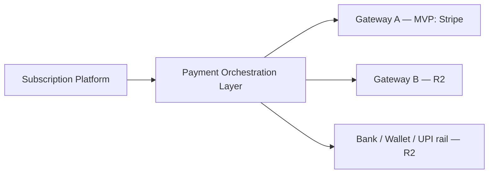
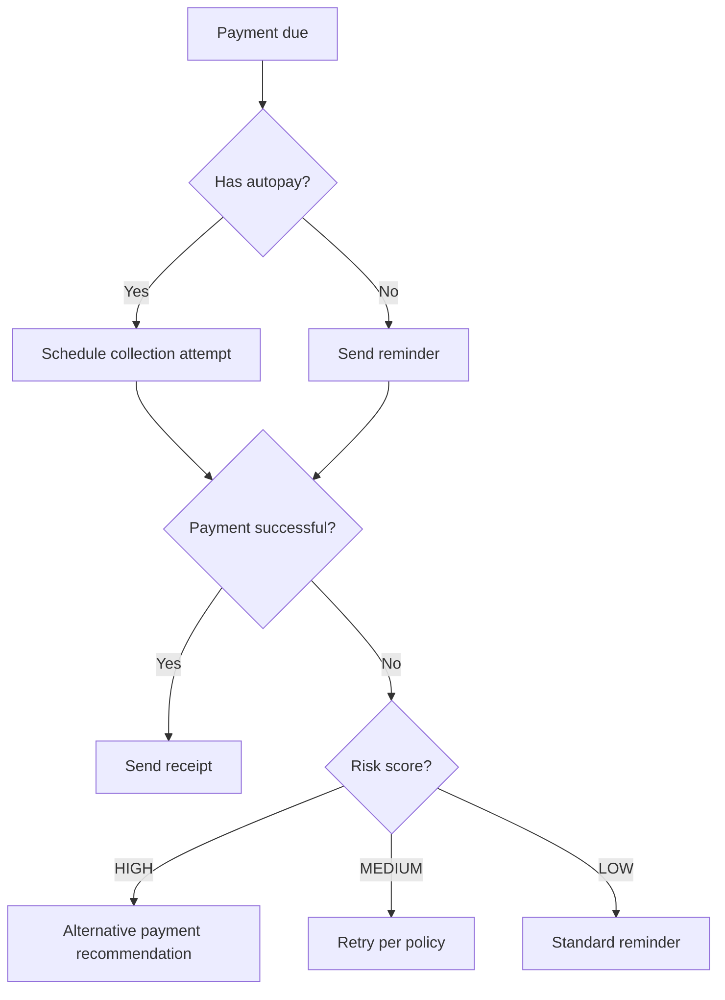

# SUB-0009 — Payments & Collections Specification

**Document ID:** SUB-0009
**Title:** Payments & Collections Specification
**Version:** 0.1 (Draft)
**Status:** Draft
**Owner:** Payments Architect
**Reviewers:** Revenue Accounting SME, Security Architect, AI/ML Architect, QA/Test Architect
**Created Date:** 2026-09-23
**Last Updated:** 2026-09-23
**Dependencies:** [SUB-0004](SUB-0004_Domain_Model.md), [SUB-0005](SUB-0005_State_Machine_Specification.md), SUB-0008 Billing & Invoicing Specification
**Related Documents:** SUB-0010 Accounting & Revenue Specification (planned), SUB-0016 AI & Agent Governance Specification (planned)

## 1. Payment methods

| Method | MVP/R2 | Notes |
|---|:---:|---|
| Card | MVP | Via Stripe adapter; tokenized only (§3) |
| ACH | R2 | US bank debit rail |
| SEPA | R2 | EU bank debit rail |
| BACS | R2 | UK bank debit rail |
| UPI | R2 | India real-time payment rail |
| UPI AutoPay | R2 | India mandate-based recurring debit |
| Bank transfer | R2 | Manual/semi-automated reconciliation |
| Wallet | R2 | Regional digital wallets |
| PayPal | R2 | |
| Apple Pay | R2 | Card-network tokenized, via provider |
| Google Pay | R2 | Card-network tokenized, via provider |
| Virtual accounts | R2 | Dedicated collection accounts per customer |
| Wire transfer | R2 | High-value manual settlement |
| PO settlement | R2 | Enterprise purchase-order-backed payment terms, no card/bank rail |

Method support is connector-driven (SUB-0017); adding a method never changes the canonical `Payment`/`PaymentAttempt` model (SUB-0004 §5.9, ADR — payments are provider-neutral).

## 2. Payment orchestration

### 2.1 Gateway abstraction

- The canonical `Payment`/`PaymentAttempt`/`Refund` model (SUB-0004 §5.9, SUB-0005 §4–§5, §8) is provider-neutral; a `Gateway` (SUB-0004 §5.9) is a configured routing target behind the orchestration layer. Provider-specific reason codes and states are mapped to the canonical taxonomy (§2.5) at the adapter boundary and never leak into domain state.

### 2.2 Routing and failover

- MVP routing is deterministic: tenant configuration, currency, country, method, amount limits, and gateway health.
- Failover to a second gateway after a declined/failed attempt is permitted only when scheme/legal rules and duplicate-risk controls allow it — a failover always creates a new `PaymentAttempt` under the same logical `Payment`, never a silent resubmission that could double-charge.
- R2 introduces scored routing recommendations (§4); routing legality, cost, and duplicate-safety validation always remain policy-enforced regardless of any score.

### 2.3 Tokenization

- Raw PAN, CVV, and bank credentials are never accepted by general platform APIs or stored in platform infrastructure. Collection happens exclusively through provider-hosted fields/SDKs; the platform stores only provider tokens, safe display metadata, fingerprint hash, and mandate reference (`PaymentMethod`, SUB-0004 §5.9).

### 2.4 Retries and idempotency

- Retry policy evaluates canonical reason, attempt count, time, method/gateway rules, customer consent/mandate, invoice status, and collection case state.
- A retry creates a new `PaymentAttempt`; it never resubmits under a new idempotency reference while a prior outcome is `UNKNOWN` (SUB-0005 §5) — the same provider idempotency reference is reused to query/reconcile first.
- A change of amount or currency always creates a new `Payment`, never another attempt on the existing one.
- Every attempt carries a unique provider idempotency reference within its gateway account scope.

### 2.5 Processor references and canonical reason model

Provider codes map to a stable reason taxonomy while preserving the safe raw code:

| Category | Example canonical reasons |
|---|---|
| Customer action | `AUTHENTICATION_REQUIRED`, `MANDATE_REQUIRED`, `PAYMENT_METHOD_EXPIRED` |
| Funds/issuer | `INSUFFICIENT_FUNDS`, `ISSUER_DECLINED`, `LIMIT_EXCEEDED` |
| Method/account | `INVALID_METHOD`, `ACCOUNT_CLOSED`, `MANDATE_REVOKED` |
| Risk/compliance | `FRAUD_SUSPECTED`, `COMPLIANCE_BLOCK`, `DO_NOT_HONOR` |
| Technical | `GATEWAY_UNAVAILABLE`, `TIMEOUT_UNKNOWN`, `PROVIDER_ERROR` |
| Merchant/config | `CURRENCY_UNSUPPORTED`, `MISCONFIGURED_ROUTE`, `INVALID_REQUEST` |
| Unknown | `UNMAPPED_PROVIDER_REASON` |

Each mapping carries `retry_advice` (`NEVER`, `CUSTOMER_ACTION`, `SAFE_AFTER`, `RECONCILE_FIRST`, `POLICY_EVALUATION`) and a version; retryability is never inferred from free-text message content.

### 2.6 Duplicate prevention

Enforced at three layers: (1) client `Idempotency-Key` on the create-payment command, (2) unique provider idempotency reference per attempt, (3) unique constraint on `(tenant_id, gateway_id, provider_event_external_id)` for inbound provider events, preventing a duplicated webhook from applying twice.

### 2.7 Refunds

Reuses SUB-0005 §8 in full: `REQUESTED → PENDING_APPROVAL → SUBMITTING → PENDING → SUCCEEDED | FAILED | CANCELLED`. Cumulative succeeded/pending refunds cannot exceed the refundable succeeded payment amount after chargebacks; refund currency matches payment currency in MVP.

### 2.8 Partial payments and overpayments

- **Partial payment:** a `Payment` for an amount less than the invoice's open balance partially settles the receivable (`PARTIALLY_PAID`, SUB-0005 §3); the remaining balance continues normal collection treatment.
- **Overpayment:** cash exceeding the open receivable becomes an unapplied/credit balance (`CreditBalance`-equivalent concept, SUB-0004 §5.10 pattern extended); it is never discarded or silently absorbed into the next invoice without an explicit allocation record.

## 3. Payment Success Engine

### 3.1 Prediction inputs

Customer payment history, payment method type and expiry status, gateway health/success-rate signals, invoice amount relative to account baseline, time-of-day/day-of-week success patterns, prior retry outcomes for the same reason category. Protected/sensitive attributes are never used (PRIN-06, mirrored from collections risk scoring §7).

### 3.2 Deterministic fallback

Every prediction-driven decision (preferred retry time, preferred gateway, communication timing, payment-method recommendation) has a deterministic rule-based fallback that activates automatically when the predictive model is unavailable, stale, or has failed its evaluation checks. The fallback is not a degraded experience presented apologetically — it is a fully specified, always-correct baseline that the model only ever improves upon (SUB-0000 PRIN-01).

### 3.3 Retry scheduling

Retry timing considers the canonical reason's `retry_advice` (§2.5), historical successful-retry windows for the customer/method/gateway combination, and merchant-configured maximum retry count and spacing. A model-recommended time is validated against policy bounds before being used — it can narrow the window, never override a hard policy limit.

### 3.4 Routing logic

Given a set of legally and technically eligible gateways/methods for the transaction, the engine ranks them by predicted success probability, cost, and risk; the ranking is a recommendation consumed by the deterministic router (§2.2), which still performs final legality/duplicate-safety validation.

### 3.5 Merchant controls

Merchants configure: maximum retry attempts, minimum spacing between retries, allowed gateway failover pairs, whether predictive routing is enabled at all (default: deterministic-only until a tenant explicitly opts in), and communication tone/channel preferences feeding pre-due notices (§4).

## 4. Collections

### 4.1 Pre-due, due-date, and post-due collections

| Phase | Trigger | Typical action |
|---|---|---|
| Pre-due | Forecasted upcoming amount + risk assessment above policy threshold | Payment-method-expiry notice, upcoming-amount notice, mandate confirmation request |
| Due-date | Due date reached with balance remaining | Attempt payment (if autopay) or send due notice |
| Post-due (dunning) | Grace period expired with collectible open balance | Recovery sequence per §4.2, escalation per §4.5 |

The objective is explicitly to prevent delinquency before it occurs, not merely to recover after (SUB-0000 PRIN-01) — pre-due is a first-class phase, not an optional enhancement layered onto post-due dunning.

### 4.2 Dunning

Configurable retry/contact sequences (`DunningCampaign`, SUB-0004 §5.10) with eligibility rules, a defined schedule, and explicit stop conditions (balance resolved, dispute opened, legal hold, consent withdrawal, maximum contact frequency reached). Every scheduled action revalidates policy and live account state immediately before execution, not only at scheduling time (SUB-0005 §7 Collection Case transition rules).

### 4.3 Promise-to-pay and payment plans

- **Promise-to-pay:** a recorded commitment (amount, date, qualifying receivables, creator, evidence) with states `OPEN | KEPT | BROKEN | CANCELLED`. Breach is evaluated from actual qualifying allocations, never from provider attempt success alone.
- **Payment plans:** an installment schedule requires explicit merchant policy and, above a configured threshold, maker-checker approval; a plan never silently changes the original invoice's terms — it creates a separately auditable schedule/hold policy.

### 4.4 Suspension rules

Suspension is a `Subscription` state transition (SUB-0005 §2), driven by collections policy but tracked independently of the collection case itself — suspending service never automatically writes off debt, and reinstatement requires the governing hold condition to actually clear (not merely a UI role permitting the click).

### 4.5 Escalation and account-manager tasking

Escalation criteria: value threshold, age threshold, broken promise, repeated failure category, or explicit policy trigger. Escalated cases route to a senior collections role or an account-manager task with safe context (exposure, risk factors, history) and require an outcome/reason capture on completion — an escalation is never a silent hand-off with no closure loop.

### 4.6 Communication orchestration

### 4.7 Channels

Email (MVP), SMS/WhatsApp/push (R2), in-app and portal (MVP surface via Payment & Collections Intelligence summary, SUB-0001 FR-150), chat (R2), account-manager task (MVP for escalated high-value cases). Every channel honors consent, suppression, quiet hours, and frequency caps before send, revalidated at execution time (§4.2).

## 5. Collection Risk Score

### 5.1 Allowed signal categories

Prior payment outcomes and days-to-pay, payment-method expiry/mandate status, canonical failure history, upcoming amount deviation from account baseline, invoice age/value and payment terms, promise and dispute behavior, gateway/method health, contract/account service facts necessary for collection policy. Geography is usable only for legal/payment-rail/contact-policy decisions or approved operational risk, never for discriminatory treatment. Protected sensitive attributes and unjustified proxies are prohibited (PRIN-06).

### 5.2 Output

`LOW | MEDIUM | HIGH` band with explainable, versioned factor codes and direction/contribution, subject/time-horizon, generated/expiry time, validation status, and a record of whether a deterministic fallback was used.

## 6. Explainability

Every risk score, retry recommendation, and Next Best Action carries its contributing factor codes and policy/model version — never a bare number or an unexplained label (PRIN-02). A subscriber- or operator-facing surface displaying risk must display the reasons alongside the band (SUB-0015).

## 7. AI boundaries

Reuses PRIN-06/PRIN-12 and is formally governed in SUB-0016. Summary constraints applicable here: AI may summarize, explain, detect, recommend, or simulate collections/payment actions; it may not independently approve an exception, execute an irreversible action outside its assigned autonomy level, or use a protected attribute. Every AI-influenced payment or collections action carries model/version, input reference, decision, and outcome in the audit trail (SUB-0004 §5.14).

## 8. Acceptance criteria

1. An API timeout after provider acceptance cannot cause a duplicate charge — the attempt enters `UNKNOWN` and reconciles under the same provider key.
2. Duplicate and out-of-order provider webhooks produce one legal state progression and one allocation.
3. A synchronous decline schedules a retry only if the versioned reason/policy permits it.
4. A success webhook with mismatched amount, currency, or gateway account is quarantined and never marks the payment succeeded.
5. One succeeded payment can allocate across eligible invoices without exceeding payment or receivable balances.
6. A high-risk upcoming invoice opens one preventive case and recommends a method update without waiting for failure.
7. A pending/unknown payment suppresses a duplicate charge attempt until reconciliation.
8. An unavailable predictive model falls back to deterministic policy and records the fallback (§3.2, §5.1).
9. A user cannot manually approve an extension/write-off outside their threshold or approve their own request when separation of duties applies.
10. Raw payment credentials never appear in database, logs, events, traces, or support views.

## Decisions Requiring Product Owner Approval

| ID | Decision needed | Status |
|---|---|---|
| DEC-018 | Stripe account model and supported regions/methods at MVP launch (extends DEC-003) | Open |
| DEC-019 | Predictive routing/retry model opt-in default and evaluation cadence before any tenant enables it | Open |
| DEC-020 | Collections risk-signal review for fairness/disparate-impact before enabling for any live tenant | Open |
