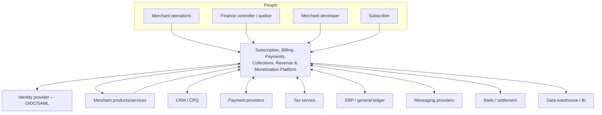
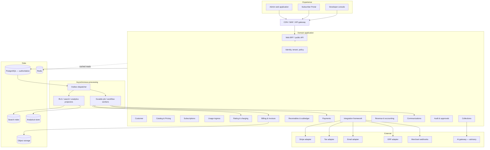
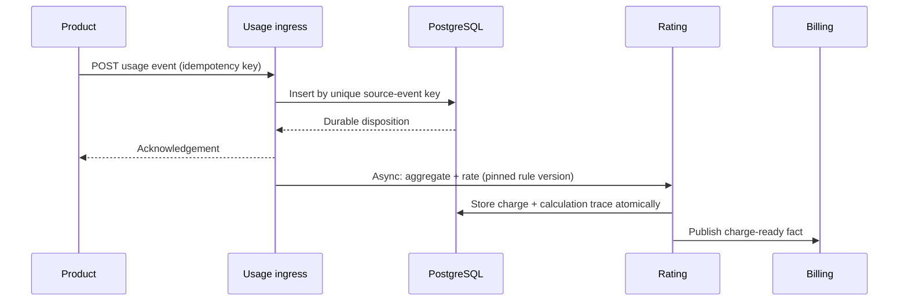
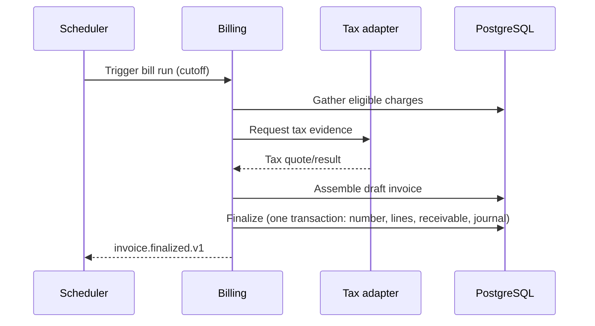
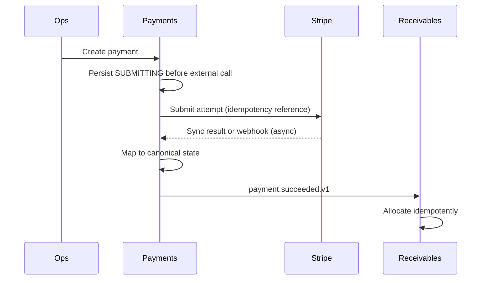
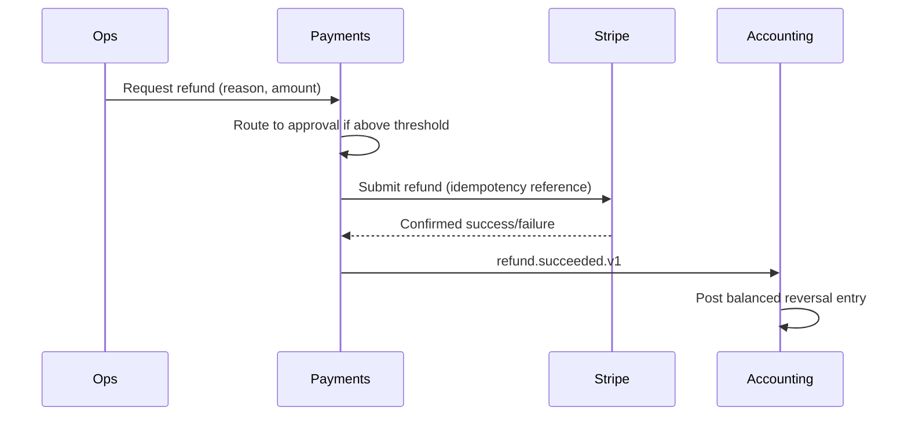
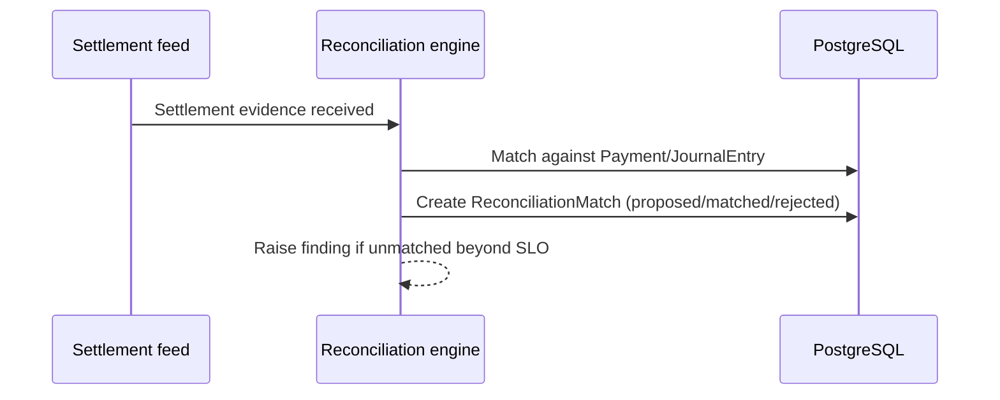

# SUB-0011 — System Architecture

**Document ID:** SUB-0011
**Title:** System Architecture
**Version:** 0.1 (Draft)
**Status:** Draft
**Owner:** Principal Software Architect
**Reviewers:** Data Architect, Site Reliability Architect, Security Architect, Payments Architect, Billing and Rating Architect
**Created Date:** 2026-09-23
**Last Updated:** 2026-09-23
**Dependencies:** [SUB-0004](SUB-0004_Domain_Model.md)–[SUB-0010](SUB-0010_Accounting_Revenue_Specification.md)
**Related Documents:** SUB-0012 Data Architecture & ERD (planned), SUB-0013 API & Event Contracts (planned), [SUB-ADR-REGISTER](SUB-ADR-REGISTER.md)

## 1. Architecture summary

The platform is a **domain-modular application with independently scalable workers**, PostgreSQL as the authoritative operational and ledger store, an event-driven backbone for reliable asynchronous propagation, Redis for non-authoritative acceleration, object storage for documents, and provider adapters at explicit ports. Only authoritative domain modules commit financial state; search, analytics, and AI are consumers, never sources, of financial truth. Every accepted command or event is tenant-scoped, idempotent where necessary, authorized, audited, and traceable by correlation/causation IDs (PRIN-04, PRIN-13, SUB-0000).

## 2. System context (C4 Level 1)

## 3. Containers (C4 Level 2)

## 4. Component responsibilities

| Component | Responsibility | Authoritative writes |
|---|---|---|
| Admin web / Portal | Keyboard-accessible operations / self-service (SUB-0015) | None directly; commands via API |
| BFF | Contract validation, auth context, idempotency envelope, response composition | None; delegates to domain modules |
| Identity/Tenant/Policy | Membership, roles, ABAC, approvals, tenant settings (SUB-0014) | Tenant and authorization configuration |
| Customer | Customer/Account facts (SUB-0004 §5.2) | Customer/Account aggregates |
| Catalog & Pricing | Versioned commercial definitions, rating (SUB-0004 §5.3–5.4, SUB-0007) | Product/Offer/Plan/RateCard versions, RatedEvent |
| Subscriptions | Lifecycle and effective-dated changes (SUB-0005 §2) | Subscription aggregates and schedules |
| Usage ingress | Durable validation, dedupe, disposition (SUB-0004 §5.7) | UsageEvent |
| Billing | Bill runs, preview, grouping, finalization (SUB-0008) | Invoice aggregates |
| Receivables | Balances, allocation, immutable postings (SUB-0010 §3–§4) | Receivable and journal transactions |
| Payments | Canonical payments, attempts, refunds (SUB-0009) | Payment aggregates; never raw credentials |
| Collections | Risk, policy decision, case workflow (SUB-0009 §4–§7) | Assessments, cases, promises, actions |
| Revenue & Accounting | Recognition, reconciliation, ERP export (SUB-0010) | RevenueSchedule, JournalEntry, ReconciliationMatch |
| Communications | Template rendering and delivery lifecycle | Notification/delivery state |
| Audit/Approvals | Append-only evidence, maker-checker | AuditEvent, ApprovalRequest records |
| Integration framework | Ports, mappings, webhook ingress/egress, exports (SUB-0017) | Connector configs, safe evidence |
| Projectors | Rebuildable RLG/search/metrics views | Projection stores only |
| AI gateway | Model allowlist, grounding, redaction, action policy (SUB-0016) | AI interaction evidence; no direct financial writes |

## 5. Bounded contexts and service boundaries

Reuses SUB-0004 §2 bounded contexts without redefinition. Every context is a distinct module in code and database schema from day one (§9), enforced by architecture tests, regardless of whether it is deployed as part of the monolith or as an independent service.

## 6. Synchronous and asynchronous interactions

### 6.1 Synchronous command

1. Edge authenticates transport, applies coarse rate controls, passes a correlation ID.
2. API resolves tenant from credential/membership, never from a trusted-by-default body field (SUB-0014 §1).
3. Policy checks action, resource attributes, maker-checker status, expected aggregate version.
4. One database transaction validates invariants, writes aggregate changes, records idempotency outcome/audit reference, appends an outbox record.
5. Response returns canonical resource version and correlation ID.
6. Dispatcher publishes the fact; consumers deduplicate through inbox/checkpoint state.

### 6.2 Usage ingestion sequence

### 6.3 Billing sequence

### 6.4 Payment sequence

### 6.5 Usage-to-invoice sequence

Composes §6.2 and §6.3: usage acceptance → aggregation/rating → charge → bill run inclusion → finalized invoice, each step's fact durably persisted before the next step consumes it (no in-memory-only handoff across a transaction boundary).

### 6.6 Refund sequence

### 6.7 Reconciliation sequence

## 7. Event streaming

Reuses the transactional-outbox-first approach: domain state and an outbox record commit atomically (§9 ADR-009); a dispatcher publishes to the event transport. Ordering is guaranteed only per authoritative aggregate key, never globally. See ADR-009 (§9) for the transport technology decision.

## 8. Workflow engine, API gateway, identity, data stores, cache, search, analytics, object storage, observability

| Layer | Role | Decision reference |
|---|---|---|
| Workflow engine | Durable job/process-manager execution for bill runs, dunning, retries | ADR-010 (§9) |
| API gateway | TLS termination, coarse rate limiting, correlation ID injection, routing to BFF | Edge zone, SUB-0014 §7 |
| Identity | OIDC/SAML federation, tenant membership resolution | SUB-0014 §2 |
| Data stores | PostgreSQL (authoritative), Redis (cache/rate-limit/lease) | ADR-008, this document §9 |
| Search | Tenant-scoped index over projected facts | ADR-014 (§9) |
| Analytics | Tenant-scoped analytical store for reporting/BI export | ADR-015 (§9) |
| Object storage | Versioned rendered invoices, exports, evidence, tenant-prefixed paths, signed short-lived URLs | SUB-0012 (planned) |
| Observability | OpenTelemetry traces/metrics/logs, correlation/causation propagation end to end | SUB-0018 |

## 9. Architecture decisions

This section formally authors the eleven mandatory architecture-topic ADRs listed as "Planned" in [SUB-ADR-REGISTER](SUB-ADR-REGISTER.md) through Gate 2. Each is also appended to that register.

### ADR-008 — Modular monolith with independently scalable workers, not microservices at MVP

- **Decision:** Keep transactional domain modules in one deployable application initially; run asynchronous/scale-sensitive workers (usage ingress, rating, billing runs, notifications, projectors) as separately deployable units from day one; enforce module boundaries in code and database schema regardless of deployment topology.
- **Context:** The domain is not yet empirically stable at scale; distributed transactions are especially dangerous for money (PRIN-04).
- **Alternatives:** microservices per bounded context from MVP; serverless functions per operation; a single undivided monolith with no internal module boundaries at all.
- **Benefits:** simpler transaction boundaries for invoice/receivables postings, fewer failure modes, faster development velocity, coherent local testing, lower operating cost; usage ingress/rating/notifications have clear extraction seams already.
- **Risks:** coarse deployment unit for the core application; risk of module-boundary erosion without enforcement tooling; shared-database contention if unmanaged.
- **Rationale:** premature distributed transactions are a more dangerous failure mode for a financial platform than a coarser deployment unit; module boundaries enforced in code preserve the extraction option without paying its operational cost now.
- **Consequences:** an architecture-boundary linter (SUB-0020, planned) forbids cross-module table access; outbox contracts exist even for in-process consumers; extraction triggers (§10) are measured, not assumed.

### ADR-009 — Transactional outbox with a Kafka-compatible transport once volume warrants it

- **Decision:** Commit domain state and an outbox record atomically inside PostgreSQL; a dispatcher publishes to an in-process/queue-based transport initially, migrating to a Kafka-compatible platform when volume, retention, or multi-consumer replay needs exceed the simpler transport's capability.
- **Context:** Domain facts must never disappear after a successful financial commit (PRIN-05); event volume at MVP scale does not yet justify operating a distributed log.
- **Alternatives:** publish directly inside the request path (dual-write risk); adopt Kafka from MVP regardless of volume; change-data-capture as the sole propagation mechanism.
- **Benefits:** no dual-write gap, replayability, transport independence, incremental operational complexity.
- **Risks:** an interim transport must still guarantee at-least-once delivery and ordering-per-aggregate-key; a later migration requires a defined cutover.
- **Rationale:** the outbox pattern (not the specific transport) is what protects the financial invariant; the transport is a scaling decision that can be deferred.
- **Consequences:** all consumers are built idempotent from day one so the transport migration is invisible to them; schema versioning (SUB-0013) is transport-independent.

### ADR-010 — Database-backed durable jobs now; adopt a Temporal-style workflow engine when volume/complexity justify it

- **Decision:** MVP uses database-backed jobs/process managers with explicit state, lease, retry limit, and operator recovery for bill runs, dunning sequences, and retries; a dedicated workflow orchestration engine is adopted only when workflow volume/complexity crosses a measured threshold.
- **Context:** Invoice runs and collections need durability now; a new workflow platform is not necessary before flows stabilize.
- **Alternatives:** cron plus ad hoc flags; adopt Temporal-style orchestration immediately; broker-only choreography with no explicit workflow state.
- **Benefits:** controlled incremental complexity, restartable/resumable work, visible timeouts and retries without a new platform dependency.
- **Risks:** the interim job framework must be disciplined (stable identity, checkpointing); a later migration to a dedicated engine requires deliberate planning.
- **Rationale:** matches PRIN-03/PRIN-04 — introduce complexity only where correctness demands it, not preemptively.
- **Consequences:** every job has stable identity, state, lease, retry limit, next-attempt time, correlation ID, and operator recovery path from day one, so a later engine migration changes only the execution substrate, not the job contract.

### ADR-011 — PostgreSQL as the sole operational database

- **Decision:** PostgreSQL is authoritative for transactional aggregates, idempotency records, outbox/inbox, audit references, and the accounting subledger.
- **Context:** Integrity and operational clarity outweigh speculative global write scale at MVP.
- **Alternatives:** distributed SQL from MVP; a document database for flexible schema; an event store as the primary source of truth.
- **Benefits:** mature ACID semantics, constraints, indexing, JSON support where appropriate, broad operational familiarity.
- **Risks:** horizontal write scale requires partitioning/read replicas or eventual service extraction; tenant hot spots require active management.
- **Rationale:** correctness guarantees for money movement are non-negotiable (PRIN-04); PostgreSQL provides them without a new, less-proven data platform.
- **Consequences:** SUB-0012 defines partition keys, benchmarks high-volume tables, and defines archival/restore procedures before schema freeze.

### ADR-012 — Ledger model: application-enforced double-entry over PostgreSQL constraints, not a specialized ledger database

- **Decision:** Double-entry accounting concepts (SUB-0010 §2) are implemented as balanced `JournalEntry` rows within PostgreSQL, with a database-level constraint rejecting any unbalanced posting transaction, rather than adopting a specialized ledger/event-sourcing database product.
- **Context:** The platform's ledger needs are well-served by relational constraints and immutable append-only tables; a specialized ledger product would introduce a second data platform to operate and reconcile against the primary store.
- **Alternatives:** a dedicated ledger-as-a-service product; full event-sourcing with the ledger derived from a separate event store; an application-only balance check with no database-level enforcement.
- **Benefits:** one operational data platform, ACID-guaranteed balance invariant, straightforward reconciliation against the same store that holds Invoice/Payment records.
- **Risks:** very high posting-volume scenarios may eventually need dedicated ledger infrastructure; this is deferred until measured.
- **Rationale:** matches ADR-011's rationale — avoid introducing a second critical data platform before it is proven necessary.
- **Consequences:** SUB-0012 defines the `JournalEntry`/ledger-account schema and the balance-check constraint explicitly.

### ADR-013 — Shared database with mandatory tenant keys and row-level security, dedicated deployment as an enterprise option

- **Decision:** Shared PostgreSQL cluster and shared application tier in MVP, with every tenant-owned row carrying a non-null tenant key, application-level mandatory tenant filtering, and row-level security as defense in depth; dedicated per-tenant deployment remains an explicit, supported enterprise option.
- **Context:** Shared tenancy fits the initial commercial model (SUB-0003) and provides fast provisioning and consistent migrations; some enterprise/regulated customers will eventually require stronger isolation.
- **Alternatives:** database-per-tenant or schema-per-tenant from MVP; fully shared storage with no per-tenant structural boundary at all.
- **Benefits:** operational efficiency and scalable SaaS economics now, without foreclosing the dedicated-deployment path later.
- **Risks:** isolation mistakes have high impact; noisy-neighbor controls are required.
- **Rationale:** cross-tenant leakage is the platform's highest-severity realistic failure mode; defense-in-depth (application filter + RLS) is the mitigation, detailed fully in SUB-0014.
- **Consequences:** cross-tenant negative tests are mandatory and release-blocking (SUB-0019); support/admin access is time-bound and audited (SUB-0014); every async envelope carries trusted tenant context re-validated per transaction.

### ADR-014 — PostgreSQL-native search initially; dedicated search service only when scale/relevance evidence requires it

- **Decision:** Search starts as PostgreSQL full-text/trigram indexing over projected facts; a dedicated search technology (e.g., OpenSearch) is adopted only once measured latency or relevance requirements exceed this baseline.
- **Context:** Primary search use cases (customer/invoice/subscription lookup) are well within PostgreSQL's native search capability at MVP scale.
- **Alternatives:** a dedicated search cluster from MVP; no structured search at all (relying on exact-match queries only).
- **Benefits:** no second search infrastructure to operate before it is justified; rebuild/backup simplicity.
- **Risks:** relevance ranking and fuzzy matching are more limited than a dedicated engine.
- **Rationale:** matches the general pattern of deferring specialized infrastructure until measured need (PRIN-03 applied to infrastructure, not just domain rules).
- **Consequences:** search indexes never replace exact unique/control indexes used for financial correctness; a later migration is transparent to API consumers (search contracts are storage-neutral).

### ADR-015 — Analytics deferred to a lightweight semantic layer at MVP; dedicated analytical store when reporting scope grows

- **Decision:** MVP analytics (SUB-0001 FR capability "Analytics") uses a defined semantic layer over the operational store/read replicas rather than a dedicated columnar analytical store; a dedicated store is adopted when custom-report-builder and forecasting scope (SUB-0003 §2, Release 2) is built.
- **Context:** MVP-scope reporting is a fixed set of well-defined KPIs (SUB-0018), not ad hoc exploratory analytics.
- **Alternatives:** stand up a columnar warehouse from MVP; use the primary transactional database directly for all analytics without a semantic layer or read replica isolation.
- **Benefits:** avoids a second data platform before Release 2 reporting scope requires it; a defined semantic layer still protects against divergent metric definitions.
- **Risks:** heavier ad hoc analytical queries could compete with transactional load if not isolated to read replicas.
- **Rationale:** matches ADR-014's deferral pattern; the semantic-layer requirement (metrics defined once, versioned) is the load-bearing control, not the storage technology.
- **Consequences:** SUB-0012 defines read-replica isolation for reporting queries; metric definitions are version-controlled from MVP regardless of storage technology.

### ADR-016 — Idempotency via a dedicated idempotency-record table plus unique business constraints, not solely client-side deduplication

- **Decision:** Every financially material command's idempotency guarantee is enforced by a server-side `IdempotencyRecord` (keyed by tenant, scope, and client key) written in the same transaction as the domain effect, backed additionally by unique business constraints on the domain tables themselves (e.g., unique source-event identity for usage, unique provider idempotency reference for payment attempts).
- **Context:** A retried financial command must never produce a second effect (BR-002); relying on client discipline alone is insufficient.
- **Alternatives:** rely only on unique business constraints without a dedicated idempotency-record table; rely only on client-side request deduplication.
- **Benefits:** a uniform mechanism across every command type, with a stored response for exact-replay cases and clear conflict semantics for a reused key with a different payload (SUB-0013, planned).
- **Risks:** idempotency records require a retention/expiry policy that must never expire before the domain effect they protect is durably observable.
- **Rationale:** this is the concrete mechanism that satisfies BR-002 and INV — never double-charge due to retries — end to end, not merely at one layer.
- **Consequences:** every financially material command handler's signature requires an idempotency key; this is enforced by an architecture-lint rule (SUB-0020, planned).

### ADR-017 — Effective-dated versioning via immutable version rows plus optimistic concurrency, not temporal-table auto-versioning

- **Decision:** Historical/effective-dated versioning (products, plans, rate cards, contracts) is implemented as explicit, immutable version rows with a content hash and effective period, selected deterministically by effective time — not by a database temporal-table feature that auto-versions on every update.
- **Context:** Commercial configuration must be effective-dated and never silently repriced (PRIN-05, PRIN-14); the selection logic (which version applies to which historical fact) is itself a significant piece of business logic, not a generic temporal-query feature.
- **Alternatives:** database-native temporal tables with automatic history capture; a single mutable row with an audit log reconstructing history after the fact.
- **Benefits:** explicit, testable version-selection logic; a version's identity and content hash are stable and directly referenceable from a `SubscriptionItem`'s pinned snapshot (SUB-0007 §11), rather than reconstructed from a generic audit log.
- **Risks:** more schema/application code than relying on a database feature; requires discipline to always create a new version rather than an in-place update.
- **Rationale:** the selection semantics (SUB-0007 §6) are business-critical and must be explicit, testable, and versioned independently of the underlying storage engine's temporal features.
- **Consequences:** SUB-0012 defines the version/content-hash schema pattern once and applies it uniformly to every effective-dated entity.

### ADR-018 — Financial consistency model: strong consistency for posting operations, eventual consistency for projections

- **Decision:** Price activation, subscription state changes, usage acceptance/dedup, invoice finalization, and payment/allocation posting are strongly consistent within one database transaction; search, dashboards, analytics, notifications, and the Revenue Lifecycle Graph projection are eventually consistent with an explicit freshness indicator.
- **Context:** Some operations (posting money) cannot tolerate staleness or partial application; others (a dashboard KPI) can, and forcing strong consistency everywhere would be both unnecessary and operationally expensive.
- **Alternatives:** strong consistency everywhere (unnecessary cost and complexity for read-heavy projections); eventual consistency everywhere (unacceptable for financial posting).
- **Benefits:** correctness where it matters most, without paying strong-consistency cost for every read path.
- **Risks:** requires clear, consistently applied labeling of which operations are which — a UI or API that fails to disclose eventual consistency risks user confusion about "true" state.
- **Rationale:** directly implements PRIN-04 (financial correctness over convenience) while keeping the system responsive and scalable for non-financial reads.
- **Consequences:** every projection-backed API response and UI surface (SUB-0015) carries a freshness indicator; the consistency requirement per operation type is tabulated explicitly (§10).

## 10. Consistency matrix

| Operation | Required model | Mechanism |
|---|---|---|
| Activate a price version | Strong | Approval/state/version checks in one transaction (SUB-0007 §11) |
| Change subscription | Strong per aggregate | Optimistic concurrency + idempotency + outbox (SUB-0005 §2) |
| Accept/dedupe usage | Strong on event identity | Unique constraint and durable disposition (SUB-0004 §5.7) |
| Rate usage | Exactly-once business effect | Deterministic key, unique active result, idempotent replay (SUB-0007 §13) |
| Finalize invoice | Strong | Freeze totals/lines, number allocation, posting transaction (SUB-0008 §6) |
| Post payment/allocation | Strong | Legal state transition and balanced posting transaction (SUB-0005 §4, SUB-0010 §4) |
| Provider interaction | Eventual/uncertain | Idempotent attempt + callback/poll + reconciliation (SUB-0005 §5) |
| Notification | Eventual | Durable job, retries and delivery receipts |
| Search/dashboard/RLG | Eventual | Projectors with freshness watermark (SUB-0006 §8) |
| ERP export | Eventual and reconciled | Batch/control totals, acknowledgement, replay (SUB-0010 §10) |

## 11. Scale and extraction triggers

A module is split into its own service only when at least one measured condition applies: independent scaling is repeatedly constrained, release ownership requires isolation, data residency differs, failure blast radius is unacceptable, or the bounded context has stable contracts and distinct SLOs (extends ADR-008). First candidates: usage ingress/rating, notifications, webhook delivery, document rendering, search/projectors, and high-volume integrations — not invoice/subledger transactions by default, since those carry the platform's strongest consistency requirements.

## 12. Observability and operability

- One correlation ID crosses API, jobs, provider calls, outbox facts, webhooks, and audit references; causation IDs form the event chain (SUB-0004 §5.14, SUB-0013 planned).
- Technical telemetry follows RED/USE conventions; business telemetry includes accepted/quarantined usage, rating lag, bill-run progress, invoice finalization rate, payment conversion, outbox lag, notification delivery, and ledger reconciliation status.
- Logs are structured, tenant-safe, and redacted per data classification (SUB-0014).
- Every batch is restartable, resumable, and exposes progress/control totals.
- Operational runbooks cover: provider outage, webhook backlog, stuck billing run, duplicate suspicion, projection rebuild, restore, and key rotation.

## 13. Acceptance criteria

1. Every bounded context in SUB-0004 §2 maps to exactly one module with an enforced dependency boundary, regardless of deployment topology.
2. All eleven mandatory architecture ADRs (§9) are recorded with decision, context, alternatives, benefits, risks, rationale, and consequences, and mirrored in SUB-ADR-REGISTER.
3. Every operation in the consistency matrix (§10) has an unambiguous consistency classification and enforcement mechanism.
4. Every C4 and sequence diagram uses only terminology defined in SUB-GLOSSARY.
5. No diagram or component description implies a financial write path through search, analytics, cache, or AI.

## Decisions Requiring Product Owner Approval

| ID | Decision needed | Status |
|---|---|---|
| DEC-024 | Confirm the modular-monolith starting topology (ADR-008) as the approved architecture baseline before Gate 4 backlog conversion | Open |
| DEC-025 | Approve deferral of a dedicated search/analytics platform (ADR-014/ADR-015) pending measured Release 2 need | Open |
