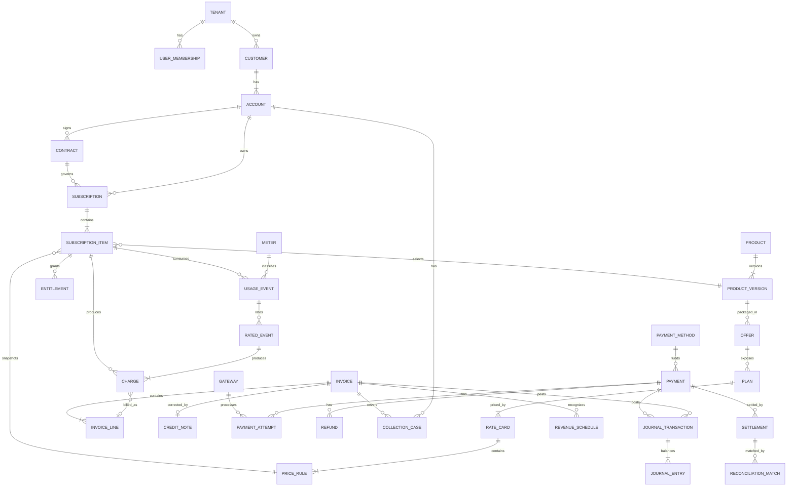

# SUB-0012 — Data Architecture & ERD

**Document ID:** SUB-0012
**Title:** Data Architecture & ERD
**Version:** 0.1 (Draft)
**Status:** Draft
**Owner:** Data Architect
**Reviewers:** Principal Software Architect, Billing and Rating Architect, Payments Architect, Security Architect
**Created Date:** 2026-09-23
**Last Updated:** 2026-09-23
**Dependencies:** [SUB-0004](SUB-0004_Domain_Model.md), [SUB-0011 System Architecture](SUB-0011_System_Architecture.md)
**Related Documents:** SUB-0013 API & Event Contracts (planned), SUB-0014 Security, Privacy & Compliance Architecture (planned)

## 1. Storage conventions

| Concern | Convention |
|---|---|
| Primary IDs | ULID/UUIDv7, application-generated; benchmarked before schema freeze. |
| Tenant isolation | Every tenant-owned row has non-null `tenant_id`; foreign and unique constraints include tenant scope. |
| Business keys | Human-facing keys are unique within a defined tenant/legal-entity scope and never serve as foreign keys. |
| Time | `timestamptz` in UTC for instants; `date` plus IANA time zone for business schedules. Effective ranges are `[start, end)`. |
| Money | `amount_minor bigint` plus ISO 4217 currency for settled/display money; calculation rates use fixed `numeric(38,18)` (SUB-0007 §13). |
| Quantity | `numeric(38,12)` plus unit code. |
| Status | Validated domain enum/check value; transition history is separate for material lifecycles (SUB-0005). |
| Versioning | `row_version bigint` for optimistic concurrency; effective configuration also has an immutable semantic version/revision and content hash (SUB-0011 ADR-017). |
| Audit columns | Mutable roots: `created_at`, `created_by`, `updated_at`, `updated_by`, `row_version`; immutable facts omit misleading update fields. |
| Soft deletion | Financial/configuration history is retired/closed, never deleted. PII erasure uses a governed anonymization/purge workflow (SUB-0014). |
| Flexible metadata | `jsonb` only for bounded extension fields/dimensions; monetary logic and searchable control fields are typed columns, never buried in JSON. |

## 2. Storage layers

| Layer | Technology (SUB-0011 ADR reference) | Contents |
|---|---|---|
| Operational database | PostgreSQL (ADR-011) | All aggregates in SUB-0004 §5; authoritative for every financial fact |
| Financial ledger storage | PostgreSQL, same cluster (ADR-012) | `JournalEntry` and ledger-account tables, append-only, balance-constrained |
| Event storage | Outbox tables in PostgreSQL, transport per ADR-009 | Domain event envelopes pending/published dispatch |
| Analytics store | Read replica / semantic layer at MVP (ADR-015) | Reporting-optimized views over operational data |
| Search indexes | PostgreSQL full-text/trigram at MVP (ADR-014) | Projected, tenant-scoped search documents |
| Object storage | S3-compatible | Rendered invoices, exports, evidence attachments, tenant-prefixed paths |

## 3. High-level ERD

## 4. Physical table specifications (financially critical tables)

The remaining entities from SUB-0004 §5 follow these same conventions (§1); this section elaborates DDL-level detail for the tables where a schema mistake carries the highest financial or isolation risk.

### 4.1 `tenant`

| Field | Type | Nullable | Constraint/Index |
|---|---|---|---|
| `tenant_id` | uuid | No | PK |
| `tenant_slug` | text | No | Unique (global) |
| `status` | enum | No | Check: `PROVISIONING\|ACTIVE\|SUSPENDED\|CLOSED` |
| `default_currency` | char(3) | No | ISO 4217 |
| `default_timezone` | text | No | IANA zone |
| `data_residency_region` | text | Yes | Reserved (SUB-0011 §"regional deployment", enterprise horizon) |
| `row_version` | bigint | No | Optimistic concurrency |

Tenant isolation: this table is the isolation root; every other table's `tenant_id` foreign-keys here.

### 4.2 `account`

| Field | Type | Nullable | Constraint/Index |
|---|---|---|---|
| `account_id` | uuid | No | PK |
| `tenant_id` | uuid | No | FK → tenant; part of every unique index below |
| `customer_id` | uuid | No | FK → customer (tenant-scoped) |
| `account_number` | text | No | Unique `(tenant_id, account_number)` |
| `currency` | char(3) | No | ISO 4217 |
| `status` | enum | No | Check: `ACTIVE\|ON_HOLD\|CLOSED` |
| `row_version` | bigint | No | Optimistic concurrency |

Indexes: `(tenant_id, customer_id)`, `(tenant_id, status)`.

### 4.3 `rate_card` / `price_rule`

| Field | Type | Nullable | Constraint/Index |
|---|---|---|---|
| `rate_card_id` | uuid | No | PK |
| `tenant_id` | uuid | No | FK → tenant |
| `plan_id` | uuid | No | FK → plan (tenant-scoped) |
| `version` | int | No | Unique `(tenant_id, plan_id, version)` |
| `content_hash` | text | No | Not null once `ACTIVE` |
| `effective_from` | timestamptz | No | Exclusion constraint prevents overlap by selector (§4.7) |
| `effective_to` | timestamptz | Yes | Open-ended if null |
| `status` | enum | No | `DRAFT\|VALIDATED\|SIMULATED\|PENDING_APPROVAL\|ACTIVE\|RETIRED` |
| `row_version` | bigint | No | Optimistic concurrency |

`price_rule` is a child table keyed `(rate_card_id, sequence)`, immutable once its parent `rate_card` is `ACTIVE` (SUB-0011 ADR-017).

### 4.4 `subscription` / `subscription_item`

| Field | Type | Nullable | Constraint/Index |
|---|---|---|---|
| `subscription_id` | uuid | No | PK |
| `tenant_id` | uuid | No | FK → tenant |
| `account_id` | uuid | No | FK → account (tenant-scoped) |
| `subscription_number` | text | No | Unique `(tenant_id, subscription_number)` |
| `state` | enum | No | Per SUB-0005 §2 (closed enum, no undocumented value) |
| `row_version` | bigint | No | Optimistic concurrency, checked on every transition (SUB-0005 §2) |

`subscription_item` keyed `(subscription_id, item_number)`, with `effective_from`/`effective_to` marking closed intervals — an item change never updates a row's period boundaries after the successor interval is created (SUB-0004 §5.6).

### 4.5 `usage_event`

| Field | Type | Nullable | Constraint/Index |
|---|---|---|---|
| `usage_event_id` | uuid | No | PK |
| `tenant_id` | uuid | No | FK → tenant |
| `source` | text | No | Part of dedup key |
| `source_event_id` | text | No | Unique `(tenant_id, source, source_event_id)` — the durable dedup constraint (BR-002) |
| `subscription_item_id` | uuid | No | FK → subscription_item |
| `meter_id` | uuid | No | FK → meter |
| `event_time` | timestamptz | No | Immutable once written |
| `received_time` | timestamptz | No | System-assigned |
| `quantity` | numeric(38,12) | No | Per meter scale |
| `dimensions` | jsonb | Yes | Bounded, allowlisted keys only (SUB-0007 §4) |
| `disposition` | enum | No | `RECEIVED\|ACCEPTED\|REJECTED\|QUARANTINED` |

Partitioned by `event_time` (§7). No update path exists for `event_time`, `quantity`, or `dimensions` after acceptance — a correction is a new row referencing this one (SUB-0004 §5.7).

### 4.6 `invoice` / `invoice_line`

| Field | Type | Nullable | Constraint/Index |
|---|---|---|---|
| `invoice_id` | uuid | No | PK |
| `tenant_id` | uuid | No | FK → tenant |
| `account_id` | uuid | No | FK → account |
| `invoice_number` | text | Yes | Null before posting; unique `(tenant_id, legal_entity_id, invoice_number)` once assigned |
| `document_state` | enum | No | Per SUB-0005 §3 |
| `currency` | char(3) | No | Single currency per invoice (SUB-0008 §7) |
| `total_amount_minor` | bigint | No | |
| `row_version` | bigint | No | Optimistic concurrency |

`invoice_line` keyed `(invoice_id, line_number)`; immutable once the parent posts — enforced by a trigger/constraint rejecting any `UPDATE`/`DELETE` on a line belonging to a `POSTED` invoice, not merely application-layer discipline.

### 4.7 `payment` / `payment_attempt`

| Field | Type | Nullable | Constraint/Index |
|---|---|---|---|
| `payment_id` | uuid | No | PK |
| `tenant_id` | uuid | No | FK → tenant |
| `account_id` | uuid | No | FK → account |
| `state` | enum | No | Per SUB-0005 §4 |
| `amount_minor` | bigint | No | |
| `currency` | char(3) | No | |
| `row_version` | bigint | No | Optimistic concurrency |

`payment_attempt` keyed `(payment_id, attempt_number)`, unique `(tenant_id, gateway_id, provider_event_external_id)` for the linked `provider_event` table — the concrete constraint preventing a duplicated webhook from applying twice (SUB-0009 §2.6).

### 4.8 `journal_entry`

| Field | Type | Nullable | Constraint/Index |
|---|---|---|---|
| `journal_entry_id` | uuid | No | PK |
| `tenant_id` | uuid | No | FK → tenant |
| `journal_transaction_id` | uuid | No | Groups balanced entries |
| `ledger_account_id` | uuid | No | FK → ledger_account |
| `debit_minor` | bigint | No | Default 0 |
| `credit_minor` | bigint | No | Default 0 |
| `currency` | char(3) | No | |
| `source_document_type` / `source_document_id` | text / uuid | No | Mandatory evidenced origin (SUB-0010 §13) |
| `posted_at` | timestamptz | No | Immutable |

Database constraint/trigger: `SUM(debit_minor) = SUM(credit_minor)` per `(journal_transaction_id, currency)` before commit — the enforcement mechanism behind SUB-0010 §2/§14 AC 1. No `UPDATE`/`DELETE` grant exists on this table for the application role (SUB-0014 §9.1 equivalent).

### 4.9 `audit_event`

| Field | Type | Nullable | Constraint/Index |
|---|---|---|---|
| `audit_event_id` | uuid | No | PK |
| `tenant_id` | uuid | No | FK → tenant |
| `actor_type` / `actor_id` | text / uuid | No | Human/service/system + delegated-by |
| `action` | text | No | |
| `target_type` / `target_id` | text / uuid | No | |
| `reason_code` | text | Yes | Mandatory for sensitive mutation types (application-enforced) |
| `correlation_id` / `causation_id` | uuid | No / Yes | |
| `before_ref` / `after_ref` | jsonb (redacted) | Yes | Safe diff only; never a secret/credential |
| `ai_model` / `ai_prompt_ref` / `ai_policy_ref` | text | Yes | Populated only for AI-originated actions (SUB-0016) |
| `recorded_at` | timestamptz | No | Append-only |

Application role has `INSERT`-only privilege; no `UPDATE`/`DELETE` grant exists.

## 5. Effective-dated pricing storage

Every catalog/pricing entity (`product_version`, `offer`, `plan`, `rate_card`, `price_rule`) stores `effective_from`/`effective_to` plus a `content_hash` computed at activation. Selection uses an exclusion constraint (or serialized activation check) preventing two active rows with overlapping effective ranges for the same selection key (market/segment/channel/currency), matching SUB-0007 §6's "selection conflicts are errors" rule at the database level, not only in application code. A `subscription_item` stores the pinned `price_rule_id` + `content_hash` it selected — a later rate-card version never changes what an existing item references (ADR-017).

## 6. Financial history preservation

- Posted `invoice`, `invoice_line`, `journal_entry`, and settled `payment`/`payment_attempt` rows have no ordinary `UPDATE`/`DELETE` grant for the application role.
- Corrections (`credit_note`, reversal `journal_entry`, adjustment `charge`) are new rows linked via `CORRECTS`/`REVERSES` relationships (mirrored in the Revenue Lifecycle Graph, SUB-0006 §4) — never in-place edits.
- A full restore or migration preserves invoice numbering sequences, idempotency records, usage dedup constraints, allocations, and journal balance invariants; this is a required, tested property of every restore drill (SUB-0019, planned).

## 7. Partitioning, retention, archival

| Table class | Partitioning | Retention |
|---|---|---|
| `usage_event`, `audit_event`, outbox tables | Time-partitioned by event/recorded time, tenant-aware indexes; never one physical partition per tenant | Financial/audit retention floor (≥ 7 years default, tenant-configurable upward, never downward below the legal minimum) |
| `journal_entry` | Time-partitioned once volume warrants it (benchmarked before adoption, SUB-0011 ADR-011) | Same as above; immutable indefinitely absent legal purge order |
| Configuration draft rows | Not partitioned at MVP scale | Retired, not deleted, once superseded by an active version |

Archival moves cold partitions to cheaper storage tiers while preserving query-ability for audit/legal purposes; archival never removes a record still within its retention floor.

## 8. PII, encryption, soft delete

- PII fields (contact name, email, phone, address) are minimized and separated where practical from purely financial records, consistent with SUB-0014's data classification (planned) and the privacy handling this document defers to that specification.
- Encryption at rest applies to the full database; `SECURITY_SECRET`-classified values (credentials, signing keys) never enter this database at all — they live in a secrets manager (SUB-0014, planned).
- Soft deletion is retirement (a status transition to a terminal, non-active state), never a physical delete, for any record with financial or audit significance. Physical deletion is reserved for a governed PII-erasure workflow operating only on the separable personal-data fields, never on the financial fact itself (SUB-0014).

## 9. Data lineage

Data lineage is the Revenue Lifecycle Graph's job (SUB-0006), not a duplicate mechanism in this document — every table above stores the explicit foreign/reference IDs that the RLG projector consumes to build nodes and edges. This document's obligation is to ensure those reference IDs exist, are indexed, and are never nullable where the domain model (SUB-0004) requires the relationship.

## 10. Migration strategy

- Forward-only schema migrations with expand/migrate/contract sequencing.
- Backfills are restartable, tenant-bounded, checksummed, and observable.
- New `NOT NULL` constraints follow populate-and-validate staging for large tables — never a single blocking constraint addition at production scale.
- Enum/status changes use a compatibility window so in-flight workers can drain safely.
- Financial migrations require source/target control totals, count/hash reconciliation, dry runs, and signed cutover evidence before any production cutover.

## 11. Acceptance criteria

1. A database constraint or transaction guard exists for every critical financial uniqueness/balance invariant named in §4.
2. Every entity in SUB-0004 §5 maps to exactly one owning bounded context's tables, and no module's code writes another module's tables (enforced by SUB-0011 §9 ADR-008's boundary tooling).
3. Cross-tenant foreign keys cannot be constructed, including through background jobs and imports.
4. Posted documents and ledger entries have no ordinary update/delete grant.
5. Every Revenue Lifecycle Graph edge (SUB-0006 §4) can be rebuilt from source tables and versioned facts alone.
6. A representative customer with hybrid pricing (SUB-0007 §3.9) can be traced from product version through payment allocation using stable IDs.
7. A restore/migration test preserves invoice numbering, idempotency, usage dedupe, allocations, and journal balance.

## Decisions Requiring Product Owner Approval

| ID | Decision needed | Status |
|---|---|---|
| DEC-026 | Financial/audit retention floor by launch jurisdiction (extends DEC-001) | Open |
| DEC-027 | Primary-key scheme final selection (ULID vs. UUIDv7) after benchmark | Open |
