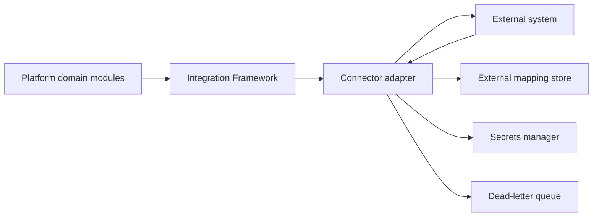

# SUB-0017 — Integration Architecture

**Document ID:** SUB-0017
**Title:** Integration Architecture
**Version:** 0.1 (Draft)
**Status:** Draft
**Owner:** ERP Integration Architect
**Reviewers:** Principal Software Architect, Payments Architect, Security Architect
**Created Date:** 2026-09-23
**Last Updated:** 2026-09-23
**Dependencies:** [SUB-0009](SUB-0009_Payments_Collections_Specification.md), [SUB-0011 System Architecture](SUB-0011_System_Architecture.md)
**Related Documents:** SUB-0018 Non-Functional Requirements (planned)

## 1. Connector architecture

Every connector is an anti-corruption adapter (SUB-0009 §2.1 applies the same pattern to payments): the external system's identifiers, states, and error codes are translated at the connector boundary and never become canonical domain state (SUB-0004, ADR pattern established in SUB-0011). A `Connector` and `ExternalMapping` record (SUB-0004 §5, platform/governance context) exist per configured integration instance, tenant-scoped.

## 2. Connector interface (common contract)

Every connector implements the same interface regardless of external system category:

| Operation | Contract |
|---|---|
| `authenticate()` | Establishes a session/token using credentials resolved from the secrets manager (§4); never accepts inline credentials in configuration |
| `send(payload, idempotencyKey)` | Outbound call, idempotent by the connector's own reference scheme; retried per §5 |
| `receive(rawPayload)` | Inbound call/webhook handling, verified and mapped per §3 before reaching any domain module |
| `healthCheck()` | Reports connector health (latency, error rate) to the monitoring surface (§7) |
| `reconcile(window)` | Produces a batch comparison against the platform's own records for the declared period (§6) |

## 3. Authentication and credential storage

- Every connector's credentials live exclusively in the secrets manager (SUB-0014 §6), referenced by ID from the `Connector` configuration row — never stored in the primary database or application configuration files.
- Authentication method is connector-specific (OAuth2 client credentials, API key, mTLS certificate) but always resolved through the same workload-identity-mediated retrieval path (SUB-0014 §2).
- Credential rotation follows SUB-0014 §6's schedule; a connector's health check fails closed (marks the connector `DEGRADED`) rather than silently continuing with an expired credential.

## 4. Mapping

- `ExternalMapping` stores `(tenant_id, system, external_type, external_id) → internal_typed_id`, with a sync version and conflict state.
- Mapping is bidirectional: an inbound record from the external system resolves to the correct internal aggregate, and an outbound export carries the external system's expected identifier once previously mapped, or requests a new mapping on first sync.
- A mapping conflict (the external system's record no longer matches the expected internal state) is surfaced as an operator-visible exception, never silently overwritten.

## 5. Retry and rate limits

- Every outbound call is retried with bounded exponential backoff per connector-specific rate-limit awareness (respecting the external system's documented limits, not just the platform's own defaults).
- A connector-specific idempotency reference prevents a retried outbound call from creating a duplicate record in the external system (mirrors SUB-0009 §2.4's payment-attempt discipline, generalized to every connector).
- Rate-limit state is tracked per connector instance; a connector approaching its external rate limit sheds load gracefully (queues rather than fails) before hitting a hard external block.

## 6. Reconciliation

Every connector supports a `reconcile(window)` operation producing control totals/record counts compared against the platform's own records for the same period — this is the same finding shape used throughout the platform (SUB-0006 §9, SUB-0010 §9): an unreconciled record beyond SLO is an operator-visible finding with evidence, never silently absorbed.

## 7. Monitoring and dead-lettering

- Every connector exposes health, latency, error-rate, and reconciliation-status metrics (SUB-0011 §12 business telemetry).
- A message that repeatedly fails processing (inbound or outbound) moves to a per-connector dead-letter queue with reason and attempt history, operator-visible with a safe replay control — matching the dead-lettering discipline already established for domain events (SUB-0013 §11.1).

## 8. Configuration and versioning

- Connector configuration (endpoint, mapping rules, retry policy, rate-limit awareness) is tenant-scoped and versioned; a configuration change is audited identically to any other material mutation (SUB-0004 §5.14).
- A connector's integration contract with the external system is itself versioned where the external system supports API versioning (e.g., an ERP's API version); the platform pins a tested compatible version and upgrades deliberately, never automatically tracking "latest."

## 9. ERP connectors

| System | Scope |
|---|---|
| SAP S/4HANA | Journal-level posting export, AR/Revenue/Deferred Revenue/Cash/Tax/Gateway Fees/Refunds/Write-offs (SUB-0010 §10) |
| SAP ECC | Same scope, legacy API surface |
| Oracle Fusion | Same scope |
| Oracle EBS | Same scope, legacy API surface |
| NetSuite | Same scope |
| Dynamics 365 Finance | Same scope |

ERP export is Release 2/Enterprise scope (SUB-0003 §2); the MVP horizon provides the underlying evidence trail (Settlement, JournalEntry) so no data-model rework is needed when a specific ERP connector is built (SUB-0010 §10). ERP acknowledgement and batch/control totals are reconciled per §6; an ERP-side rejection never silently changes a posted platform source document.

## 10. CRM connectors

| System | Scope |
|---|---|
| Salesforce | Customer/opportunity reference sync (MVP: stable external reference only, per SUB-0004 §2 "does not own subscription state or payment credentials"); full quote-to-subscribe automation is Release 2/Enterprise |
| HubSpot | Same scope |
| Dynamics (CRM) | Same scope |

CRM integration never becomes authoritative for subscription, billing, or payment state — the platform remains authoritative for those; CRM sync exchanges only stable external references and, in later scope, quote/order data.

## 11. Payment connectors

| System | Scope |
|---|---|
| Stripe | MVP — the first and only launch-scope payment adapter (SUB-0009 §1–§2, SUB-0011 ADR pattern from ADR-006 in SUB-ADR-REGISTER, "canonical payments with anti-corruption adapters") |
| Adyen | Release 2 — multi-gateway routing |
| Razorpay | Release 2 — India UPI/regional rail |
| PayPal | Release 2 |

Every payment connector implements the canonical `Payment`/`PaymentAttempt`/`Refund` model exactly as specified in SUB-0005 §4–§5, §8 and SUB-0009 §2 — provider-specific states and reason codes are mapped to the canonical taxonomy (SUB-0009 §2.5) at the connector boundary without exception.

## 12. Tax connectors

| System | Scope |
|---|---|
| Avalara | Release 2 — native tax determination |
| Vertex | Release 2 — native tax determination |
| Other regional providers | Release 2, launch-jurisdiction-dependent (Decision DEC-001) |

MVP accepts externally derived tax results and stores tax evidence (`TaxRecord`, SUB-0004 §5.11, SUB-0008 §8) without native determination; a tax connector's job in Release 2 is to produce that same evidence shape automatically rather than requiring manual/external input.

## 13. Messaging connectors

| Channel | Scope |
|---|---|
| Email | MVP (SUB-0009 §4.7) |
| SMS | Release 2 |
| WhatsApp | Release 2 |
| Push | Release 2 |

Every messaging connector honors consent, suppression, quiet hours, and frequency caps evaluated by the Communications context before send (SUB-0009 §4.2/§4.7) — the connector itself never bypasses this evaluation for delivery-optimization reasons.

## 14. Data/BI connectors

| System | Scope |
|---|---|
| Snowflake | Release 2 — versioned data product export |
| Databricks | Release 2 |
| Other BI platforms | Release 2, per tenant demand |

Data/BI export uses the same de-identified, separately-authorized pipeline pattern as any cross-tenant operational analytics (SUB-0014 §4) when aggregating across tenants; a single tenant's own data export uses the tenant-scoped export job pattern (SUB-0013 job pattern, applied here).

## 15. Acceptance criteria

1. Every connector implements the common interface (§2) regardless of external system category.
2. No connector stores a credential outside the secrets manager.
3. Every connector supports a `reconcile(window)` operation producing operator-visible findings for any discrepancy beyond SLO.
4. A repeatedly failing inbound or outbound message reaches a dead-letter queue with safe replay, never silently drops.
5. No CRM, tax, or BI connector becomes authoritative for subscription, billing, payment, or tax-determination state that the platform itself owns.
6. Every payment connector maps to the canonical Payment/PaymentAttempt model with no provider-specific state leaking into domain records.

## Decisions Requiring Product Owner Approval

| ID | Decision needed | Status |
|---|---|---|
| DEC-037 | ERP connector implementation priority order for Release 2 (which system first) | Open |
| DEC-038 | Tax provider selection by launch jurisdiction (extends DEC-001) | Open |
