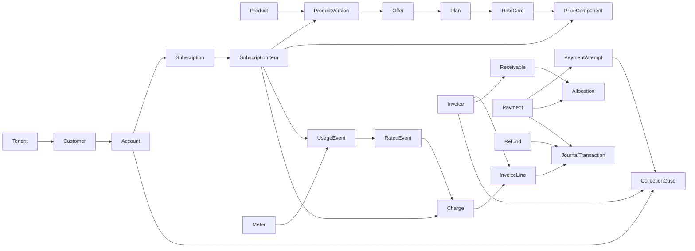

# Domain model

**Version:** 0.1  
**Status:** Conceptual model; logical and physical ERD follows in deliverable 07

## 1. Modeling principles

1. A commercial promise, consumption fact, calculated charge, legal invoice, movement of money, and accounting entry are different facts with different lifecycles.
2. Every aggregate has a platform ID, tenant ID, human/business key where useful, version, and audit metadata.
3. Activated commercial configuration and posted financial facts are immutable. Corrections create a new version, adjustment, or reversal.
4. Cross-context references use stable IDs and published contracts, not shared mutable objects.
5. Provider states are translated at an anti-corruption boundary; they never define canonical payment state.
6. Amounts use currency-aware value objects and fixed-precision arithmetic. Time periods have explicit inclusive/exclusive boundaries.
7. The Revenue Lifecycle Graph is derived from authoritative links and events; it is not a second source of financial truth.

## 2. Ubiquitous language

| Term | Meaning |
|---|---|
| Tenant | Security, configuration, and data-isolation boundary for one merchant organization. |
| Customer | Party receiving or buying value; may own one or more billing accounts. |
| Account | Commercial and receivables boundary that owns subscriptions, invoices, balance, contacts, and payment terms. |
| Product | Stable identity for something offered; its mutable definition exists only through Product Versions. |
| Offer | Market/channel/segment-specific sellable packaging of products and terms. |
| Plan | Recurring commercial configuration chosen by a subscriber. |
| Rate Card | Effective-dated set of price components and rating rules. |
| Price Component | One charge-producing rule such as recurring, seat, usage, tier, or one-time. |
| Subscription | Effective-dated agreement to receive an offer/plan under captured commercial terms. |
| Subscription Item | One subscribed product/component with quantity, service dates, and price snapshot references. |
| Meter | Definition of a measurable unit, dimensions, aggregation, and correction policy. |
| Usage Event | Immutable statement that a measurable event occurred. |
| Rated Event | Deterministic pricing result for one event or aggregate under one price version. |
| Charge | Billable economic fact produced by subscription, usage, or adjustment logic. |
| Invoice | Legal demand for payment; draft is recalculable, posted is immutable. |
| Payment | Logical intent/movement to satisfy receivables, independent of provider attempts. |
| Payment Attempt | One interaction with a gateway/rail for a payment. |
| Allocation | Application of payment or credit to a receivable. |
| Collection Case | Managed work to prevent or resolve delinquency for an account or invoice set. |
| Journal Transaction | Balanced set of immutable ledger entries created from a business event. |
| Lifecycle Edge | Typed, attributable relationship from one commercial/financial node to another. |

## 3. Bounded contexts

| Context | Responsibilities | Owns | Does not own |
|---|---|---|---|
| Identity & Tenant | Tenant lifecycle, users, roles, policies, service identities | Tenant, User, Role, Permission, ApprovalPolicy | Customer identity, payment credentials |
| Customer | Parties, billing accounts, contacts, addresses, external keys | Customer, Account, Contact, Address | Subscription state, account balance calculation |
| Catalog | Product hierarchy, offers, plans, publication | Product, ProductVersion, Offer, Plan | Customer-specific subscription agreement |
| Pricing | Rate cards, components, rules, simulation, activation | RateCard, PriceComponent, PriceRule, CalculationTrace | Invoice legal state |
| Subscription | Lifecycle, items, effective changes, renewal | Subscription, SubscriptionItem, SubscriptionChange | Product master, usage facts |
| Metering | Meter definitions, ingestion, deduplication, corrections | Meter, UsageEvent, UsageCorrection, UsageAggregate | Monetary price calculation |
| Rating | Allowances and deterministic conversion of usage to charge facts | RatedEvent, RatingRun, Charge | Invoice presentation and collection |
| Billing | Bill scheduling, proration, invoice assembly and finalization | BillingSchedule, BillingRun, Invoice, InvoiceLine, CreditNote | Provider payment execution |
| Receivables | Account balance, allocations, disputes, write-offs, subledger | Receivable, Allocation, CreditBalance, Dispute, JournalTransaction | Gateway attempt state |
| Payments | Token references, logical payments, attempts, refunds, provider adapters | PaymentMethodRef, Payment, PaymentAttempt, Refund | Raw payment credentials, invoice calculation |
| Collections | Risk assessment, dunning policy, cases, promises, actions | RiskAssessment, CollectionCase, DunningRun, PromiseToPay | Invoice truth, payment provider truth |
| Communications | Templates, preferences, delivery requests and outcomes | Template, Notification, DeliveryAttempt | Collections policy decision |
| Audit & Governance | Append-only audit, approvals, configuration evidence | AuditEvent, ApprovalRequest, PolicyDecision | Domain aggregate state |
| Reporting & Graph | Read models, metrics, search, lifecycle traversal | Projections and LifecycleEdge read model | Authoritative transactional state |
| Integration | Credentials, mappings, webhooks, import/export jobs | Connector, ExternalMapping, WebhookEndpoint, Delivery | External systems of record |

## 4. Aggregate map

The arrows mean “is authoritatively related to,” not necessarily foreign-key direction. Deliverable 07 defines physical keys and cardinality.

## 5. Core aggregates

### Tenant

**Root:** `Tenant`  
**Identity:** `tenant_id`; business key `tenant_slug`  
**Contains/references:** tenant settings, default locale/time zone, feature flags, legal-entity placeholders, retention policy.  
**Lifecycle:** `PROVISIONING → ACTIVE → SUSPENDED → CLOSED`.  
**Invariants:** tenant slug is globally unique; closing is not deletion; material configuration changes are audited; every owned record carries `tenant_id`.

### Customer and Account

**Roots:** `Customer`, `Account`  
**Identity:** platform IDs plus tenant-scoped customer/account numbers.  
**Relationships:** Customer 1..* Accounts; Account owns bill-to contacts, payment terms, invoice grouping policy, and subscription references.  
**Lifecycle:** `PROSPECT | ACTIVE | SUSPENDED | CLOSED`; financial references survive closure.  
**Invariants:** an invoice and subscription belong to exactly one account; account currency/legal-entity changes cannot rewrite existing documents.

### Product, Offer, Plan, and Rate Card

**Roots:** `Product`, `Offer`, `Plan`, `RateCard`; `ProductVersion` is immutable after publication.  
**Key concepts:** market, segment, channel, geography, currency, tax category, accounting classification, effective period, publication status.  
**Lifecycle:** `DRAFT → IN_REVIEW → ACTIVE → RETIRED`; rejection returns a new draft/revision, never mutates active facts.  
**Invariants:** active effective ranges for the same business key cannot overlap unless an explicit selection dimension makes them mutually exclusive; rate tiers have complete, ordered, non-overlapping bounds; published dependencies resolve to published compatible versions.

### Subscription

**Root:** `Subscription`  
**Children:** Subscription Items, terms snapshot, schedule, change records.  
**References:** Account, Offer/Plan version, Product Version, Price Components.  
**Lifecycle:** specified in deliverable 08.  
**Invariants:** all items share subscription/account/tenant; changes have requested and effective time; commercial snapshot is preserved; state/version update is optimistic and idempotent; cancellation cannot erase earned or billed facts.

### Meter and Usage

**Roots:** `Meter`, `UsageEvent`; ingestion treats each event as independently addressable.  
**Identity:** `(tenant_id, source, source_event_id)` is unique; internal `usage_event_id` remains stable.  
**Key concepts:** measurement unit, event time, received time, quantity, dimensions, subscription/customer references, schema version, disposition.  
**Disposition:** `RECEIVED → ACCEPTED | REJECTED | QUARANTINED`; accepted processing continues `UNRATED → RATED`, with separate correction links.  
**Invariants:** acknowledgement follows durable persistence; event time never changes; correction references original event; deduplication returns the original disposition.

### Rating and Charge

**Roots:** `RatingRun`, `Charge`; `RatedEvent` is a result record.  
**Inputs:** immutable usage set/aggregate, price version, allowance state, calculation policy version.  
**Outputs:** money, quantity, service period, tax/accounting classification, complete calculation trace.  
**Invariants:** identical canonical inputs and engine version produce identical output; each input is consumed once per rating purpose/version; replay either returns existing output or produces a linked correction, never a duplicate active charge.

### Invoice

**Root:** `Invoice`  
**Children:** Invoice Lines, totals, tax records, document render references, status history.  
**References:** Account, Charges, legal entity, payment terms, currency, corrective document.  
**Lifecycle:** specified in deliverable 09.  
**Invariants:** draft can change; finalization atomically freezes lines/totals and allocates number; totals reconcile (`subtotal - discounts + tax + adjustments = total` under defined sign rules); posted changes use legal corrective documents.

### Receivables and subledger

**Roots:** `Receivable`, `JournalTransaction`, `CreditBalance`.  
**Key concepts:** open amount, due buckets, applications/allocations, debit/credit ledger accounts, source document.  
**Invariants:** journal transaction debits equal credits per currency; entry rows are immutable; open amount is derived from posted source and allocations; an allocation cannot exceed eligible unapplied value or open receivable unless policy explicitly creates an overpayment balance.

### Payment

**Root:** `Payment`  
**Children:** Payment Attempts; allocations remain owned by Receivables.  
**References:** Account, payment method token reference, provider route, provider transaction IDs.  
**Lifecycle:** specified in deliverable 10.  
**Invariants:** a logical payment has one intended amount/currency; each provider call has a unique idempotency reference; success is based on authenticated provider evidence; asynchronous methods distinguish authorized/pending/settled; refunds cannot exceed refundable settled amount.

### Collection Case

**Root:** `CollectionCase`  
**Children:** action schedule, communications, promises, notes, outcomes.  
**References:** Account, invoices/receivables, risk assessment, failed attempts.  
**Lifecycle:** specified in deliverable 11.  
**Invariants:** actions satisfy contact policy, consent, quiet hours, and stop conditions; payment/waiver/dispute changes reevaluate scheduled work; recommendations retain reason codes and policy version.

### Audit and Approval

**Roots:** `AuditEvent`, `ApprovalRequest`.  
**Key concepts:** actor, delegated actor, action, object, correlation/causation ID, source, timestamp, reason, before/after hash or safe diff, decision evidence.  
**Invariants:** append-only; tenant-scoped access; no secret, raw credential, or prohibited sensitive data; maker cannot approve own request when separation-of-duties policy applies.

## 6. Shared value objects

| Value object | Rules |
|---|---|
| Money | Integer minor amount or explicit decimal scale plus ISO currency; arithmetic rejects mixed currencies. |
| Quantity | Fixed precision decimal, unit of measure, and scale; negative values require correction semantics. |
| EffectivePeriod | `[start, end)` in a named business time zone; open end allowed. |
| ServicePeriod | Explicit instants/dates and boundary convention preserved on charge/invoice line. |
| Percentage | Decimal with declared scale and valid range; basis is explicit. |
| TaxEvidence | Jurisdiction, category, provider/reference, rate/amount, timestamp, and inputs hash. |
| CalculationTrace | Typed operation tree with inputs, rule/version IDs, intermediate values, rounding, and result. |
| ExternalReference | System, type, value; tenant-scoped uniqueness policy. |
| Actor | Human/service/system identity, authentication context, and delegated identity. |
| Reason | Controlled code plus optional safe note; required for sensitive mutations. |

## 7. Commands, facts, and projections

| Type | Examples | Contract |
|---|---|---|
| Command | `ActivatePrice`, `ChangeSubscription`, `FinalizeInvoice`, `AttemptPayment` | May be rejected; carries actor, tenant, idempotency and expected version. |
| Domain fact | `subscription.changed`, `invoice.finalized`, `payment.succeeded` | Past tense, immutable, schema-versioned, emitted only after authoritative commit. |
| Integration fact | Normalized provider webhook or ERP acknowledgement | Authenticated and deduplicated; preserves provider evidence. |
| Projection | Customer 360, search index, revenue dashboard, lifecycle graph | Rebuildable; may be eventually consistent; shows freshness. |

## 8. Cross-context consistency

- **Single transaction:** aggregate change, idempotency outcome, audit pointer, and outbox fact for that change.
- **Process manager/saga:** subscription change spanning billing schedule and notification; invoice collection spanning gateway and receivables.
- **No distributed transaction:** external providers, search, analytics, email, warehouse, and ERP.
- **Reconciliation:** every asynchronous process has explicit status, retry policy, dead-letter/quarantine state, and an operator-visible reconciliation query.

## 9. Forward compatibility

The MVP reserves stable concepts for Contract, Entitlement, Legal Entity, Tax Record, Settlement, Revenue Schedule, Marketplace Party, and Reconciliation Match without making them mandatory runtime dependencies. Their later introduction must extend lifecycle lineage rather than overload Subscription, Invoice, or Payment.

