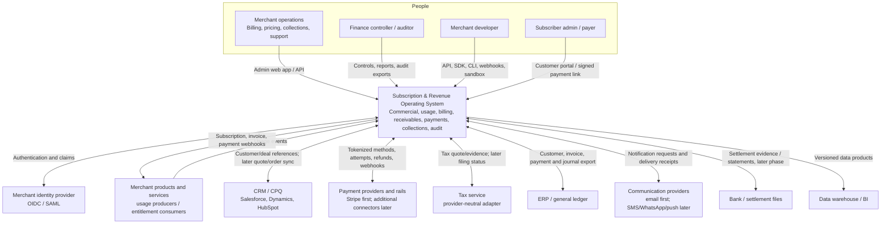
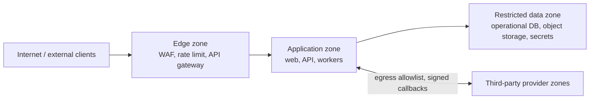

# System context

**Version:** 0.1  
**Scope:** MVP system boundary with enterprise extension points

## 1. Context diagram

## 2. Boundary statement

The platform is authoritative for catalog versions, subscription lifecycle, accepted usage facts, rating results, charges, invoices, receivables, canonical payment state, collection policy execution, and audit evidence. It is not the authoritative source for raw card/bank credentials, provider settlement truth, corporate identity, general ledger close, CRM opportunity state, or tax law content.

## 3. Actors

| Actor | Trust level | Key interactions | Authentication |
|---|---|---|---|
| Merchant operator | Privileged but least-privilege scoped | Configure, bill, collect, support | OIDC/SAML, MFA, tenant role and optional attributes |
| Finance controller | Privileged with separation of duties | Approve, reconcile, export, audit | OIDC/SAML, MFA, elevated approval permission |
| Merchant developer | Machine and human access | Integrate APIs, usage, webhooks | OIDC for console; OAuth client/mTLS or scoped secret for service |
| Subscriber admin | Untrusted external user with account scope | View/pay/change within policy | Portal identity or short-lived signed link for narrow action |
| Platform scheduler | Internal service principal | Billing runs, retries, notifications | Workload identity and scoped policy |
| Auditor | Read-only sensitive access | Evidence and lineage | Federated login, MFA, time-bounded role |

## 4. External system contracts

### Identity provider

- Supplies authenticated subject and claims; platform owns tenant membership and authorization decisions.
- A missing/disabled platform membership denies access even if identity authentication succeeds.
- Break-glass access is separate, time-limited, alerted, and audited.

### Merchant products and services

- Send idempotent usage records and receive signed versioned webhooks.
- May query subscription/entitlement view, but must tolerate projection lag unless using a financially material consistency endpoint.
- Cannot submit tenant ID as an untrusted override; tenant derives from credential scope.

### Payment provider

- Hosts or tokenizes credentials; platform stores provider/customer/method tokens and safe display metadata only.
- Provider webhooks are evidence, not blindly trusted commands: verify signature, timestamp, account mapping, uniqueness, and permissible transition.
- Connector maps provider-specific error and state into canonical reason/state while preserving raw safe reference data.

### Tax service

- MVP may call a provider or accept externally calculated tax according to launch scope.
- Invoice stores tax inputs hash, jurisdiction, provider/version, timestamp, rate/amount, and response reference so a posted result remains reproducible.

### ERP / general ledger

- Platform exports balanced business postings and source-document references.
- ERP acknowledgement and batch/control totals are reconciled; ERP is authoritative for corporate GL close.
- ERP rejection never silently changes a posted source document.

### Communications provider

- Receives rendered content or approved template/parameters through a connector.
- Delivery outcomes update notification state, not invoice/payment truth.
- Contact preferences, legal basis, quiet hours, and suppression rules are evaluated before send.

### CRM / CPQ

- MVP syncs stable customer/external references; quote-to-subscribe automation is later scope.
- Integration mapping records source, external ID, version, last synchronization, and conflicts.

## 5. Principal end-to-end data flows

### Configure to subscribe

`Operator → Catalog/Pricing → Approval → Active version → Subscription API/UI → Commercial snapshot → subscription.created webhook`

Trust checks: operator permission, maker-checker, non-overlapping effective dates, account ownership, idempotency, audit.

### Usage to posted invoice

`Product → Usage ingress → Durable accept/dedupe → Validate/enrich → Aggregate/rate → Charge → Billing run → Preview → Finalize → Receivable/ledger → Subscriber notification`

Trust checks: scoped source credential, schema/version, tenant derivation, source event uniqueness, deterministic price version, balanced posting.

### Invoice to cash

`Invoice due → Risk/policy → Payment → Provider attempt → Authenticated callback/poll → Canonical success → Allocation/ledger → Receipt → ERP export`

Trust checks: idempotency at logical payment and provider attempt, callback signature, amount/currency match, legal transition, allocation constraint, reconciliation.

### Failed payment to collection

`Failure reason → Risk assessment → Policy decision → Collection case/action → Communication or retry → Payment outcome → stop/escalate/close`

Trust checks: protected-attribute exclusion, contact rules, retry caps, gateway policy, human approval thresholds, full decision evidence.

## 6. Trust zones and sensitive data

| Data class | Examples | Rule |
|---|---|---|
| Restricted financial | Invoice lines, balances, payment tokens, tax identifiers | Encrypt, tightly authorize, audit reads/mutations where appropriate, redact logs |
| Confidential business | Pricing, usage, contracts, customer contacts | Tenant isolation, least privilege, retention controls |
| Security secret | API secret, signing key, provider credential | Secrets manager only; never database/log/event payload |
| Internal operational | Trace IDs, job state, non-sensitive metrics | Tenant-safe labels; no high-cardinality PII in metrics |
| Public | Published docs and SDK examples | Review before publication; synthetic data only |

## 7. Failure and ownership expectations

- External timeouts produce an explicit `UNKNOWN/PENDING` process state, not assumed failure or success.
- Retries are bounded and idempotent; dead letters/quarantines are visible with safe replay controls.
- Every connector has health, latency, error, and reconciliation metrics.
- The platform remains able to preview bills and accept durable usage during non-critical provider outages when safe.
- Payment, invoice, and ledger uncertainty is surfaced to operators; it is never hidden by an optimistic dashboard projection.

## 8. Out-of-boundary items

Raw payment credential capture, identity password storage, CRM opportunity management, statutory tax content maintenance, bank settlement network operation, corporate general ledger close, and merchant product access enforcement are outside the platform. The system supplies secure integrations and traceable facts for them.

