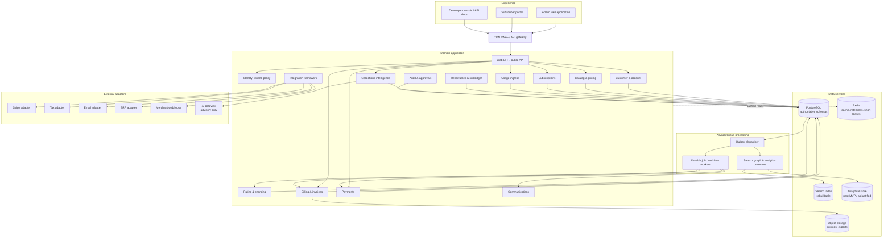

# Logical architecture

**Version:** 0.1  
**Status:** Proposed baseline; deployment topology is deliverable 25

## 1. Architecture summary

The MVP uses a **domain-modular application with separately scalable workers**, PostgreSQL as the authoritative store, transactional outbox/inbox patterns for reliable asynchronous work, Redis for non-authoritative acceleration, object storage for documents, and provider adapters at explicit ports. This preserves financial transaction boundaries and development speed while allowing high-volume metering, notification, search, and integration workloads to split when evidence justifies it.

The architecture has three inviolable rules:

1. Only authoritative domain modules can commit financial state.
2. Search, analytics, graph, cache, and AI are projections/consumers, never the source used to post money.
3. Every accepted command or event is tenant-scoped, idempotent where necessary, authorized, audited, and traceable by correlation/causation IDs.

## 2. Logical component diagram

Lines show principal dependencies, not unrestricted network access.

## 3. Component responsibilities

| Component | Responsibility | Authoritative writes |
|---|---|---|
| Admin web | Keyboard-accessible merchant operations and configuration | None directly; commands via API |
| Subscriber portal | Account-scoped self-service, invoice explanation, payments | None directly; policy-checked commands via API |
| API/BFF | Contract validation, authentication context, request shaping, rate limits, response composition | Idempotency envelope; delegates domain writes |
| Identity/Tenant/Policy | Membership, roles, attributes, approvals, tenant settings | Tenant and authorization configuration |
| Customer/Account | Customer master and billing account facts | Customer/account aggregates |
| Catalog/Pricing | Versioned commercial definitions, simulation and activation | Product/offer/plan/rate versions and calculation policies |
| Subscriptions | Lifecycle and effective-dated changes | Subscription aggregates and schedules |
| Usage ingress | Durable validation, dedupe, disposition | Raw accepted/rejected usage and ingestion metadata |
| Rating/Charging | Deterministic aggregation, rating and trace | Rated facts and charges |
| Billing/Invoice | Bill runs, preview, grouping, finalization, documents | Invoice aggregates and billing run state |
| Receivables/Subledger | Balances, allocation, credit, immutable double entry | Receivable and journal transactions |
| Payments | Canonical payments, attempts, refunds, method references | Payment aggregates; never raw credentials |
| Collections | Risk facts, policy decision, case workflow | Assessments, cases, promises and actions |
| Communications | Template rendering and delivery lifecycle | Notification/delivery state |
| Audit/Approvals | Append-only evidence and maker-checker | Audit and approval records |
| Integration framework | Ports, mappings, webhook ingress/egress, exports | Connector configs, safe evidence and delivery state |
| Projectors | Rebuildable graph/search/metrics views | Projection stores only |
| AI gateway | Model allowlist, grounding, redaction, evaluations and action policy | AI interaction evidence; no direct financial writes |

## 4. Request and event processing

### Synchronous command

1. Edge authenticates transport, applies coarse rate controls, and passes a correlation ID.
2. API resolves tenant from credential/membership, never from a trusted-by-default body field.
3. Policy checks action, resource attributes, maker-checker status, and expected aggregate version.
4. One database transaction validates invariants, writes aggregate changes, records idempotency outcome/audit pointer, and appends an outbox record.
5. Response returns canonical resource version and correlation ID.
6. Dispatcher publishes the fact; consumers deduplicate through inbox/checkpoint state.

### Usage ingestion

1. Authenticate source and derive tenant.
2. Validate envelope and impose batch/size/cardinality limits.
3. Insert by unique source-event key and acknowledge only durable disposition.
4. Asynchronously enrich and resolve subscription/meter; quarantine unresolved facts.
5. Aggregate/rate using effective event time and pinned rule versions.
6. Store charge and calculation trace atomically; publish facts for billing.

### Provider callback

1. Preserve the raw request only as permitted and verify signature/timestamp/provider account.
2. Deduplicate provider event ID.
3. Map to an existing attempt using stored external mapping.
4. Validate amount/currency and legal canonical transition.
5. Commit payment state + evidence + outbox; allocation occurs idempotently in Receivables.
6. Unknown/out-of-order callbacks enter a reconciliation queue instead of forcing a state.

## 5. Data architecture

### Authoritative PostgreSQL

- Separate schemas by bounded context, one logical cluster initially.
- Every tenant-owned table includes non-null `tenant_id`; unique keys include tenant scope unless truly global.
- Row-level security is defense in depth, paired with application policy and mandatory repository filters.
- Optimistic aggregate versions prevent lost updates.
- Append-only partitions for usage, audit, and ledger-style records; lifecycle/retention policy is explicit.
- Invoice/payment posting uses ACID transactions and constraints, not cache/distributed lock correctness.

### Redis

Used for response cache, rate limits, short leases, and ephemeral coordination. Redis eviction or loss must not lose accepted usage, idempotency decisions, billing schedules, financial state, or audit evidence.

### Object storage

Stores versioned rendered invoices, exports, import files, and large evidence with content hashes, encryption, retention controls, malware scanning for uploads, and tenant-aware access through short-lived signed URLs.

### Search and analytics

Search and analytical views consume versioned events/outbox records and expose projection freshness. Rebuild procedures are mandatory. Metrics definitions are version-controlled. No projection can authorize or post a financial action.

## 6. Consistency matrix

| Operation | Required model | Mechanism |
|---|---|---|
| Activate a price version | Strong | Approval/state/version checks in one transaction |
| Change subscription | Strong per aggregate | Optimistic concurrency + idempotency + outbox |
| Accept/dedupe usage | Strong on event identity | Unique constraint and durable disposition |
| Rate usage | Exactly-once business effect | Deterministic key, unique active result, idempotent replay |
| Finalize invoice | Strong | Freeze totals/lines, number allocation and posting transaction |
| Post payment/allocation | Strong | Legal state transition and balanced posting transaction |
| Provider interaction | Eventual/uncertain | Idempotent attempt + callback/poll + reconciliation |
| Notification | Eventual | Durable job, retries and delivery receipts |
| Search/dashboard/graph | Eventual | Projectors with freshness watermark |
| ERP export | Eventual and reconciled | Batch/control totals, acknowledgement, replay |

## 7. Architecture decisions

### ADR-LA-001 — Begin with a modular monolith plus independent workers

- **Decision:** Keep transactional domain modules in one deployable API/application initially; run asynchronous/scale-sensitive workers separately and enforce module boundaries in code and database schemas.
- **Alternatives:** microservices per bounded context; serverless functions per operation.
- **Advantages:** simpler transactions for invoice/receivables, fewer failure modes, faster development, coherent local testing, lower operating cost.
- **Disadvantages:** coarse deployment unit, risk of boundary erosion, shared database contention if unmanaged.
- **Rationale:** the domain is not yet empirically stable, and premature distributed transactions are especially dangerous for money. Usage ingress/rating and integrations have clear seams for later extraction.
- **Implications:** architecture tests forbid cross-module table access; ownership is explicit; outbox contracts exist even for in-process consumers; extraction triggers are measured.

### ADR-LA-002 — PostgreSQL is the MVP system of record

- **Decision:** Use PostgreSQL for transactional aggregates, idempotency, outbox/inbox, audit references, and subledger records.
- **Alternatives:** distributed SQL; document database; event store as primary source.
- **Advantages:** mature ACID semantics, constraints, indexing, JSON support where appropriate, operational familiarity.
- **Disadvantages:** horizontal write scale requires partitioning/read replicas or eventual service extraction; tenant hot spots require management.
- **Rationale:** integrity and operational clarity outweigh speculative global scale for the MVP.
- **Implications:** design partition keys now, benchmark usage tables, avoid database-specific leakage in public contracts, and define archival/restore procedures.

### ADR-LA-003 — Transactional outbox/inbox rather than dual writes

- **Decision:** Commit domain state and an outbox record atomically; consumers track dedupe/checkpoints.
- **Alternatives:** publish directly inside request; distributed transaction; change-data-capture only.
- **Advantages:** no state/event dual-write gap, replayability, transport independence.
- **Disadvantages:** eventual delivery, dispatcher operations, duplicate delivery handling.
- **Rationale:** facts must not disappear after a successful financial commit.
- **Implications:** all consumers are idempotent; ordering is scoped to an aggregate key; schemas are versioned; lag is observable.

### ADR-LA-004 — Workflow state is durable and explicit

- **Decision:** MVP may use database-backed jobs/process managers; adopt a Temporal-style engine when workflow volume/complexity justifies it without embedding workflow-engine types in domain contracts.
- **Alternatives:** cron plus ad hoc flags; introduce Temporal immediately; broker-only choreography.
- **Advantages:** controlled incremental complexity, restartable work, visible timeouts/retries.
- **Disadvantages:** an interim job framework must be disciplined; later migration work.
- **Rationale:** invoice runs and collections need durability now, but a new workflow platform is not necessary before flows stabilize.
- **Implications:** every job has stable identity, state, lease, retry limit, next attempt, correlation, and operator recovery.

### ADR-LA-005 — REST/OpenAPI commands and versioned asynchronous facts

- **Decision:** Use REST with OpenAPI for external synchronous APIs and CloudEvents-style envelopes with JSON Schema/AsyncAPI documentation for asynchronous facts.
- **Alternatives:** GraphQL-first; gRPC public APIs; proprietary webhook shapes.
- **Advantages:** broad interoperability, generated clients, explicit idempotency and resource semantics, portable events.
- **Disadvantages:** multiple contracts to govern; REST can overexpose CRUD if not command-oriented.
- **Rationale:** merchant developers need familiar, toolable contracts; domain facts need independent evolution.
- **Implications:** compatibility policy and contract tests are release gates; sensitive internals never leak into public schemas.

### ADR-LA-006 — Canonical payments with anti-corruption adapters

- **Decision:** Model Payment, Attempt, Method Reference, Refund, and provider reason mapping internally; Stripe is only the first adapter.
- **Alternatives:** use Stripe objects as canonical model; outsource all payment state to gateway.
- **Advantages:** future gateway routing, stable APIs, testable failure behavior, reduced vendor coupling.
- **Disadvantages:** mapping and reconciliation complexity; lowest-common-denominator risk.
- **Rationale:** provider neutrality is a product requirement and critical to regional expansion.
- **Implications:** preserve provider-specific metadata in an extension/evidence record; never collapse meaningful asynchronous states merely for uniformity.

### ADR-LA-007 — Persist the deterministic calculation trace

- **Decision:** Pricing/rating returns both result and typed calculation tree; invoice lines pin its ID/hash.
- **Alternatives:** recompute explanations; store only total and prose; rely on model-generated explanation.
- **Advantages:** auditability, reproducibility, customer explanation, regression testing.
- **Disadvantages:** storage and schema evolution cost; careful redaction needed.
- **Rationale:** “why was I charged?” is core product behavior and cannot depend on mutable configuration or AI memory.
- **Implications:** trace schema is versioned; calculation engine versions remain runnable for replay or have a certified compatibility strategy.

### ADR-LA-008 — Shared database, strong tenant controls in MVP

- **Decision:** Shared application/cluster with tenant-keyed rows, mandatory tenant context, RLS defense in depth, encryption, and tenant-aware caches/queues; dedicated deployment remains an enterprise option.
- **Alternatives:** database per tenant; schema per tenant; fully shared without database policy.
- **Advantages:** operational efficiency, fast provisioning, consistent migrations, scalable SaaS economics.
- **Disadvantages:** isolation mistakes have high impact; noisy-neighbor controls are required.
- **Rationale:** shared tenancy fits the initial SaaS product, while explicit tenant keys and ports preserve dedicated deployment options.
- **Implications:** cross-tenant negative tests are mandatory; support/admin access is time-bound and audited; all async envelopes carry trusted tenant context.

### ADR-LA-009 — AI is behind a governed advisory gateway

- **Decision:** Model calls use a gateway for redaction, allowlists, grounding references, prompt/model version, evaluations, and action policy. AI cannot write core financial tables.
- **Alternatives:** direct model calls from features; no AI in MVP.
- **Advantages:** consistent governance, provider flexibility, auditable explanations, deterministic fallback.
- **Disadvantages:** added platform work and response latency; limited autonomy.
- **Rationale:** AI is differentiating only when it is safe, explainable, and operationally bounded.
- **Implications:** an AI recommendation is data with provenance and expiry; a separate authorized command is required for any action.

## 8. Scale and extraction triggers

Split a module into its own service only when at least one measured condition applies: independent scaling is repeatedly constrained, release ownership requires isolation, data residency differs, failure blast radius is unacceptable, or a bounded context has stable contracts and distinct SLOs. First candidates are usage ingress/rating, notifications, webhook delivery, document rendering, search/projectors, and high-volume integrations—not invoice/subledger transactions by default.

## 9. Observability and operability

- One correlation ID crosses API, jobs, provider calls, outbox facts, webhooks, and audit references; causation IDs form the event chain.
- Technical telemetry includes RED/USE metrics; business telemetry includes accepted/quarantined usage, rating lag, bill-run progress, invoice finalization, payment conversion, outbox lag, notification delivery, and ledger reconciliation.
- Logs are structured, tenant-safe, and redacted. Monetary values may be restricted by environment and role.
- Every batch is restartable, resumable, and exposes progress/control totals.
- Operational runbooks cover provider outage, webhook backlog, stuck billing run, duplicate suspicion, projection rebuild, restore, and key rotation.

## 10. Technology baseline to validate

| Layer | Baseline | Validation needed |
|---|---|---|
| Web | React + Next.js + TypeScript | SSR/auth boundary, accessibility and portal isolation |
| Application | TypeScript/Node or Kotlin; choose after spike against pricing/batch needs | Decimal libraries, throughput, team capability, profiling |
| Database | PostgreSQL | partitioning, RLS, backup/restore, invoice contention |
| Cache | Redis | fail-open/fail-closed behavior per use |
| Events | Outbox first; Kafka-compatible transport when needed | ordering, retention, schema registry, operational cost |
| Search | PostgreSQL search initially or OpenSearch when scale requires | relevance, tenant filters, rebuild time |
| Object storage | S3-compatible | immutability, encryption, signed access, retention |
| Observability | OpenTelemetry | context propagation and PII-safe conventions |
| Deployment | Containers; Kubernetes only when operational scale warrants it | platform ownership, multi-zone, cost |

No named technology is approved solely by this table; the implementation plan must record the spike evidence and operational owner.

## 11. Risks requiring follow-up artifacts

- Pricing precision, proration and tier boundary semantics: deliverable 12.
- Aggregate tables, constraints, RLS, partitioning, and ledger shape: deliverable 07.
- Legal state transitions and reversal paths: deliverables 08–11.
- API idempotency/error/pagination conventions: deliverable 13.
- Event compatibility, ordering, and retention: deliverable 14.
- Threat model, key management, PCI scope, support access: deliverable 15.
- Tenant isolation and dedicated deployment path: deliverable 16.
- Capacity targets and multi-zone topology: deliverable 25.

