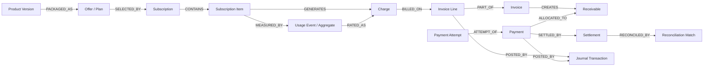
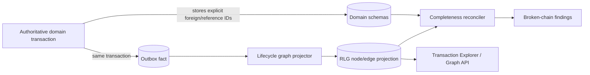

# Revenue Lifecycle Graph design

**Version:** 0.1  
**Status:** Proposed  
**Purpose:** Native, bidirectional traceability from commercial configuration to accounting evidence

## 1. Product intent

The Revenue Lifecycle Graph (RLG) answers two classes of question without inventing financial facts:

- **Forward:** What did this offer, subscription change, or usage event eventually produce?
- **Backward:** Which commercial rule and source event caused this invoice line, payment allocation, settlement, or ledger entry?

The graph is a traceability and operations capability. Authoritative domain tables remain the source of truth; the graph is a rebuildable, access-controlled projection of their stable identities and explicit relationships.

## 2. Design principles

1. Every edge is attributable to an authoritative record or versioned domain fact.
2. No graph edge may create financial meaning that the source domains do not contain.
3. Nodes use stable platform identities and preserve source versions.
4. Corrections add relationships; they never rewrite history.
5. Cross-tenant edges are structurally impossible.
6. The graph exposes projection freshness and completeness.
7. AI can summarize a verified subgraph but cannot add nodes, edges, amounts, or causal claims.

## 3. Canonical lifecycle



Not every path contains usage, payment, settlement, or enterprise accounting nodes. A flat recurring invoice, an unpaid invoice, and an externally settled invoice have different valid shapes. Completeness is evaluated against the expected path for the applicable business process.

## 4. Node model

Each projected node contains:

| Field | Meaning |
|---|---|
| `tenant_id` | Mandatory isolation key derived from the authoritative source. |
| `node_type` | Registered semantic type such as `SUBSCRIPTION`, `USAGE_EVENT`, or `INVOICE`. |
| `node_id` | Stable platform ID of the authoritative record. |
| `source_version` | Aggregate/configuration version represented by this node where relevant. |
| `business_key` | Safe display identifier such as subscription or invoice number. |
| `occurred_at` | Business occurrence time. |
| `effective_at` | Commercial effective time where applicable. |
| `state` | Current or represented state, explicitly labeled as projected. |
| `amount_minor`, `currency` | Optional normalized display amount copied from source facts. |
| `source_context` | Owning bounded context. |
| `source_event_id` | Domain fact/outbox record that produced or refreshed the node. |
| `projected_at` | Projection timestamp used for freshness. |
| `classification` | Data/security class used to filter attributes. |

Node identity is `(tenant_id, node_type, node_id, source_version?)`. Stateful aggregates normally have one current node plus state history available from domain/audit events. Immutable versions and financial documents may use version as part of identity.

### Registered node types

| Layer | MVP node types | Later node types |
|---|---|---|
| Configuration | Product Version, Offer, Plan, Rate Card, Price Component, Meter | Contract template, promotion, tax rule |
| Commercial | Customer, Account, Subscription, Subscription Item, Subscription Change | Quote, Contract, Amendment, Entitlement |
| Consumption | Usage Event, Usage Aggregate, Rated Event, Rating Run | Allowance bucket, mediation batch |
| Billing | Charge, Invoice Line, Invoice, Credit Note | Debit note, tax document, revenue event |
| Cash | Payment, Payment Attempt, Refund, Allocation | Payment plan, promise-to-pay |
| Settlement | — | Settlement, payout, bank statement line, reconciliation match |
| Accounting | Receivable, Journal Transaction, Journal Entry | Revenue schedule, performance obligation, GL batch |
| Governance | Approval, Audit Event, Policy Decision, Calculation Trace | AI action, configuration package |

## 5. Edge taxonomy

Edges are directed but traversable in both directions.

| Edge type | From → to | Meaning / source |
|---|---|---|
| `VERSION_OF` | Product Version → Product | Immutable configuration version belongs to stable identity. |
| `PACKAGED_AS` | Product Version → Offer/Plan | Published catalog relationship. |
| `PRICED_BY` | Plan/Subscription Item → Rate Card/Price Component | Commercial price selection. |
| `SELECTED_BY` | Offer/Plan → Subscription | Subscription captured the offered version. |
| `CONTAINS` | Subscription → Subscription Item | Aggregate membership. |
| `CHANGED_BY` | Subscription → Subscription Change | Effective-dated lifecycle change. |
| `MEASURED_BY` | Subscription Item → Usage Event/Aggregate | Usage attribution. |
| `AGGREGATES` | Usage Aggregate → Usage Event | Proven membership or stored membership-set reference. |
| `RATED_AS` | Usage Event/Aggregate → Rated Event/Charge | Deterministic rating result. |
| `GENERATES` | Subscription Item/Change → Charge | Recurring, seat, one-time, or proration charge. |
| `EXPLAINED_BY` | Charge/Invoice Line → Calculation Trace | Typed calculation evidence. |
| `BILLED_ON` | Charge → Invoice Line | Charge included or adjusted on legal document. |
| `PART_OF` | Invoice Line → Invoice | Legal document composition. |
| `CREATES` | Invoice → Receivable | Posted amount creates AR. |
| `ATTEMPT_OF` | Payment Attempt → Payment | Provider interaction belongs to logical payment. |
| `ALLOCATED_TO` | Payment/Credit → Receivable | Monetary application with allocation identity/amount. |
| `REFUNDS` | Refund → Payment/Allocation | Return of settled funds. |
| `SETTLED_BY` | Payment → Settlement | Bank/provider settlement evidence. |
| `POSTED_BY` | Invoice/Payment/Refund → Journal Transaction | Balanced accounting effect. |
| `RECONCILED_BY` | Payment/Settlement/Journal → Reconciliation Match | Evidence of matching. |
| `CORRECTS` | Correction/adjustment → original record | Non-destructive correction. |
| `REVERSES` | Reversal → original financial record | Full or partial reversal. |
| `SUPERSEDES` | New configuration/version → prior version | Effective-dated succession. |
| `APPROVED_BY` | Configuration/action → Approval | Maker-checker evidence. |
| `GOVERNED_BY` | Action/result → Policy Decision | Versioned policy evaluation. |

Every edge stores `tenant_id`, `edge_type`, source/target typed IDs, authoritative relationship ID or event ID, validity timestamps where applicable, projection timestamp, and optional amount/quantity when the relationship itself carries value (for example an allocation).

## 6. Authoritative link and projection architecture



The MVP stores the RLG projection in PostgreSQL adjacency tables with typed indexes. A graph database is not required until measured traversal depth, relationship volume, or query latency exceeds this design.

### Projection guarantees

- Delivery is at least once; upserts use deterministic node/edge identities.
- Ordering is required only per authoritative aggregate or relationship key.
- A high-water mark exposes latest consumed outbox position/time by context.
- Rebuild reads authoritative records/events and writes to a shadow projection before atomic cutover.
- Projector failure does not roll back a valid financial transaction.

## 7. Expected-path policies

A path policy defines which nodes and deadlines are expected for a business scenario.

| Policy | Trigger | Expected continuation |
|---|---|---|
| Recurring bill | Active billable item reaches schedule | Charge → Invoice Line → posted Invoice → Receivable |
| Usage bill | Accepted usage before cutoff | Rated Event/Charge by rating SLO, then invoice by bill schedule |
| Autopay invoice | Posted invoice with active mandate | Payment + Attempt by due policy; success or explicit failure evidence |
| Successful payment | Canonical success | Allocation and balanced posting; settlement later if applicable |
| Refund | Approved refund command | Refund attempt/result, receivable/credit effect, balanced reversal posting |
| ERP export | Posted journal transaction | Export batch reference and acknowledgement/rejection |

Expected paths are versioned rules. A missing node is not automatically leakage: it may be pending, exempt, below threshold, disputed, not yet due, or intentionally manual.

## 8. Broken-chain detection

| Finding | Example | Severity basis |
|---|---|---|
| Missing successor | Accepted billable usage has no rating result after SLO. | Age × estimated exposure × customer/materiality |
| Orphan | Invoice line has no charge or permitted manual-adjustment source. | High by default for posted document |
| Duplicate branch | One active charge appears on two non-corrective invoices. | Critical unless grouping explicitly splits quantity |
| Inconsistent amount | Allocation edge exceeds payment available or receivable open amount. | Critical financial invariant |
| Illegal temporal order | Price effective after service period without correction marker. | High |
| Stale projection | Context watermark outside freshness SLO. | Operational; suppress causal conclusions |
| Unreconciled terminal | Payment succeeded but lacks allocation/posting beyond SLO. | High |

Findings contain rule/version, affected typed IDs, evidence, first/last detected time, state, owner, and resolution—not an AI-generated diagnosis.

## 9. Query and experience model

The Transaction Explorer starts at any permitted node and returns:

- an immediate neighborhood plus a summarized valid path;
- direction (`upstream`, `downstream`, `both`), type/depth/time filters;
- node state, business key, safe amount, timestamp, and owning context;
- edge meaning and authoritative evidence link;
- projection freshness and incomplete-path findings;
- permission-filtered deep links to source screens.

Conceptual query:

```text
GET /revenue-graph/nodes/{type}/{id}?direction=both&depth=4
```

The API specification will finalize limits, cursors, errors, and authorization. Bulk graph export is asynchronous and separately permissioned.

## 10. Corrections and temporal behavior

- A corrected usage event remains linked by `CORRECTS`; re-rating produces a new rated result and an adjustment/reversal charge.
- A credit note links to the invoice/lines it corrects; original invoice nodes remain unchanged.
- A retried payment attempt is a sibling `ATTEMPT_OF` the logical payment, not a replacement.
- A refund links to the settled payment and the affected allocation or account credit.
- A superseding price version links to its predecessor but never changes the price link captured by an existing charge.
- Effective time, recorded time, and projected time are separate so backdated corrections remain explainable.

## 11. Security and privacy

- Tenant ID is included in every primary/foreign index; projector credentials are tenant-aware or service-scoped with controlled cross-tenant processing.
- Authorization filters both nodes and attributes. Access to an invoice does not imply access to gateway evidence, AI context, or raw usage dimensions.
- Sensitive dimension values are redacted or summarized in the projection; the source screen performs detailed authorization.
- Support access is time-bound and audited. Graph exports are watermarked, encrypted, and retention-controlled.
- Node/edge deletion follows source retention policy. Legally retained financial nodes may keep pseudonymous party references after approved privacy action.

## 12. Architecture decision

### ADR-RLG-001 — Rebuildable relational graph projection first

- **Decision:** Store typed nodes/edges in PostgreSQL projection tables and query bounded-depth adjacency paths.
- **Alternatives:** graph database from MVP; calculate every traversal live across domain tables; event store as graph source.
- **Advantages:** low operational overhead, transactional projection updates, familiar tenant controls, simple rebuild and backup.
- **Disadvantages:** deep or highly connected traversals can become expensive; graph algorithms are limited.
- **Rationale:** primary product queries are short lifecycle paths with known types. Specialized graph infrastructure should follow measured need.
- **Implications:** public contracts are storage-neutral; query depth and result size are capped; load tests include high-fanout accounts.

## 13. Acceptance criteria

1. From a posted invoice line, a permitted user can reach its charge, calculation trace, subscription item, pinned price component, and usage or recurring source.
2. From a usage event, a permitted user can see disposition, rating/charge, invoice inclusion, and later correction lineage.
3. From a payment, a permitted user can see attempts, allocations, invoice/receivable, refunds, and postings without provider-specific semantics leaking into canonical state.
4. Replaying projection events creates no duplicate active nodes or edges.
5. A full rebuild produces identical edge counts and control hashes for a frozen dataset.
6. Cross-tenant traversal tests return no existence signal or data.
7. Broken-chain tests detect missing rating, duplicate billing, missing allocation, and stale projections with deterministic evidence.
8. “Explain my bill” uses only verified graph/calculation facts and cites their internal references.

