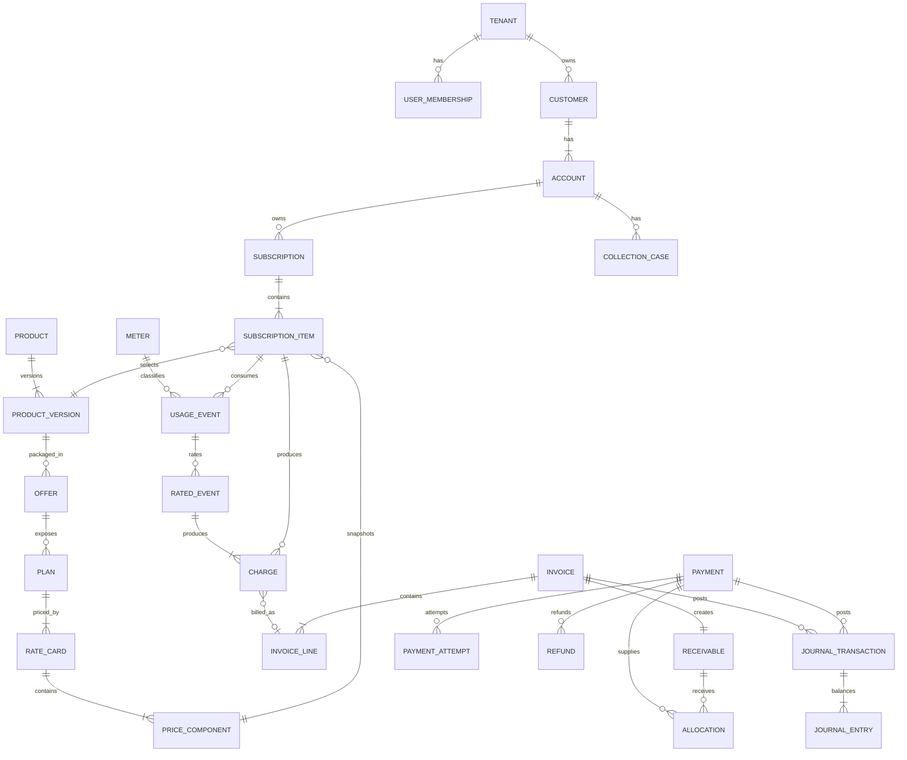
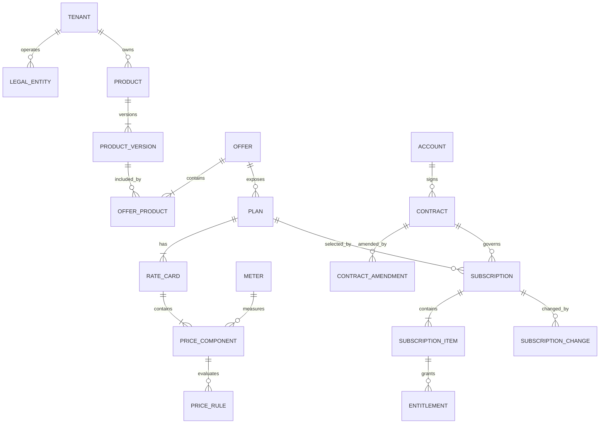
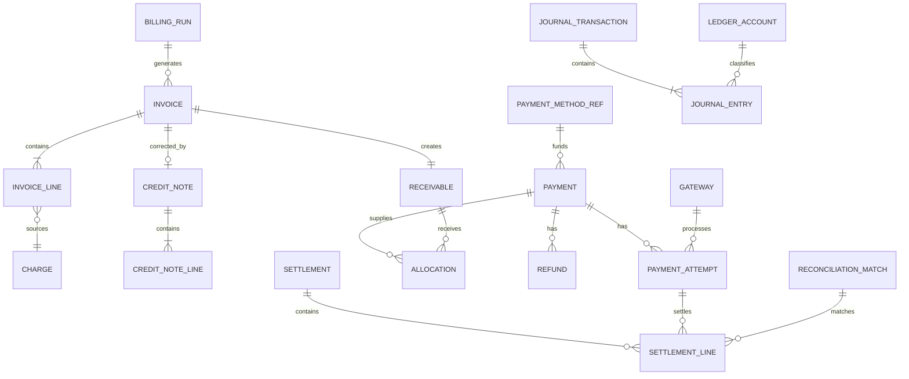

# Data model and ERD

**Version:** 0.1  
**Status:** Logical model with MVP physical guidance  
**Related:** [Domain model](03-domain-model.md), [Revenue Lifecycle Graph](06-revenue-lifecycle-graph.md)

## 1. Storage conventions

| Concern | Convention |
|---|---|
| Primary IDs | UUIDv7 or ULID generated by the application; final choice is benchmarked before schema freeze. |
| Tenant isolation | Every tenant-owned row has non-null `tenant_id`; foreign and unique constraints include tenant scope. |
| Business keys | Human-facing keys are unique within defined tenant/legal-entity scope and never serve as foreign keys. |
| Time | `timestamptz` in UTC for instants; `date` plus IANA time zone for business schedules. Effective ranges are `[start, end)`. |
| Money | `amount_minor bigint` plus ISO 4217 currency for settled/display money; calculation rates use fixed `numeric(38,18)`. |
| Quantity | `numeric(38,12)` plus unit code; meter may restrict scale. |
| Status | Validated domain enum/check value; transition history is separate for material lifecycles. |
| Versioning | `row_version bigint` for optimistic concurrency; effective configuration also has immutable semantic version/revision. |
| Audit columns | Mutable roots include `created_at`, `created_by`, `updated_at`, `updated_by`, `row_version`; immutable facts omit misleading update fields. |
| Soft deletion | Financial/configuration history is retired/closed, not deleted. PII erasure uses governed anonymization/purge workflows. |
| Flexible metadata | `jsonb` only for bounded extension fields/dimensions; monetary logic and searchable control fields are typed columns. |

## 2. High-level ERD

## 3. Configuration and commercial ERD

## 4. Financial ERD

## 5. Entity catalog

All rows below use the standard tenant and audit conventions unless identified as global or immutable. `MVP`, `R2`, and `ENT` identify delivery horizon, not importance.

### Platform, governance, and integration

| Entity | Horizon | Primary / business key | Important attributes and relationships | Status |
|---|---|---|---|---|
| Tenant | MVP | `tenant_id` / global `tenant_slug` | name, locale, timezone, default currency, data policy | provisioning, active, suspended, closed |
| User | MVP | `user_id` / identity-provider subject | non-secret profile; memberships provide tenant scope | invited, active, disabled |
| Role | MVP | `role_id` / tenant `role_code` | permission bindings, optional ABAC policy reference | draft, active, retired |
| UserMembership | MVP | `membership_id` / tenant+user | user, tenant, roles, valid period | invited, active, suspended, revoked |
| ApprovalRequest | MVP | `approval_id` / tenant `approval_number` | target type/id/version, maker, policy, decisions | pending, approved, rejected, expired, cancelled |
| Rule | MVP | `rule_id` / tenant `rule_code`+version | type, expression/decision table, effective period, checksum | draft, active, retired |
| Workflow | R2 | `workflow_id` / tenant `workflow_code`+version | trigger, steps, timeouts, policies | draft, active, paused, retired |
| AuditEvent | MVP | `audit_event_id` / immutable event ID | actor, action, target, reason, correlation, safe diff/hash | immutable |
| IdempotencyRecord | MVP | `idempotency_id` / tenant+scope+key | request hash, resource/result reference, expiry | processing, completed, failed-final |
| OutboxEvent | MVP | `outbox_id` / event ID | aggregate, schema/type/version, payload, correlation/causation | pending, published, quarantined |
| InboxReceipt | MVP | `inbox_id` / consumer+event ID | consumer, processing result, attempt | processing, completed, quarantined |
| Connector | MVP | `connector_id` / tenant `connector_code` | kind, safe config reference, credentials secret reference | draft, active, degraded, disabled |
| ExternalMapping | MVP | `mapping_id` / tenant+system+type+external ID | internal typed ID, sync version | active, conflicted, retired |
| WebhookEndpoint | MVP | `endpoint_id` / tenant `endpoint_code` | URL, subscribed event types, signing secret reference | active, paused, disabled |

### Customer and catalog

| Entity | Horizon | Primary / business key | Important attributes and relationships | Status |
|---|---|---|---|---|
| Customer | MVP | `customer_id` / tenant `customer_number` | party type, display name, external refs, segment | active, suspended, closed |
| Account | MVP | `account_id` / tenant `account_number` | customer, reserved legal-entity reference, currency, terms, balance policy | active, on_hold, closed |
| Contact | MVP | `contact_id` / optional external ref | customer/account, purpose, email/phone, consent refs | active, suppressed, inactive |
| Address | MVP | `address_id` | customer/account, purpose, validated fields, country | active, inactive |
| Product | MVP | `product_id` / tenant `product_code` | family/portfolio refs, product type | draft, active, retired |
| ProductVersion | MVP | `product_version_id` / product+version | effective range, attributes, tax/accounting classification | draft, in_review, active, retired |
| Offer | MVP | `offer_id` / tenant `offer_code`+version | market, segment, channel, currency, product-version members | draft, in_review, active, retired |
| Plan | MVP | `plan_id` / tenant `plan_code`+version | offer, cadence, trial/renewal policy | draft, in_review, active, retired |
| RateCard | MVP | `rate_card_id` / plan+version | currency, effective range, precedence, checksum | draft, in_review, active, retired |
| PriceComponent | MVP | `price_component_id` / rate card `component_code` | charge type, timing, quantity source, meter, rounding | draft, active, retired with parent |
| PriceRule | MVP | `price_rule_id` / component+sequence/version | condition, operation, tiers/matrix refs, trace label | draft, active, retired with parent |
| Meter | MVP | `meter_id` / tenant `meter_code`+version | unit, dimensions schema, aggregation, late/correction policy | draft, active, retired |
| Promotion | R2 | `promotion_id` / tenant `promotion_code`+version | eligibility, benefit, budget, effective range | draft, active, paused, expired |

### Contracts, subscriptions, and entitlements

| Entity | Horizon | Primary / business key | Important attributes and relationships | Status |
|---|---|---|---|---|
| Contract | R2 | `contract_id` / tenant+legal entity `contract_number` | account, parties, term, commitments, notice, PO | draft, in_review, active, expired, terminated |
| ContractAmendment | R2 | `amendment_id` / contract `amendment_number` | original contract, effective date, changed terms, approval | draft, approved, effective, superseded, withdrawn |
| Subscription | MVP | `subscription_id` / tenant `subscription_number` | account, plan snapshot, dates, billing anchor, state/version | see deliverable 08 |
| SubscriptionItem | MVP | `subscription_item_id` / subscription `item_number` | product version, price component/snapshot, quantity, service period | pending, active, paused, ended |
| SubscriptionChange | MVP | `change_id` / subscription `change_number` | command type, requested/effective time, before/after snapshot, proration result | scheduled, applied, cancelled, failed |
| BillingSchedule | MVP | `schedule_id` / subscription+schedule type | anchor, cadence, next run, business timezone | active, paused, completed |
| Entitlement | R2 | `entitlement_id` / tenant `entitlement_key` | account/subscription item, feature/resource, quantity, validity | pending, active, suspended, expired, revoked |

### Usage, rating, and billing

| Entity | Horizon | Primary / business key | Important attributes and relationships | Status |
|---|---|---|---|---|
| UsageEvent | MVP | `usage_event_id` / tenant+source+source event ID | event/received time, customer, subscription item, meter, quantity, dimensions, schema | received, accepted, rejected, quarantined; accepted events also track rating disposition |
| UsageCorrection | MVP | `correction_id` / tenant+source correction key | original event, delta/replacement semantics, reason | accepted, applied, rejected |
| UsageAggregate | MVP | `aggregate_id` / meter+item+window+dimensions hash+version | window, quantity, membership/control hash | open, closed, superseded |
| RatingRun | MVP | `rating_run_id` / tenant `run_number` | input window, engine/rule version, control totals | pending, running, completed, completed_with_errors, failed |
| RatedEvent | MVP | `rated_event_id` / deterministic input+purpose+version key | event/aggregate, rate card/component, amount, trace | rated, adjusted, reversed |
| CalculationTrace | MVP | `trace_id` / content hash | schema/engine version, typed operation tree, inputs hash, result | immutable |
| Charge | MVP | `charge_id` / tenant `charge_number` | source type/id, item, service period, amount/currency, tax/account classes, trace | pending, billable, billed, adjusted, reversed |
| BillingRun | MVP | `billing_run_id` / tenant `run_number` | cutoff, schedule set, control totals, checkpoint | pending, running, completed, completed_with_errors, failed, cancelled |
| Invoice | MVP | `invoice_id` / tenant+legal entity `invoice_number` after posting | account, dates, terms, currency, totals, billing run | see deliverable 09 |
| InvoiceLine | MVP | `invoice_line_id` / invoice `line_number` | charge/manual-adjustment source, service period, quantity, unit/rate, discount, tax, amount, trace | draft, posted, credited/adjusted through links |
| CreditNote | MVP | `credit_note_id` / tenant+legal entity `credit_note_number` | account, invoice, reason, totals, effective date | draft, issued, applied, voided |
| CreditNoteLine | MVP | `credit_note_line_id` / note `line_number` | original invoice line, amount, tax reversal, reason | draft, issued |
| TaxRecord | MVP evidence; R2 calculation | `tax_record_id` / provider reference | line/document, jurisdiction, category, inputs hash, rate/amount, provider/version | quoted, committed, voided, failed |

### Receivables, payments, collections, and accounting

| Entity | Horizon | Primary / business key | Important attributes and relationships | Status |
|---|---|---|---|---|
| Receivable | MVP | `receivable_id` / source document+type | account, original/open amount, currency, due date | open, partially_paid, paid, disputed, written_off, reversed |
| PaymentMethodRef (`PaymentMethod`) | MVP | `payment_method_id` / provider token mapping | account, provider, type, safe display, mandate/expiry, fingerprint hash | pending, active, expiring, failed, revoked |
| Gateway | MVP | `gateway_id` / tenant `gateway_code` | connector, merchant account reference, currencies/methods | active, degraded, disabled |
| Payment | MVP | `payment_id` / tenant `payment_number` | account, intended amount/currency, method, invoice set/purpose | see deliverable 10 |
| PaymentAttempt | MVP | `attempt_id` / payment `attempt_number` | gateway, idempotency ref, provider ref, amount, reason, timestamps | see deliverable 10 attempt states |
| ProviderEvent | MVP | `provider_event_id` / gateway+provider event ID | signature result, safe payload ref/hash, mapping, received time | received, applied, duplicate, quarantined |
| Allocation | MVP | `allocation_id` / tenant `allocation_number` | payment/credit source, receivable, amount/currency, applied time | active, reversed |
| Refund | MVP | `refund_id` / tenant `refund_number` | payment/allocation, amount, reason, provider attempts | requested, pending, succeeded, failed, cancelled |
| CreditBalance | MVP | `credit_balance_id` / account+currency | balance derived from credit ledger | active, closed |
| CollectionCase | MVP | `collection_case_id` / tenant `case_number` | account, invoice set, risk assessment, owner, next action | see deliverable 11 |
| DunningCampaign | MVP basic | `campaign_id` / tenant `campaign_code`+version | eligibility, retry/contact schedule, stop rules | draft, active, paused, retired |
| RiskAssessment | MVP | `assessment_id` / subject+model/policy version+time | band, factors, score if allowed, expiry | current, superseded, invalidated |
| CollectionAction | MVP | `action_id` / case sequence | action type, due/execute time, policy, outcome | scheduled, in_progress, succeeded, failed, skipped, cancelled |
| PromiseToPay | MVP P1 | `promise_id` / case `promise_number` | amount/date, creator, evidence | open, kept, broken, cancelled |
| Communication | MVP | `communication_id` / tenant `communication_number` | case/account, channel, template/version, recipient ref, legal basis | queued, sent, delivered, failed, suppressed |
| RevenueSchedule | ENT | `revenue_schedule_id` / source obligation+version | performance obligation, allocation, recognition pattern | draft, active, complete, adjusted |
| LedgerAccount | MVP subledger | `ledger_account_id` / tenant `account_code` | type, currency policy, ERP mapping | active, inactive |
| JournalTransaction | MVP | `journal_transaction_id` / tenant `journal_number` | source type/id, posting date, currency/control totals, reversal ref | pending, posted, reversed |
| JournalEntry | MVP | `journal_entry_id` / transaction `line_number` | ledger account, debit/credit amount, account/customer dimensions | posted; immutable |
| Settlement | R2 | `settlement_id` / gateway/provider settlement ID | period, gross, fees, net, currency, payout ref | expected, received, reconciled, exception |
| ReconciliationMatch | R2 | `match_id` / tenant `match_number` | source/target typed refs, amount/date confidence, rule | proposed, matched, rejected, reversed |

## 6. Critical physical constraints

1. `unique (tenant_id, source, source_event_id)` on usage events.
2. `unique (tenant_id, idempotency_scope, idempotency_key)` with request-hash conflict detection.
3. `unique (tenant_id, gateway_id, provider_event_external_id)` on provider events.
4. `unique (tenant_id, payment_id, attempt_number)` and unique non-null provider transaction reference within gateway scope.
5. One active rating result per deterministic input/purpose/price/engine key.
6. One active billing inclusion per `(tenant_id, charge_id)` unless explicit split-allocation rows prove quantity/amount partitioning.
7. Posted invoice number unique by tenant/legal entity/sequence and null before finalization.
8. Allocation currency must match payment/credit and receivable currency unless an explicit FX allocation entity is introduced later.
9. Active allocation total cannot exceed source available amount; open receivable is source amount minus active allocations/credits/write-offs.
10. Journal transaction posts only when debit and credit control totals are equal per currency.
11. Effective catalog ranges use exclusion constraints or serialized activation to prevent invalid overlap by selection key.
12. Every tenant-scoped foreign key includes `tenant_id` to prevent accidental cross-tenant references.

## 7. Indexing and partitioning

- Partition high-volume immutable tables (`usage_event`, `audit_event`, `outbox_event`, possibly `journal_entry`) by time with tenant-aware indexes; avoid one physical partition per tenant.
- Usage lookup indexes: tenant/source/source ID; tenant/subscription item/event time; tenant/meter/event time; processing disposition/next attempt.
- Billing indexes: tenant/account/status/due date; tenant/billing run; charge billable state/service period.
- Payment indexes: tenant/account/created time; gateway/provider ref; attempts needing reconciliation; provider events awaiting mapping.
- Collections indexes: tenant/state/priority/next action time/owner; account; invoice relationship.
- RLG adjacency indexes: `(tenant_id, source_type, source_id, edge_type)` and reverse target equivalent.
- Search indexes never replace exact unique/control indexes.

Partitioning must preserve uniqueness and foreign-key behavior; benchmark evidence is required before adopting a layout that weakens database constraints.

## 8. Row-level security and access

- Session/transaction tenant context is set from authenticated server identity, not request payload.
- RLS policies require `tenant_id` equality for reads and writes; service roles for migrations/projectors are narrowly controlled and audited.
- Background jobs carry a signed/trusted tenant ID and re-establish database context for every transaction.
- Cache keys, object paths, event partition keys, search documents, and exports include tenant scope.
- Cross-tenant operational analytics use a separate de-identified pipeline and service role; product APIs never gain implicit global access.

## 9. Retention and immutability

| Record class | Mutation / retention policy |
|---|---|
| Active configuration draft | Mutable with optimistic version and audit; publication freezes version. |
| Usage fact | Immutable; correction references original; raw dimensional retention is policy-driven. |
| Charge/calculation trace | Immutable after billable; adjustment/reversal creates new record. |
| Posted invoice/credit note | Immutable legal facts; rendering version and delivery state are separate. |
| Payment/provider evidence | State transitions append history; provider evidence is retained/redacted per policy. |
| Journal entry | Immutable after posting; correction uses reversing/new transaction. |
| PII | Minimize and separate where possible; erase/pseudonymize only through approved workflow consistent with legal holds. |
| Projection | Rebuildable and disposable after replacement; must not outlive source retention without policy. |

## 10. Migration strategy

- Forward-only schema migrations with expand/migrate/contract sequencing.
- Backfills are restartable, tenant-bounded, checksummed, and observable.
- New non-null constraints follow populate-and-validate stages for large tables.
- Enum/status changes use compatibility windows so old workers can drain safely.
- Financial migration uses source/target control totals, count/hash reconciliation, dry runs, and signed cutover evidence.

## 11. Data-model acceptance criteria

1. A database constraint or transaction guard exists for each critical financial uniqueness/balance invariant.
2. Every MVP entity maps to one owning bounded context and no module writes another module's tables.
3. Cross-tenant foreign keys cannot be constructed, including through background jobs and imports.
4. Posted documents and ledger entries have no ordinary update/delete path.
5. All lifecycle graph edges can be rebuilt from source tables and versioned facts.
6. A representative customer with hybrid pricing can be traced from product version through payment allocation using stable IDs.
7. Restore and migration tests preserve invoice numbering, idempotency, usage dedupe, allocations, and journal balance.
