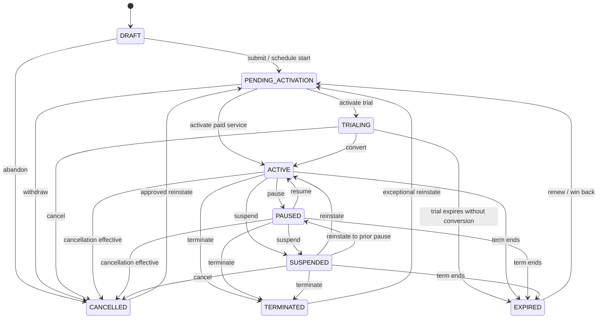

# Subscription state machine

**Version:** 0.1  
**Status:** Proposed canonical lifecycle

## 1. State model

A subscription has one canonical lifecycle state. Scheduled changes, billing standing, provisioning progress, and entitlement state are separate dimensions. For example, an `ACTIVE` subscription may have `cancel_at=2027-01-01` and a past-due invoice; it does not enter a vague “pending cancellation and delinquent” combined state.

### Canonical states

| State | Meaning | Service expectation | Billing expectation |
|---|---|---|---|
| `DRAFT` | Configuration is incomplete and creates no commercial obligation. | None | None |
| `PENDING_ACTIVATION` | Valid subscription awaits effective start, approval, or required provisioning prerequisite. | Not yet active unless a policy explicitly grants pre-service access. | One-time/advance charge may be prepared; posting follows activation policy. |
| `TRIALING` | Time-bounded trial is in effect. | Trial entitlements when implemented. | Trial price or zero charge; conversion impact is previewed. |
| `ACTIVE` | Service relationship is in force. | Normal access according to subscribed items. | Billable according to schedule and item terms. |
| `PAUSED` | Subscriber/merchant-approved temporary pause. | Controlled by pause policy; typically reduced or no access. | Charge treatment is explicit: stop, reduced, or continue; never implicit. |
| `SUSPENDED` | Involuntary operational/compliance/collections hold. | Usually restricted; safety/legal exceptions may remain. | Billing and collection behavior follow suspension policy independently. |
| `CANCELLED` | Subscription ended through ordinary cancellation. | Ends at recorded effective time. | Earned/unbilled amounts and credits are resolved; history retained. |
| `TERMINATED` | Subscription ended exceptionally for breach, fraud, legal, or operator action. | Ends at effective time, commonly immediate. | Termination fees/credits require explicit policy and approval. |
| `EXPIRED` | Fixed term ended without renewal. | Ends at term boundary. | Final arrears usage and closing invoice may still be processed. |

`CANCELLED`, `TERMINATED`, and `EXPIRED` are terminal service states. Reinstatement is an explicit, policy-controlled transition that opens a new service interval and never erases the prior terminal event.

## 2. Canonical diagram

The diagram shows legal transitions, not authorization. Every command must also satisfy tenant policy, permissions, effective-time rules, expected aggregate version, and any maker-checker requirement.

## 3. Scheduled changes

Future actions live in immutable `SubscriptionChange` records with `SCHEDULED`, `APPLIED`, `CANCELLED`, or `FAILED` disposition. The subscription remains in its current canonical state until the effective action commits.

Examples:

- Active with cancellation scheduled: `state=ACTIVE`, `cancel_at=...`, scheduled change type `CANCEL`.
- Trial conversion scheduled: `state=TRIALING`, scheduled change type `CONVERT`.
- Future quantity increase: current item quantity remains authoritative until `effective_at`.
- Renewal: extends term/schedule through a change; only a lapsed subscription uses the reinstatement path.

A scheduler claiming a due change uses an idempotent change ID and expected subscription version. If prerequisites fail, the change becomes `FAILED` with a safe, operator-visible reason; the subscription is not silently advanced.

## 4. Transition contract

Every transition command contains:

- tenant and subscription identity derived/validated from access context;
- command ID and idempotency key;
- expected aggregate version;
- requested action and effective time;
- actor and reason code;
- requested item/term changes;
- proration and billing preview reference or explicit waiver policy;
- approval reference when required;
- correlation and causation IDs.

The commit atomically writes the new aggregate version, state/change history, audit reference, and outbox event.

## 5. Transition rules and effects

| Command | Allowed from | Preconditions | Commercial/billing effect | Result |
|---|---|---|---|---|
| Submit | Draft | Valid account, plan/version, dates, items, currency | Freeze commercial snapshot; compute first bill preview | Pending Activation |
| Activate | Pending Activation | Effective time reached; prerequisites/approval satisfied | Start service; create schedules/eligible advance charges | Trialing or Active |
| Convert trial | Trialing | Valid paid terms and payment requirements | Close trial interval; preview/create paid-period charges | Active |
| Add item | Trialing, Active, Paused | Compatible active version; dependency/exclusion rules pass | New item interval and proration/one-time charges | Same subscription state |
| Remove item | Trialing, Active, Paused | Mandatory/dependency rules pass | End item interval; credit/charge by policy | Same subscription state |
| Change quantity | Trialing, Active, Paused | Quantity bounds and effective policy pass | New item version/interval; proration preview | Same subscription state |
| Change plan | Trialing, Active, Paused | Migration mapping, currency and compatibility pass | End/start item terms atomically; charge/credit adjustments | Same or Trialing→Active |
| Pause | Active | Pause allowed; max duration/frequency; impact accepted | End or suspend billability per explicit policy | Paused |
| Resume | Paused | Resume time/policy valid | Restart service/billing interval; proration if applicable | Active |
| Suspend | Active, Paused | Authorized reason; policy and notice/approval satisfied | Does not erase charges; future billing behavior explicit | Suspended |
| Reinstate | Suspended | Hold cleared and policy allows | Resume from stored prior service state; possible catch-up bill | Active or Paused |
| Cancel | Trialing, Active, Paused, Suspended | Contract/policy/law, disclosed impact, approval if sensitive | End at effective time; final usage/credits/fees explicit | Cancelled when effective |
| Terminate | Active, Paused, Suspended | Exceptional reason and elevated authorization | Immediate/scheduled close with explicit termination economics | Terminated |
| Renew | Trialing/Active before expiry; Expired for win-back | Renewal offer/terms accepted | New term and pinned pricing; no retroactive mutation | Active or Pending Activation |
| Expire | Trialing, Active, Paused, Suspended | Term boundary reached and no renewal | End service interval; final arrears run remains allowed | Expired |
| Reinstate terminal | Cancelled, Terminated, Expired | Policy, account standing, new terms; elevated approval for terminated | New interval/change record; historical end preserved | Pending Activation |

## 6. Subscription item lifecycle

Items use `PENDING`, `ACTIVE`, `PAUSED`, and `ENDED`. Item intervals are effective-dated. A plan/quantity change does not overwrite an active interval; it closes the prior interval at `effective_at` and creates the successor interval/snapshot.

Rules:

- A subscription must have at least one active or future item except while draft/terminal.
- An item cannot be active outside the subscription's service interval.
- Mandatory dependencies and mutual exclusions are evaluated at the same effective instant.
- A price component is pinned by ID/version/snapshot; later catalog retirement does not change it.
- Item-level pause is future scope unless explicitly introduced; MVP pause is subscription-wide.

## 7. Effective time and proration

- `requested_at`, `recorded_at`, and `effective_at` are distinct.
- Backdating before the latest posted billing boundary is rejected by default. An approved correction creates adjustments and never rewrites posted invoices.
- Future changes are ordered by effective time and sequence. Conflicting changes at the same instant must be combined or explicitly prioritized in one command.
- Proration uses the pricing specification's calendar, precision, and rounding policy and returns a calculation trace.
- A preview has expiry and input/version hash; commit recomputes or rejects if relevant inputs changed.
- Late usage after cancellation can still rate against the valid historical service/price interval and follows late-event adjustment policy.

## 8. Billing and access policy matrix

| State | Recurring schedule | Usage acceptance | Rating/billing of historical service | Collection of open AR |
|---|---|---|---|---|
| Draft | No | Reject/quarantine as invalid reference | No | Not applicable |
| Pending Activation | Policy-dependent advance setup | Usually reject before service start | Only explicitly allowed pre-service charge | Yes, if advance invoice posted |
| Trialing | Trial policy | Accept within trial | Yes | Yes for paid trial/other charges |
| Active | Run | Accept | Yes | Yes |
| Paused | Pause policy | Accept/reject by service policy | Yes for valid pre-pause/allowed usage | Yes |
| Suspended | Suspension policy | Usually reject new usage | Yes for valid pre-suspension usage | Yes |
| Cancelled/Terminated/Expired | Stop future recurring generation | Reject after end; accept valid late events before end | Yes, including final corrections | Yes |

Subscription state never writes off debt automatically.

## 9. Domain events

| Event | Required payload references |
|---|---|
| `subscription.created.v1` | subscription, account, plan snapshot, initial state/version |
| `subscription.activation_scheduled.v1` | change ID, effective time, prerequisites |
| `subscription.activated.v1` | prior/new state, service start, items, schedule refs |
| `subscription.trial_converted.v1` | trial interval, conversion time, paid terms |
| `subscription.changed.v1` | change ID/type, prior/new version, effective time, affected items, billing-impact reference |
| `subscription.paused.v1` / `resumed.v1` | policy, effective time, prior/new state |
| `subscription.suspended.v1` / `reinstated.v1` | reason/policy, effective time, prior state |
| `subscription.cancellation_scheduled.v1` | change ID, cancel time, mode, impact preview |
| `subscription.cancelled.v1` | prior/new state, end time, reason, final-bill policy |
| `subscription.terminated.v1` | approval, reason, end time, final-bill policy |
| `subscription.expired.v1` | term boundary, renewal disposition |

Events contain no full payment credentials, secret values, or unrestricted PII.

## 10. Concurrency and idempotency

- Commands require an idempotency key and normally `If-Match`/expected version.
- Repeating an identical completed command returns the original transition result.
- Reusing a key with a different canonical request hash returns an idempotency conflict.
- Only one due change may modify a subscription aggregate at a time; workers retry version conflicts after re-evaluation.
- Duplicate scheduled execution is harmless because `change_id` can be applied once.
- Billing consumers dedupe by subscription event ID and effective item interval.

## 11. Authorization and approval

- Subscriber actions are limited by account membership and merchant self-service policy.
- Pricing/plan migration, backdating, termination, waived proration, and exceptional reinstatement may require elevated permission/approval.
- The maker cannot approve their own request when separation-of-duties policy applies.
- Collection suspension cannot be lifted merely by a UI role if its governing case/payment condition is unresolved.

## 12. Acceptance scenarios

1. Future activation executes once at the effective instant despite scheduler retries.
2. Mid-cycle seat increase produces a disclosed deterministic proration trace and a new item interval without changing prior terms.
3. Scheduled cancellation leaves the subscription active until the effective time and can be revoked according to policy.
4. Immediate cancellation after a posted invoice creates an adjustment/credit path rather than editing the invoice.
5. Suspension stops/changes service as configured but preserves open AR and collection activity.
6. Late usage with event time before cancellation rates against the historical price and creates a policy-controlled adjustment.
7. A concurrent seat change with stale version is rejected and does not partially update items or billing schedule.
8. Reinstatement creates a new service interval and leaves cancellation/termination history traversable in the RLG.
9. An unauthorized tenant/user cannot infer subscription existence or schedule a change.

