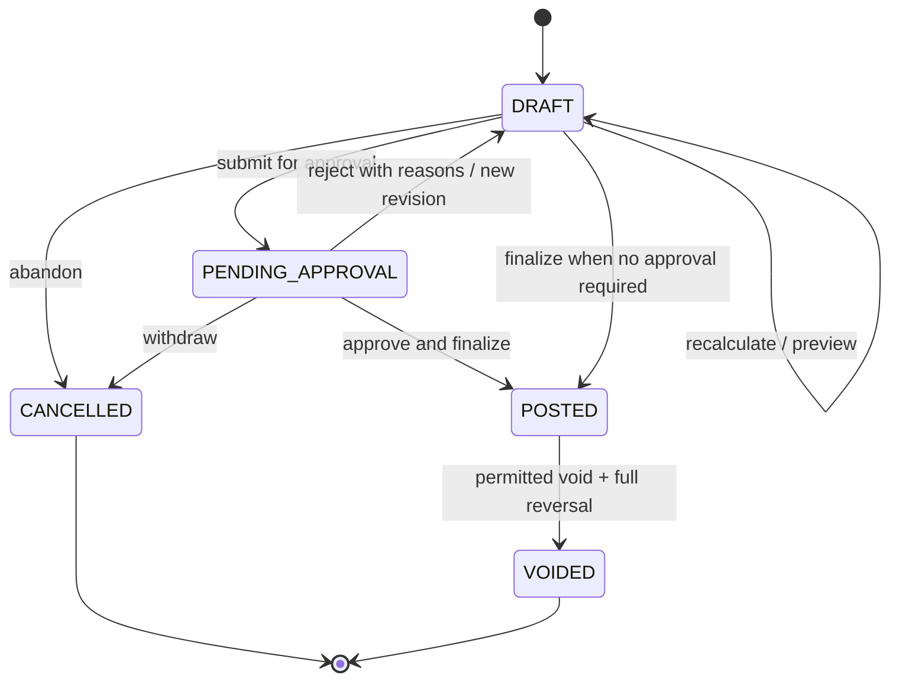
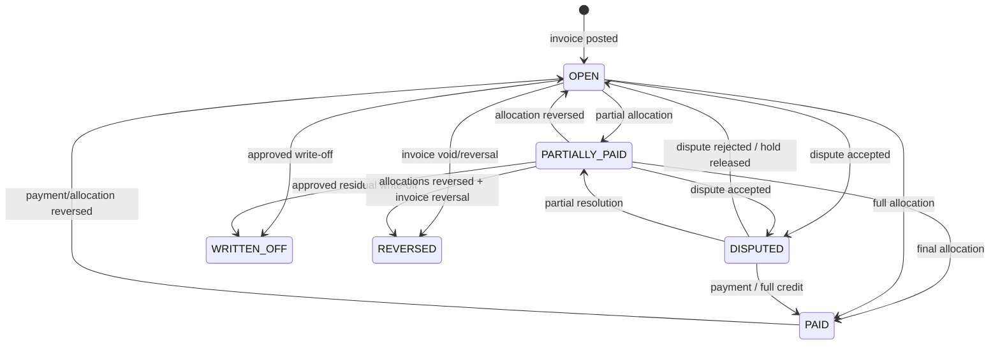

# Invoice state machine

**Version:** 0.1  
**Status:** Proposed canonical lifecycle

## 1. Separate state dimensions

An invoice has three independent dimensions:

1. **Document state** — whether the legal/commercial document is editable or posted.
2. **Receivable state** — how much remains owed and whether collection is disputed or written off.
3. **Delivery state** — whether a representation was generated and delivered.

Combining these into one enum produces contradictions such as an “overdue disputed partially paid sent invoice.” The UI may display a composite label, but APIs persist the dimensions separately.

## 2. Document state machine

| State | Meaning | Mutability |
|---|---|---|
| `DRAFT` | Calculated preview/working document without legal invoice number. | Lines, grouping, dates and totals may be recalculated with history. |
| `PENDING_APPROVAL` | Draft is frozen for maker-checker or exception review. | No ordinary line mutation; rejection returns a new draft revision. |
| `POSTED` | Finalized legal invoice with number, fixed lines/totals, receivable and journal effect. | Immutable; use credit/debit/corrective document. |
| `VOIDED` | Document has no continuing legal/financial effect under permitted void policy. | Immutable tombstone and reversal evidence retained. |
| `CANCELLED` | Draft/approval workflow abandoned before posting. | Immutable disposition; no invoice number/receivable. |

Most posted corrections do **not** transition the original invoice. They create a credit note, debit note, or replacement linked by `CORRECTS`/`REVERSES` while the original remains `POSTED`.

## 3. Receivable state machine

The receivable is created atomically with invoice posting.

| State | Meaning |
|---|---|
| `OPEN` | Full collectible amount remains. |
| `PARTIALLY_PAID` | One or more active allocations reduce but do not settle the open amount. |
| `PAID` | Open amount is zero through payments/credits. |
| `DISPUTED` | Collection is held or routed for the disputed amount; undisputed balance may still be collectible. |
| `WRITTEN_OFF` | Approved write-off reduced open amount to zero; this is not a payment. |
| `REVERSED` | Source invoice was validly voided/reversed and receivable effect was reversed. |

`OVERDUE` is derived when `open_amount > 0`, due date is past in the account business timezone, no applicable legal grace exception suppresses it, and state is not `REVERSED`. Aging buckets are also derived.

## 4. Delivery state

Delivery is independent of legal validity:

`NOT_REQUESTED → QUEUED → SENT → DELIVERED`, with `FAILED` and `SUPPRESSED` outcomes and retriable delivery attempts. A posted invoice remains owed if email delivery fails, subject to local legal requirements and merchant policy. Each PDF/HTML/UBL representation has a content hash and rendering/template version.

## 5. Draft generation and preview

A billing run selects eligible billable charges by tenant/account/grouping policy and cutoff. Draft construction records:

- source charges and service periods;
- quantity, unit/rate/tier and discounts;
- proration and rounding operations;
- tax quote/evidence;
- credits considered/applied;
- grouping dimensions and legal entity;
- calculation trace IDs and input/version hash;
- control totals and warnings.

Preview is non-posting and may be recalculated. It must identify incomplete usage, stale tax quote, missing address/PO, incompatible currency, and other blockers. A preview response has expiry; finalization revalidates or recomputes if inputs changed.

## 6. Finalization transaction

Finalization is idempotent and performs one strong transaction:

1. Lock or version-check the draft and included active charges.
2. Verify approval, account/legal-entity/currency, required tax evidence, totals, and no duplicate active billing inclusion.
3. Allocate the next invoice number in the correct tenant/legal-entity/sequence scope.
4. Freeze invoice lines, totals, due date, terms, addresses, template facts, and calculation references.
5. Mark charges billed through explicit inclusion records.
6. Create receivable and balanced journal transaction.
7. Write audit reference, idempotency outcome, and `invoice.finalized.v1` outbox fact.

Any failure rolls back the entire transaction, including number allocation unless local regulation requires gap evidence. Where gaps must be tracked, reserved numbers receive an explicit void/gap record.

## 7. Actions and rules

| Action | Allowed document state | Preconditions | Result |
|---|---|---|---|
| Recalculate | Draft | Sources still eligible; versions available | New draft revision and trace |
| Submit approval | Draft | Validation passes but policy requires approval | Pending Approval |
| Finalize | Draft/Pending Approval | Approval if needed; all blockers cleared | Posted + receivable + journal |
| Cancel draft | Draft/Pending Approval | Authorized; no posting exists | Cancelled |
| Send/render | Posted (preview watermark allowed for draft) | Template and recipient permissions | Delivery attempt; no document-state change |
| Apply payment/credit | Posted | Currency/amount and allocation rules pass | Receivable state/open amount changes |
| Open dispute | Posted | Eligible amount/reason and permission | Receivable disputed amount/state; collection hold policy |
| Issue credit note | Posted | Reason, amount/tax limits, approval | New posted corrective document and allocation/credit effect |
| Write off | Posted | Threshold approval and accounting reason | Write-off journal and receivable reduction |
| Void | Posted | Jurisdiction/policy allows; no irreversible external conflict; allocations handled | Void evidence + full reversal; document Voided |

## 8. Corrections

### Credit note

- References original invoice and, where possible, original lines.
- Cannot exceed eligible uncredited quantity/amount/tax basis without an explicit account-credit policy.
- Posting creates balanced reversal/credit entries and either reduces the receivable or creates account credit/refund eligibility.
- Original line/totals remain unchanged and graph traversal shows the corrective relationship.

### Void

Void is used only when law and operational state permit treating the invoice as without effect. If payment exists, allocations are reversed or resolved first in one governed process. After export/e-invoice acceptance, a credit/corrective invoice is generally preferred; jurisdiction rules decide.

### Usage or pricing correction

The source system creates reversal/adjustment charges from the corrected fact. Billing places them on a later corrective document or credit note according to policy. It never edits the posted line.

## 9. Totals and balance invariants

- `subtotal = sum(pre-discount line bases)` under the configured sign model.
- Discounts, tax, rounding, credits, and adjustments reconcile line-to-document totals with explicit rounding lines where necessary.
- One posted invoice uses one transaction currency; cross-currency application requires an explicit future FX allocation model.
- `receivable_original_amount = posted_invoice_amount` for collectible invoices.
- `open_amount = original - active payment allocations - active credit allocations - approved write-offs ± reversed allocations`.
- Open amount cannot be negative; excess cash becomes unapplied/credit balance.
- Posted invoice and receivable/journal control totals are created atomically.

## 10. Dates

| Date/time | Meaning |
|---|---|
| `service_period` | Period in which value was provided; line-level. |
| `invoice_date` | Legal issue/business date. |
| `posted_at` | System instant finalization committed. |
| `due_date` | Business date payment is due. |
| `tax_point_date` | Jurisdiction-specific tax date. |
| `delivered_at` | Provider/user delivery evidence; not issue date. |

Dates are not inferred from one another after posting. Business calendars and time zones are explicit.

## 11. Domain events

- `invoice.draft_generated.v1`
- `invoice.approval_requested.v1`
- `invoice.finalized.v1`
- `invoice.delivery_requested.v1`
- `invoice.delivered.v1` / `invoice.delivery_failed.v1`
- `invoice.due.v1` (scheduled fact, deduplicated)
- `invoice.overdue.v1` (derived transition with policy version)
- `invoice.partially_paid.v1`
- `invoice.paid.v1`
- `invoice.disputed.v1` / `invoice.dispute_resolved.v1`
- `invoice.credited.v1`
- `invoice.written_off.v1`
- `invoice.voided.v1`

Payment-related events reference allocations; they do not mutate invoice line facts.

## 12. Authorization and audit

- Preview, finalize, credit, write-off, dispute, and void are distinct permissions.
- Threshold/risk policies can require maker-checker approval.
- Reason code is mandatory for credit, write-off, void, and manual adjustment.
- Audit stores safe before/after state references, source calculation IDs, approval, actor, correlation, and outcome.
- Invoice access is account-scoped in the portal; signed links are short-lived and purpose-scoped.

## 13. Acceptance scenarios

1. Two finalization retries with one idempotency key produce one invoice number, receivable, and journal transaction.
2. A stale preview cannot finalize after a relevant price/usage/tax input changes without revalidation.
3. A posted invoice line cannot be edited through API, database repository, or admin UI.
4. Partial and final payment allocations update receivable state while invoice document state remains Posted.
5. Reversing a successful payment reopens the receivable and emits traceable events.
6. Credit correction leaves the original invoice intact and produces balanced postings and graph edges.
7. Delivery failure does not cancel or mutate the posted invoice.
8. A cross-tenant charge cannot be included in a draft or inferred through validation errors.
9. Duplicate charge inclusion is blocked even under concurrent billing workers.
10. Invoice totals, receivable original amount, and journal control totals reconcile exactly for golden datasets.

