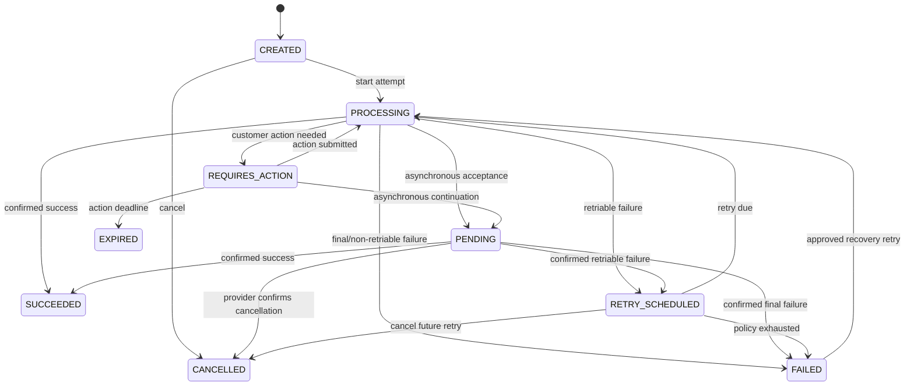
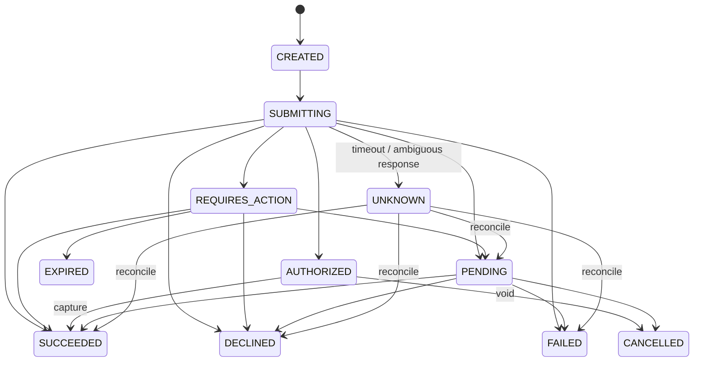

# Payment state machine

**Version:** 0.1  
**Status:** Proposed canonical lifecycle

## 1. Payment concepts

- A **Payment** is one logical intent to move a fixed amount/currency from an account toward receivables or account credit.
- A **Payment Attempt** is one interaction with one provider/rail for that payment.
- An **Allocation** applies succeeded payment value to one or more receivables.
- A **Settlement** proves provider/bank payout and is separate from customer payment success.
- A **Refund** is a new governed money movement linked to succeeded payment/allocation.

Provider objects and states are evidence mapped at the connector boundary. They are not the canonical model.

## 2. Payment lifecycle

| State | Meaning |
|---|---|
| `CREATED` | Valid logical intent exists; no provider submission has begun. |
| `PROCESSING` | An attempt is being prepared/submitted or another attempt is allowed immediately. |
| `REQUIRES_ACTION` | Customer/merchant action such as authentication, mandate, or bank instruction is required. |
| `PENDING` | Provider/rail accepted the attempt but final success/failure is asynchronous. |
| `RETRY_SCHEDULED` | No attempt is currently in flight; policy scheduled another eligible attempt. |
| `SUCCEEDED` | Authenticated evidence confirms the intended amount succeeded under the rail's canonical success rule. |
| `FAILED` | No attempt is in flight and policy considers the logical payment exhausted or non-retriable. |
| `CANCELLED` | Authorized cancellation occurred before success and no in-flight rail can still succeed. |
| `EXPIRED` | Required action or payment window expired without success. |

Refund progress is an orthogonal summary (`NONE`, `PARTIAL`, `FULL`) because refunding does not rewrite the fact that the payment succeeded.

The exceptional `FAILED → PROCESSING` transition records a new recovery cycle and policy/actor. It never alters prior attempts.

## 3. Attempt lifecycle

| State | Meaning | Terminal? |
|---|---|:---:|
| `CREATED` | Attempt identity/idempotency reference allocated locally. | No |
| `SUBMITTING` | Provider request is in progress and outcome may be uncertain. | No |
| `REQUIRES_ACTION` | Attempt awaits authentication or external payer action. | No |
| `PENDING` | Provider accepted for asynchronous processing. | No |
| `AUTHORIZED` | Funds authorized but not captured where capture is separate. | No |
| `SUCCEEDED` | Connector's configured success evidence is satisfied. | Yes |
| `DECLINED` | Provider/issuer declined; canonical reason is recorded. | Yes |
| `FAILED` | Technical or business failure is confirmed. | Yes |
| `CANCELLED` | Provider confirms cancellation/void. | Yes |
| `UNKNOWN` | Request may have reached provider but no reliable outcome is known. | No; reconciliation required |
| `EXPIRED` | Action/authorization window elapsed. | Yes |

No new attempt may be launched merely because the previous attempt is `UNKNOWN`. The system first queries/reconciles using the same provider idempotency reference or obtains an explicit safe-to-retry decision.

## 4. Command and provider flow

### Create and attempt

1. Validate account, amount/currency, eligible receivables/purpose, payment method reference, and policy.
2. Create/reuse logical payment under client idempotency key.
3. Create an attempt with unique provider idempotency reference and selected gateway/route evidence.
4. Persist `SUBMITTING` before external I/O.
5. Call the provider outside the core database transaction.
6. Map synchronous result or record `UNKNOWN` on ambiguous transport failure.
7. Apply authenticated webhooks/poll results idempotently and publish canonical events.
8. On success, Receivables allocates idempotently using payment ID and allocation plan.

### Retry

- Retry policy evaluates canonical reason, attempt count, time, method/gateway rules, customer consent/mandate, invoice status, and collection case.
- A retry creates a new attempt; it never resubmits under a new key while prior outcome is unknown.
- Gateway failover is allowed only when scheme/legal rules and duplicate-risk controls permit it.
- A change of amount or currency creates a new Payment, not another attempt.

## 5. Provider event handling

1. Verify signature, timestamp tolerance, gateway/account route, and content limits before domain lookup.
2. Insert provider event by unique gateway/provider event ID.
3. Resolve attempt by stored provider/idempotency reference; never trust tenant/account IDs supplied only in metadata.
4. Validate amount, currency, merchant account, and permissible transition.
5. Apply only newer/stronger evidence according to connector ordering rules.
6. Quarantine conflicts/unknown references; do not force payment success or failure.
7. Store safe payload hash/reference and mapping decision for audit.

Duplicate delivery returns the original disposition. Out-of-order failure received after confirmed success cannot downgrade the attempt unless it is a distinct reversal/chargeback fact.

## 6. Canonical reason model

Provider codes map to a stable reason taxonomy while preserving the safe raw code:

- customer action: `AUTHENTICATION_REQUIRED`, `MANDATE_REQUIRED`, `PAYMENT_METHOD_EXPIRED`;
- funds/issuer: `INSUFFICIENT_FUNDS`, `ISSUER_DECLINED`, `LIMIT_EXCEEDED`;
- method/account: `INVALID_METHOD`, `ACCOUNT_CLOSED`, `MANDATE_REVOKED`;
- risk/compliance: `FRAUD_SUSPECTED`, `COMPLIANCE_BLOCK`, `DO_NOT_HONOR`;
- technical: `GATEWAY_UNAVAILABLE`, `TIMEOUT_UNKNOWN`, `PROVIDER_ERROR`;
- merchant/config: `CURRENCY_UNSUPPORTED`, `MISCONFIGURED_ROUTE`, `INVALID_REQUEST`;
- unknown: `UNMAPPED_PROVIDER_REASON`.

Each mapping carries `retry_advice` (`NEVER`, `CUSTOMER_ACTION`, `SAFE_AFTER`, `RECONCILE_FIRST`, `POLICY_EVALUATION`) and version. The system does not infer retryability from message text.

## 7. Allocation and financial effects

- Provider success and cash allocation are separate idempotent steps linked by events.
- Payment `SUCCEEDED` posts cash/clearing and unapplied-cash effect according to accounting policy.
- Allocation moves value from unapplied cash/clearing to the target receivable; allocations are immutable and reversed by linked records.
- Allocation cannot exceed succeeded unallocated payment amount or receivable open amount.
- Partial payment uses a Payment for the actual fixed amount and partially settles the receivable. A provider “partial capture” outside supported behavior is reconciled into a correctly sized canonical payment/correction, not hidden in one inconsistent amount.
- A chargeback/reversal after success creates a distinct reversal/dispute fact, reverses applicable allocations/postings, and may reopen receivables/collections.

## 8. Payment method lifecycle

Payment method references use:

`PENDING → ACTIVE → EXPIRING | FAILED → REVOKED`, with provider verification and mandate status stored separately. Only provider tokens, type, safe display fields, expiry where allowed, billing-address reference, fingerprint hash, mandate reference/status, and consent evidence are stored.

Raw PAN, CVV, bank credential, wallet secret, and provider secret are never accepted by general platform APIs or logs. Hosted/provider components handle collection and tokenization.

## 9. Refund lifecycle

`REQUESTED → PENDING_APPROVAL → SUBMITTING → PENDING → SUCCEEDED | FAILED | CANCELLED`, with approval state skipped when policy allows. Ambiguous submissions use a reconciliation-required attempt state equivalent to payment `UNKNOWN`.

Rules:

- Cumulative succeeded/pending refunds cannot exceed refundable succeeded payment amount after chargebacks.
- Refund currency matches payment currency in MVP.
- Refund links to reason, payment, affected allocation/credit treatment, approval, provider evidence, and balanced posting.
- A failed refund does not modify the original payment success or receivable until a compensating business decision is made.

## 10. Idempotency and concurrency

| Scope | Idempotency key / constraint |
|---|---|
| Create Payment | Tenant + API operation + client key and canonical request hash |
| Create Attempt | Payment + attempt number; provider idempotency reference globally unique within gateway account |
| Provider event | Gateway + provider event ID |
| Apply attempt result | Attempt + evidence/result version |
| Allocate | Payment + allocation-plan/version + receivable |
| Refund | Payment + client refund key; provider refund idempotency reference |

Payment aggregate transitions use expected version/row lock. Receivables applies allocations in its own strong transaction and deduplicates the payment-success fact.

## 11. Routing and controls

MVP route selection is deterministic: tenant configuration, currency, country, method, amount limits, and gateway health. Later scoring may recommend a route, but policy validates legality, cost/risk constraints, and duplicate safety.

Sensitive actions require separate permissions: manual retry, change method, cancel, mark externally paid, refund, and payment-state repair. Manual success is prohibited without external settlement evidence and approval; correction records who, why, evidence, and journal impact.

## 12. Domain events

- `payment.created.v1`
- `payment.attempted.v1`
- `payment.action_required.v1`
- `payment.pending.v1`
- `payment.retry_scheduled.v1`
- `payment.failed.v1`
- `payment.succeeded.v1`
- `payment.cancelled.v1`
- `payment.reconciliation_required.v1`
- `payment.allocated.v1` / `payment.allocation_reversed.v1`
- `payment.refund_requested.v1`
- `refund.succeeded.v1` / `refund.failed.v1`
- `payment.reversed.v1` / `payment.chargeback_opened.v1` (later connector scope)

Events contain canonical reason and safe references, never credentials.

## 13. Acceptance scenarios

1. API timeout after provider acceptance cannot cause a duplicate charge; the attempt enters Unknown and reconciles under the same provider key.
2. Duplicate and out-of-order provider webhooks produce one legal state progression and one allocation.
3. Synchronous decline schedules a retry only if the versioned reason/policy permits it.
4. A success webhook with mismatched amount, currency, or gateway account is quarantined and does not mark payment succeeded.
5. One succeeded payment can allocate across eligible invoices without exceeding payment or receivable balances.
6. Reversing an allocation reopens the receivable while preserving the original allocation record.
7. Refund retries produce one provider refund and balanced posting.
8. Raw payment credentials do not appear in database, logs, events, traces, or support views.
9. Stripe-specific states/codes remain inside the adapter/evidence layer.
10. Every attempt, allocation, refund, and reversal is traversable from the payment in the RLG.

