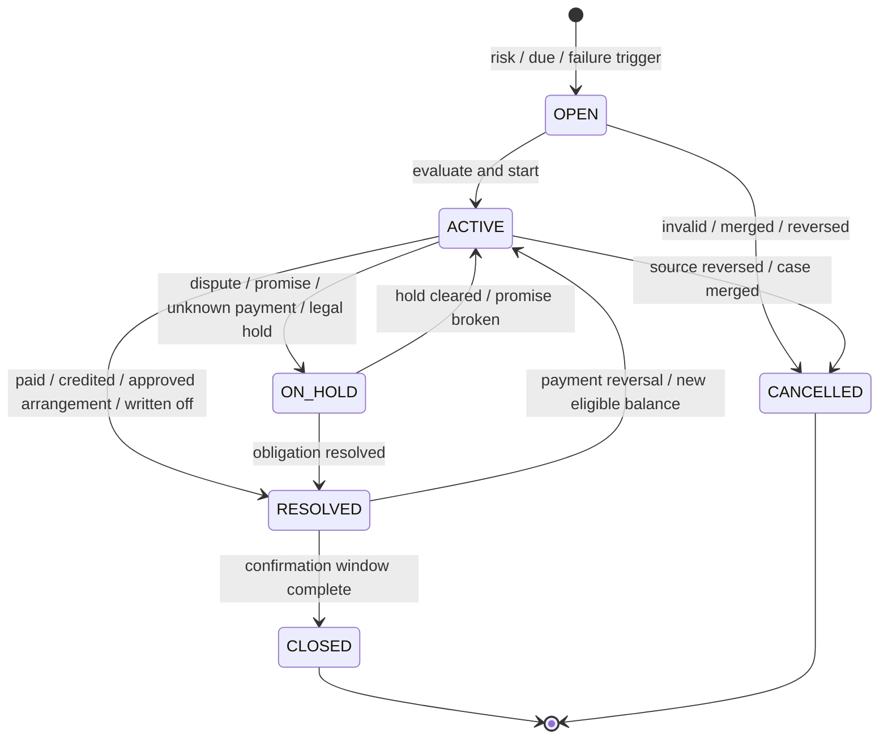
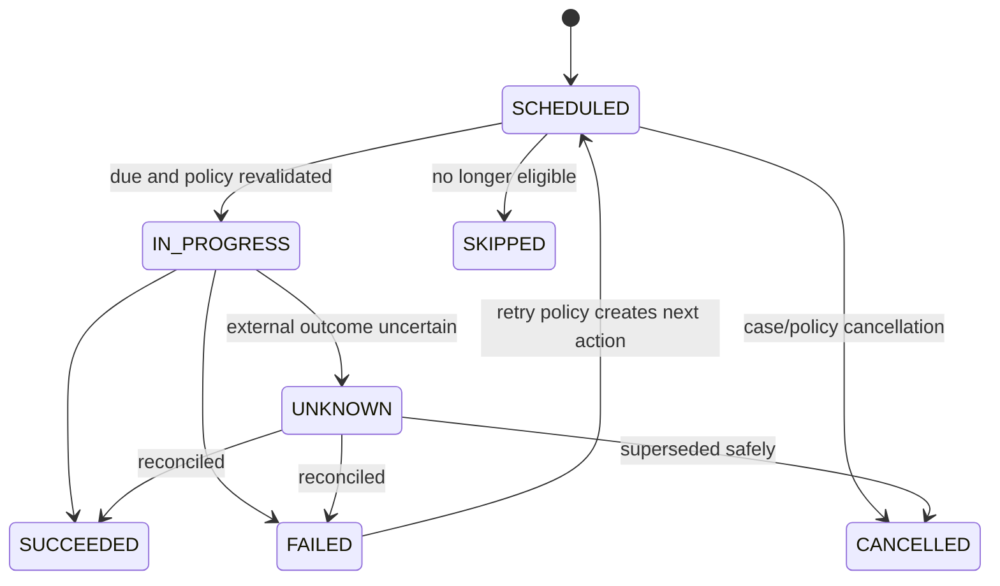

# Collection state machine

**Version:** 0.1  
**Status:** Proposed preventive and recovery workflow model

## 1. Model overview

Collections uses four related but separate dimensions:

- **Case state:** operational lifecycle of the collection case.
- **Stage:** where the account/invoice sits relative to due date and escalation policy.
- **Action state:** execution lifecycle for each retry, message, task, or recommendation.
- **Promise/dispute/payment facts:** linked domain records that influence the case but retain their own states.

This permits a case to be `ON_HOLD`, stage `PAST_DUE`, because a dispute is active, without inventing a combined status.

## 2. Case lifecycle

| State | Meaning |
|---|---|
| `OPEN` | Case was created and awaits evaluation/ownership. |
| `ACTIVE` | Policy or agent is executing preventive/recovery work. |
| `ON_HOLD` | Actions are temporarily suppressed for a recorded reason such as dispute, legal hold, active promise, or uncertain payment. |
| `RESOLVED` | Resolution condition is met; monitoring/closure window remains. |
| `CLOSED` | Resolution is confirmed and no further action is expected. |
| `CANCELLED` | Case was invalidated/merged or its source obligation was reversed; reason required. |

A payment failure does not automatically close and reopen cases per attempt. One case may coordinate several receivables/payments under the configured grouping policy.

## 3. Stage model

| Stage | Entry condition | Typical focus |
|---|---|---|
| `PRE_DUE` | Material future amount and policy/risk warrants preventive action | Expiring method, amount notice, mandate confirmation |
| `DUE` | Due date reached and balance remains | Attempt payment or send due notice |
| `GRACE` | Within configured post-due grace interval | Low-friction reminder/retry |
| `PAST_DUE` | Grace expired with collectible open balance | Recovery sequence and agent prioritization |
| `ESCALATED` | Value, age, broken promise, repeated failure, or policy threshold | Senior agent, account manager, legal/manual workflow |
| `TERMINAL` | Resolution/closure or exhausted merchant policy | Stop automated collection; record disposition |

Stage is derived from receivable dates, balances, policy version, risk/materiality, and case facts. An authorized manual escalation may advance the stage with reason; it cannot falsify due dates.

## 4. Action lifecycle

Actions include `PAYMENT_ATTEMPT`, `EMAIL`, `SMS`, `WHATSAPP`, `PUSH`, `IN_APP`, `PAYMENT_LINK`, `ACCOUNT_MANAGER_TASK`, `METHOD_UPDATE_REQUEST`, and `MANUAL_REVIEW`.

Every action stores scheduled time, actual time, type/channel, policy version, reason, input/evidence references, consent/contact evaluation, provider delivery/attempt reference, outcome, and correlation ID.

## 5. Case triggers

| Trigger | Minimum evidence | Default behavior |
|---|---|---|
| Upcoming risk | Forecast invoice/renewal amount + current risk assessment | Open preventive case only above policy threshold |
| Method expiring | Verified method expiry within policy window | Recommend/update request respecting contact preferences |
| Invoice due | Posted collectible receivable and due policy | Evaluate payment/notice action |
| Payment failed | Canonical attempt reason and retry advice | Continue existing case or open; do not duplicate |
| Broken promise | Promise due and insufficient qualifying allocation | Resume and raise priority/stage |
| Dispute | Accepted dispute record | Hold disputed amount/actions; continue undisputed policy if allowed |
| Payment reversal | Allocation/payment reversal reopens balance | Reactivate resolved case or open linked case |
| Balance resolved | Open collectible amount becomes zero or approved arrangement controls it | Resolve; cancel pending ineligible actions |

Case uniqueness uses a tenant policy-defined subject key (usually account + receivable group + campaign version). Duplicate triggers update evidence/priority idempotently.

## 6. Risk assessment

MVP uses an explainable deterministic scorecard with optional later ML score as one input.

### Allowed signal categories

- prior payment outcomes and days-to-pay;
- payment method expiry/mandate status;
- canonical failure history;
- upcoming amount deviation from account baseline;
- invoice age/value and payment terms;
- promise and dispute behavior;
- gateway/method health and method availability;
- contract/account service facts necessary for collection policy.

Protected sensitive attributes and unjustified proxies are prohibited. Geography may be used only for legal/payment-rail/contact-policy decisions or approved operational risk, not discriminatory treatment.

Each assessment records subject/time horizon, `LOW | MEDIUM | HIGH`, factor codes with direction/contribution, rule/model/version, input snapshot/hash, generated/expiry time, validation status, and fallback used. A model outage invokes deterministic rules and is visible; it never suppresses required notices or approvals.

## 7. Next Best Collection Action

The engine produces a recommendation, not an unconstrained command:

1. Build eligible actions from invoice/account/payment facts.
2. Remove actions blocked by consent, quiet hours, jurisdiction, dispute/hold, retry rules, mandate, amount, frequency cap, or permissions.
3. Apply deterministic priorities for time-critical/legal obligations.
4. Optionally rank remaining actions using validated success/cost/customer-friction estimates.
5. Return action, timing window, channel/route, reason codes, expected goal, confidence (if modeled), policy/version, expiry, and alternatives.
6. Execution revalidates policy and live state; a stale recommendation cannot execute automatically.

AI may explain the recommendation in prose from these facts. It may not independently approve extensions, write-offs, refunds, or exceptions.

## 8. Transition and hold rules

| Event/action | From | Preconditions | To/effect |
|---|---|---|---|
| Start case | Open | Collectible or preventive eligibility | Active; calculate stage/action |
| Place hold | Active | Allowed hold reason and scope/end condition | On Hold; cancel/suspend affected actions |
| Release hold | On Hold | Reason cleared/expired and balance collectible | Active; recompute risk/stage/action |
| Record promise | Active | Eligibility, amount/date, authorization | On Hold with promise reference or remain Active per policy |
| Promise kept | On Hold/Active | Qualifying allocations meet promise | Resolve if balance/arrangement condition met |
| Promise broken | On Hold | Due time passed; insufficient qualifying value | Active, priority/stage reevaluated |
| Dispute opened | Active | Valid dispute and amount | Hold scoped actions for disputed portion |
| Payment succeeds | Active/On Hold | Canonical success plus allocation/arrangement rule | Resolve if resolution condition met |
| Write-off/credit | Active/On Hold | Approved financial document posted | Resolve if no collectible balance |
| Payment reversed | Resolved | Balance reopens within retention window | Active and cancel closure timer |
| Close | Resolved | Confirmation window and reconciliation complete | Closed |
| Cancel/merge | Open/Active/On Hold | Duplicate/invalid/reversed source | Cancelled; retain merge target/reason |

## 9. Stop and suppression rules

Before every action, the system rechecks:

- no collectible balance remains;
- payment/attempt is not already in flight or outcome unknown;
- dispute, legal hold, insolvency, or protected-customer rule does not prohibit it;
- promise/arrangement terms are not being honored;
- contact consent, preference, suppression list, frequency cap, and quiet hours;
- invoice/credit/write-off/reversal changes;
- maximum retry/contact/escalation thresholds;
- gateway and method health;
- campaign/policy is still active and recommendation has not expired.

Stop decisions are recorded with reason and source version. Cancelling communication does not delete its schedule/history.

## 10. Payment and communication coordination

- Payment attempts are requested through the Payment context with a stable action/idempotency reference.
- While an attempt is `PENDING` or `UNKNOWN`, duplicate collection attempts are blocked and the case may be On Hold.
- A failed attempt returns canonical reason/retry advice; Collections chooses the next policy action.
- Communications use approved versioned templates and minimum necessary data. Payment links are short-lived, signed, narrow in purpose, and revocable.
- Delivery success is not payment success; click/open tracking is not treated as consent or promise.
- Account-manager tasks expose safe context and require outcome/reason capture.

## 11. Payment arrangements and promises

MVP P1 may record a promise to pay; installment plans/extensions require explicit merchant policy.

- Promise has amount, currency, due date, qualifying receivables, creator, evidence, and state `OPEN | KEPT | BROKEN | CANCELLED`.
- An arrangement never changes invoice terms silently. It creates a separately auditable schedule/hold policy and, where legally required, a new agreement/document.
- Only policy-authorized roles may approve exceptions. AI may recommend within limits but cannot approve.
- Breach is evaluated from allocations, not from provider attempt success alone.

## 12. Priority and queues

Queue priority is deterministic and explainable from:

`collectible exposure × age/materiality × risk urgency × promise/dispute flags × customer/contract service priority`, with policy caps and no protected attributes.

MVP queues:

- Upcoming high risk;
- Payment method expiring;
- Due today;
- Failed payment / retry scheduled;
- High-value past due;
- Promise due/broken;
- Disputed / on hold;
- Manual review / uncertain payment.

Each queue item shows exposure, due/age, risk and factor codes, case/stage, latest payment reason, next action/time, owner, freshness, and the Revenue Lifecycle Graph link.

## 13. Domain events

- `collection.case_opened.v1`
- `collection.case_activated.v1`
- `collection.risk_assessed.v1`
- `collection.action_recommended.v1`
- `collection.action_scheduled.v1`
- `collection.action_completed.v1`
- `collection.case_held.v1` / `collection.case_resumed.v1`
- `collection.promise_recorded.v1`
- `collection.promise_kept.v1` / `collection.promise_broken.v1`
- `collection.case_resolved.v1`
- `collection.case_reactivated.v1`
- `collection.case_closed.v1`

Events reference invoice/payment/communication facts and policy versions; they do not duplicate prohibited sensitive input data.

## 14. Controls and observability

- Maker-checker for policy activation and high-impact exceptions.
- Campaign simulation reports affected accounts, projected action counts, frequency/quiet-hour violations, and estimated exposure before activation.
- Kill switch pauses future automated actions without corrupting cases or in-flight provider results.
- Metrics: pre-due method update rate, first-attempt success, recovery rate by reason/method/cohort, promise kept rate, contact frequency, complaints/opt-outs, false-positive preventive cases, action suppression, and policy/model drift.
- Hold/action backlogs and stale risk assessments have SLOs and alerts.
- Model/recommendation performance is compared with deterministic fallback and reviewed for disparate outcomes.

## 15. Acceptance scenarios

1. High-risk upcoming invoice opens one preventive case and recommends a method update without waiting for failure.
2. Duplicate failure webhooks do not create duplicate cases, retries, or messages.
3. A pending/unknown payment suppresses another charge attempt until reconciliation.
4. A dispute holds only the governed amount/actions while preserving undisputed collection policy.
5. Payment allocation resolving the balance cancels future actions and moves the case to Resolved, then Closed after confirmation.
6. Payment reversal during the confirmation window reactivates the same case with preserved history.
7. Quiet hours, consent, frequency caps, and legal holds are revalidated at execution, not only recommendation time.
8. An unavailable model falls back to deterministic policy and records the fallback.
9. A user cannot manually approve an extension/write-off outside their threshold or approve their own request when separation of duties applies.
10. Every recommendation and executed action is explainable by current facts, rule/model version, and policy decision.

