# Pricing engine specification

**Version:** 0.1  
**Status:** Proposed MVP semantics  
**Scope:** Deterministic price selection, aggregation, rating, proration, discounting, simulation, and calculation evidence

## 1. Objectives

The pricing engine converts explicit commercial inputs into explainable charge candidates. It must be:

- deterministic for the same canonical input and engine/configuration versions;
- fixed-precision and currency-aware;
- effective-dated and incapable of silently repricing history;
- composable across recurring, seat, one-time, and usage components;
- idempotent and replayable;
- safe for no-code configuration without arbitrary code execution;
- capable of emitting a complete typed calculation trace.

Tax calculation, invoice legal state, payment processing, revenue recognition, and entitlement enforcement are separate concerns.

## 2. MVP capability

| Model | MVP | Canonical behavior |
|---|:---:|---|
| Flat recurring | Yes | Fixed amount per billing period, optionally prorated. |
| Per-seat / quantity | Yes | Billable quantity × unit rate, optionally tiered/prorated. |
| One-time | Yes | Fixed or quantity-based amount triggered once by an eligible event. |
| Usage per unit | Yes | Aggregated metered quantity × unit rate. |
| Volume tier | Yes | One rate chosen by total quantity and applied to all chargeable quantity. |
| Graduated tier | Yes | Each quantity slice priced at its tier rate. |
| Included allowance + overage | Yes | Allowance reduces chargeable usage, then overage model applies. |
| Package/block | Limited | Supported as ceiling(quantity/block size) × block price when explicitly enabled. |
| Fixed/percentage discount | Yes | Versioned eligibility and application stage. |
| Minimum/maximum component charge | Yes, basic | Floor/cap after discounts when configured. |
| Prepaid credit wallet | Release 2 | Requires balance/reservation/expiry ordering model. |
| Matrix/attribute/time-of-day/dynamic/outcome/revenue share | Release 2+ | Requires additional dimensions and governance. |
| Contract commitment/ramp/indexation | Release 2 | Requires Contract and amendment context. |

Supporting a model means it has defined preview, billing, correction, trace, API, and golden-test semantics—not merely a configuration field.

## 3. Architecture and flow

```mermaid
flowchart LR
  Input[Canonical pricing input] --> Select[Select effective commercial snapshot]
  Select --> Validate[Validate types, units, dimensions, eligibility]
  Validate --> Aggregate[Aggregate quantity/window]
  Aggregate --> Allowance[Apply allowance]
  Allowance --> Rate[Apply price model / tiers]
  Rate --> Prorate[Apply proration if relevant]
  Prorate --> Discount[Apply ordered discounts]
  Discount --> Guardrail[Apply minimum / maximum]
  Guardrail --> Round[Currency rounding and allocation]
  Round --> Output[Charge candidate + calculation trace]
```



Stages cannot be reordered implicitly. A future price component may explicitly choose among approved stage options, which become part of its immutable version and trace.

## 4. Inputs and output

### Canonical input

| Field | Rule |
|---|---|
| `tenant_id` | Trusted execution context, not caller-overridable. |
| `pricing_purpose` | `PREVIEW`, `BILLING`, `ADJUSTMENT`, `SIMULATION`; affects permissions/output persistence, not arithmetic. |
| `account_id`, `subscription_id`, `subscription_item_id` | Resolve commercial ownership and snapshot. |
| `price_component_id` and version/snapshot | Pinned for historical rating; selected only for new commercial events. |
| `effective_at` / `service_period` | Determines eligible version and proration. |
| `quantity`, `unit` | Fixed precision and compatible with component/meter. |
| `usage_set` or aggregate reference | Stable membership/control hash for usage rating. |
| `dimensions` | Validated against allowlisted schema; normalized before matching. |
| `currency` | Must equal component currency in MVP. |
| `context facts` | Only versioned allowlisted facts, such as segment/market or promotion assignment. |
| `engine_version` | Explicit in persisted results; selected by compatible deployment policy. |
| `idempotency/determinism key` | Stable business-effect identity. |

### Output

```text
PricingResult
  result_id / deterministic_key
  status: PRICED | ZERO | NOT_ELIGIBLE | REJECTED
  quantity: input, allowed, chargeable
  unrounded_amount
  rounded_amount_minor + currency
  component/discount/minimum/cap breakdown
  service_period and price version
  calculation_trace_id + content_hash
  warnings and reason codes
```

A `ZERO` result is distinct from `NOT_ELIGIBLE`. Rejection returns typed validation errors and creates no charge.

## 5. Configuration model

```text
RateCard
  currency, effective period, market/segment/channel selectors
  PriceComponent[]
    component code, charge type, timing, quantity source, unit
    aggregation policy, allowance policy, price model
    proration policy, discount policy, min/max policy
    rounding policy, tax/accounting classification
    PriceRule[] / Tier[]
```

### Charge types

- `RECURRING_FIXED`
- `RECURRING_QUANTITY`
- `ONE_TIME_FIXED`
- `ONE_TIME_QUANTITY`
- `USAGE_PER_UNIT`
- `USAGE_VOLUME_TIER`
- `USAGE_GRADUATED_TIER`
- `USAGE_PACKAGE`

### Timing

- recurring: advance or arrears;
- usage: arrears in MVP;
- one-time: on activation, subscription change, explicit billable event, or scheduled milestone supported by a stable trigger key.

Every one-time component defines a unique occurrence scope such as `subscription`, `subscription_item`, or `trigger_event` so retries cannot charge twice.

## 6. Version and selection semantics

1. Draft configuration is mutable and never used by billing.
2. Activation validates and freezes a version with content hash, effective period, selection keys, and approval.
3. New subscriptions capture selected offer/plan/rate/component versions or an immutable commercial snapshot.
4. Existing subscription items continue to use captured terms until an explicit effective-dated change.
5. Usage uses event/service time and the subscription item's valid historical interval, not processing time.
6. Backdated configuration activation that overlaps prior active selection is rejected. Approved corrections create new adjustment semantics; they do not mutate historical results.
7. Selection conflicts are errors. The engine never chooses “first row returned.”

Selection specificity and priority are explicit and validated. MVP avoids open-ended arbitrary attribute priority; selectors are market, segment, channel, currency, and effective time, plus the subscription's pinned choice.

## 7. Quantity and aggregation

### Quantity normalization

- Unit must match the meter/component or use an approved exact conversion version.
- Input scale beyond the meter limit is rejected or normalized only by an explicit policy.
- Negative usage is not ordinary consumption; it must be a correction referencing the original or an approved delta semantic.
- Missing required dimensions reject/quarantine the usage before rating.

### Aggregation functions

MVP supports:

- `SUM(quantity)`;
- `COUNT(events)`;
- `COUNT_DISTINCT(dimension)` with a declared exactness policy;
- `MAX(quantity)` for explicitly modeled peak metrics.

Aggregation keys are tenant, subscription item, meter/version, configured dimensions, and `[window_start, window_end)`. Each closed aggregate stores quantity, event count, membership/control hash, watermark, and version. Approximate distinct counting is not permitted for billable MVP quantities.

### Late and corrected usage

- Before invoice finalization: rebuild/supersede the aggregate and rerate idempotently.
- After finalization: create a new adjustment aggregate/rating/charge linked to the original period; never edit the posted line.
- Cutoff, grace window, and minimum adjustment threshold are tenant policies, but all accepted usage reaches an explicit billed, carried-forward, zero-rated, or adjusted disposition.

## 8. Pricing formulas

Let `Q` be normalized quantity, `A` eligible allowance, and `C = max(Q - A, 0)` chargeable quantity.

### Flat recurring

`unrounded = period_price × proration_factor`

Quantity is informational unless the component explicitly uses quantity pricing.

### Per-unit / per-seat

`unrounded = C × unit_rate × proration_factor`

Seat quantity source is declared (`LICENSED`, `PROVISIONED`, `ACTIVE_AT_POINT`, or time-weighted future model). MVP recommends subscription item quantity rather than inferred active users.

### One-time

`unrounded = fixed_amount` or `Q × unit_rate`, generated once per occurrence scope/key. Proration is off unless a distinct policy is approved.

### Volume tier

The tier containing `C` supplies one rate for all chargeable units:

`unrounded = C × rate(tier(C)) + tier_fixed_fee`

Example tiers `[0,100] @ ₹10`, `(100,1000] @ ₹8`; `C=150` costs `150 × ₹8`, not `100 × ₹10 + 50 × ₹8`.

### Graduated tier

Each slice uses its own rate:

`unrounded = Σ (quantity_in_tier_i × rate_i + applicable_tier_fee_i)`

For the same example, `C=150` costs `100 × ₹10 + 50 × ₹8`.

### Package/block

For positive `C`:

`blocks = ceil(C / block_size)`  
`unrounded = blocks × block_price`

Zero usage produces zero unless a minimum/package commitment explicitly applies.

## 9. Tier boundaries

Tiers use integer/fixed-decimal quantity boundaries with one canonical representation:

- lower bound is exclusive except the first tier begins at zero;
- upper bound is inclusive;
- final upper bound may be unbounded;
- no gaps, overlaps, descending bounds, or unreachable tiers;
- tier unit and scale match the component.

Canonical examples:

| Display | Stored interval | Quantity 100 | Quantity 100.0001 |
|---|---|---:|---:|
| First 100 | `[0, 100]` | tier 1 | — |
| Next 900 | `(100, 1000]` | — | tier 2 |
| Above 1000 | `(1000, ∞)` | — | — |

Boundary behavior is covered by golden and property-based tests.

## 10. Allowances

MVP allowance is scoped to one subscription item + meter + billing window and does not roll over.

| Policy | Behavior |
|---|---|
| Included quantity | Subtract from aggregate before rating. |
| Shared item allowance | Not MVP unless a deterministic allocation order across components is configured. |
| Rollover | Release 2; requires buckets, expiry and consumption order. |
| Prepaid credits | Release 2; monetary/value wallets are not modeled as simple quantity allowance. |

Allowance consumption stores starting allowance, used, remaining, overage quantity, and source/grant reference in the trace. Corrections recompute the relevant closed window or create an adjustment after posting.

## 11. Proration

Proration is component-specific. MVP supports:

- `NONE`: full period amount when eligible;
- `ACTUAL_DAYS`: service days divided by days in the billing period;
- `FULL_PERIOD_ONLY`: no partial charge; begins next complete period;
- `IMMEDIATE_FULL`: full amount at change instant, primarily controlled one-time/add-on cases.

Baseline `ACTUAL_DAYS` semantics:

- periods are `[start_date, end_date)` in the account billing timezone;
- numerator is the count of eligible service dates in the partial interval;
- denominator is service dates in the full billing period;
- DST does not change date count;
- leap days are included naturally;
- factor is retained at high precision and amount rounded only at component output.

Mid-cycle change creates separate old/new interval charge calculations. It never edits a prior posted charge. Whether a downgrade yields immediate credit, next-cycle effect, or no refund is explicit merchant policy surfaced in preview.

`ACTUAL_SECONDS` is excluded from MVP because it creates time-zone/DST and customer-explanation complexity; it can be introduced only as a separately named policy.

## 12. Discounts, minimums, and caps

### Discount ordering

Each discount has explicit scope, eligibility, priority, stacking mode, duration, and application base. Default order:

1. compute rated/prorated base;
2. apply non-compounding fixed discounts in priority order without crossing zero;
3. apply percentage discounts to their declared base (`ORIGINAL_BASE` or `REMAINING_BASE`);
4. apply component minimum/maximum guardrail at configured `PRE_DISCOUNT` or default `POST_DISCOUNT` stage;
5. round component output.

Conflicting exclusive discounts return a validation/selection error or choose the explicitly highest-priority offer; insertion order is never semantic.

### Guardrails

- Minimum/cap currency equals component currency.
- Default MVP guardrails apply per component per billing window.
- A minimum is distinguishable from a contractual commitment. Cross-component spend commitment is Release 2.
- A cap never discards quantity evidence; trace shows uncapped and capped amounts.
- Amount cannot become negative. Credits are explicit corrective charge types.

## 13. Precision and rounding

1. Never use binary floating point.
2. Quantity uses up to configured meter scale, maximum `numeric(38,12)`.
3. Rates and intermediate monetary values use at least `numeric(38,18)` or an equivalent checked decimal type.
4. Default monetary rounding mode is `HALF_UP` to the ISO currency minor unit, overrideable only by approved currency/jurisdiction policy.
5. Round once at component/line output unless a legally required stage says otherwise; every rounding operation is traced.
6. Sum rounded line amounts for invoice totals. Tax rounding strategy is recorded separately from provider/jurisdiction policy.
7. When allocating a rounded total across subcomponents, use deterministic largest-remainder allocation with stable tie-break key so allocations sum exactly.
8. Overflow, underflow, excess scale, invalid currency precision, and divide-by-zero reject the calculation; they never coerce silently.

Currency metadata is version-controlled rather than assumed immutable across all time.

## 14. Rule language

The no-code designer compiles to a versioned, typed JSON abstract syntax tree. Arbitrary JavaScript/SQL/template execution is prohibited.

### Allowed types

`Boolean`, `String`, `Enum`, `Decimal`, `Quantity<Unit>`, `Money<Currency>`, `Date`, `Instant`, `Duration`, and bounded `List`/`Map` for approved dimensions.

### Allowed operations

- comparisons and boolean composition;
- exact membership and bounded range checks;
- typed arithmetic with dimensional validation;
- `min`, `max`, `ceil`, `floor`, guarded division;
- tier/package operations;
- date/window functions from an approved library;
- lookup of versioned allowlisted facts.

### Prohibited behavior

- network, filesystem, database, environment, reflection, dynamic imports, random values, or current clock access;
- unbounded iteration or recursion;
- nondeterministic locale parsing;
- access to protected/sensitive customer attributes;
- hidden default values for missing billable inputs.

The compiler validates types, units, currency, stage, unreachable rules, gaps/overlaps, complexity limits, and dependency graph cycles. Runtime has instruction/time/memory bounds.

## 15. Calculation trace

The trace is a versioned typed operation tree, not prose. It contains:

- engine/schema version and calculation/determinism key;
- input references and cryptographic hashes, not duplicated secrets/PII;
- selected rate card/component/rule/tier versions;
- normalized quantity, aggregation window/control hash, and allowance;
- every operation, intermediate decimal, proration, discount, guardrail, and rounding;
- final amount/currency and warning/reason codes.

Illustrative structure:

```json
{
  "operation": "ROUND",
  "mode": "HALF_UP",
  "scale": 2,
  "input": {
    "operation": "GRADUATED_TIERS",
    "quantity": "150",
    "tiers": [
      {"range": "[0,100]", "quantity": "100", "rate": "10.00", "amount": "1000.00"},
      {"range": "(100,1000]", "quantity": "50", "rate": "8.00", "amount": "400.00"}
    ]
  },
  "result": {"amount_minor": 140000, "currency": "INR"}
}
```

Natural-language “Explain my bill” renders this structure using approved labels and underlying facts. If a trace is missing or invalid, the system reports that limitation rather than generating a causal explanation.

## 16. Idempotency, replay, and corrections

The determinism key includes tenant, pricing purpose, source fact/aggregate and version, subscription item interval, price component/version, service window, and engine semantic version.

- Repeating with the same key/input hash returns the existing result.
- Same key with different input hash is a conflict requiring correction/version handling.
- Replay in verification mode compares output/trace hash without creating a charge.
- Re-rating an unbilled superseded aggregate reverses/supersedes the prior active rated result atomically.
- After invoice posting, changed input produces adjustment/reversal charges linked to original results.
- Engine upgrades run shadow/golden comparison before activation; old persisted results remain pinned to their engine/config versions.

“Deterministic” does not mean old software must run forever. A compatibility strategy must retain executable versions or a certified replacement whose golden and historical replay outputs match.

## 17. Simulation and pricing experiments

Simulation is isolated from production financial effects:

- read-only access to authorized, point-in-time or de-identified cohorts;
- explicit candidate price version and baseline version;
- same calculation engine and trace schema with `SIMULATION` purpose;
- no Charge, Invoice, ledger, subscription, or collection mutation;
- reproducible dataset snapshot/query version, assumptions, currency/FX basis, and engine version;
- results include revenue delta, ARPU distribution, winners/losers, bill-shock thresholds, and error/exclusion counts.

Churn or margin estimates are labeled modeled estimates with methodology and are not pricing arithmetic or accounting truth. Experiment assignment is immutable/auditable and never retroactively changes contractual price.

## 18. Activation workflow

1. Author creates draft components/rules in the visual designer.
2. Static validation checks types, ranges, gaps, currencies, rule complexity, dependency cycles, and effective overlap.
3. Required golden examples and boundary tests run.
4. Simulation compares candidate to current version where policy requires.
5. Impact summary lists subscriptions/new sales affected, effective time, currency/market, warnings, and rollback/supersession plan.
6. Maker submits; authorized approvers review Product and Finance controls.
7. Activation freezes content hash and schedules effective version.
8. Audit and `pricing.version_activated.v1` event are written atomically.

Rollback does not mutate the activated version. It activates a superseding version prospectively; incorrect billed history uses corrections.

## 19. Conceptual interfaces

Final paths and schemas belong to deliverable 13.

```text
POST /pricing/validate
POST /pricing/simulations
POST /pricing/quotes
POST /pricing/rate
POST /rate-cards/{id}/submit-approval
POST /rate-cards/{id}/activate
GET  /calculation-traces/{id}
```

Public quote/rate operations are permissioned and rate-limited. Internal billing uses a version-pinned command rather than allowing callers to supply arbitrary prices or rule ASTs.

## 20. Performance and resilience

- Compile and cache immutable active rule plans by tenant/component/version; cache loss causes recompilation, not incorrect pricing.
- Bound rule complexity, tiers, dimensions, batch size, and trace size.
- Batch rating checkpoints by deterministic aggregate keys and exposes control totals.
- External tax, AI, or network calls are forbidden inside arithmetic evaluation.
- Engine failure produces explicit retry/quarantine state; it does not emit zero or estimated charges.
- Capacity tests cover high-cardinality usage dimensions, hot tenants, tier boundaries, and replay of historical windows.

## 21. Security and governance

- Separate permissions for author, simulate with production data, approve, activate, manually rate, and view detailed traces.
- Tenant context and ownership are checked before loading configuration/input facts.
- Sensitive context and unrestricted custom fields are unavailable to the rule language.
- Rule/configuration changes, validation results, simulation runs, approvals, activation, and manual corrections are audited.
- Trace/API error output redacts PII, secrets, internal stack details, and data from other tenants.
- Pricing activation and manual overrides require reason and, above policy thresholds, maker-checker approval.

## 22. Architecture decisions

### ADR-PRC-001 — Typed declarative AST, not user code

- **Decision:** Visual configuration compiles to a bounded typed AST interpreted/compiled by the pricing engine.
- **Alternatives:** execute customer JavaScript; hard-code each model; generic external rules engine.
- **Advantages:** deterministic, secure, explainable, statically validatable, versionable.
- **Disadvantages:** new model types require platform work; DSL/tooling investment.
- **Rationale:** arbitrary code is incompatible with safe no-code financial configuration.
- **Implications:** publish a language/version compatibility policy and conformance suite.

### ADR-PRC-002 — Persist result and typed trace

- **Decision:** Persist the immutable calculation result and trace/hash for billable outcomes.
- **Alternatives:** recompute on demand; store total only.
- **Advantages:** audit, explanation, corrections, golden replay, graph lineage.
- **Disadvantages:** storage cost and trace-schema lifecycle.
- **Rationale:** historical explanations cannot depend on current configuration or software alone.
- **Implications:** trace retention aligns with invoice/financial evidence and supports redacted views.

### ADR-PRC-003 — Fixed precision with component-output rounding

- **Decision:** High-precision decimal intermediates, explicit rounding policy, default rounding once per component/line output.
- **Alternatives:** floating point; round every operation; invoice-total-only rounding.
- **Advantages:** repeatability, intuitive line reconciliation, currency correctness.
- **Disadvantages:** some jurisdictions/providers require alternate tax/line methods that need named policies.
- **Rationale:** a single silent rounding convention is a major billing risk.
- **Implications:** all alternate rounding stages are named, versioned, traced, and golden-tested.

## 23. Test strategy and golden datasets

### Required golden cases

- flat monthly price across 28/29/30/31-day periods;
- mid-period start, end, seat increase/decrease, pause/resume;
- zero, exact boundary, boundary plus minimum quantum, and very large quantity;
- volume versus graduated tiers using the same tier definitions;
- allowance below/equal/above usage;
- package rounding at zero, exact block, and partial block;
- fixed and percentage discounts with exclusivity/stacking;
- minimum/cap before and after discount;
- JPY (0 minor digits), INR/USD (2), and a configured 3-decimal currency;
- late event before and after posting; correction and reversal;
- idempotent replay and conflicting input hash;
- overflow, missing dimension, unit mismatch, invalid tier gap/overlap, and rule complexity rejection.

### Property tests

- graduated price is monotonic for non-negative rates absent explicit cap/discount discontinuity;
- charge never becomes negative;
- tier slices sum exactly to chargeable quantity;
- allowance used + remaining/overage relationships balance;
- rounded allocation parts equal rounded total;
- replay output and trace content hash are stable;
- adding a zero-quantity event does not change `SUM` result;
- event order does not affect commutative aggregation;
- no configuration selection yields more than one winner.

## 24. Acceptance criteria

1. The MVP models can be configured, validated, previewed, activated, rated, corrected, and explained without source-code changes.
2. Identical canonical input/config/engine versions yield byte-stable canonical result and trace hashes.
3. Boundary, precision, proration, discount, allowance, and correction golden datasets pass in every supported runtime/database path.
4. An activated price cannot be edited or applied outside its effective/subscription snapshot semantics.
5. Repeated rating cannot create a duplicate active charge.
6. Posted history is corrected through linked adjustment/reversal charges, never repriced in place.
7. A permitted user can answer “why this amount?” entirely from the trace and Revenue Lifecycle Graph.
8. Invalid rules, ambiguous selection, numeric overflow, missing data, or engine timeout fail explicitly and create no financial effect.
9. Simulation produces no production domain mutation and is reproducible from its snapshot/version evidence.
10. Unauthorized or cross-tenant configuration, trace, and simulation access is denied without existence leakage.

