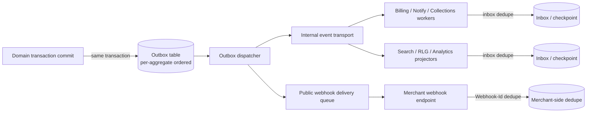

# Event taxonomy

**Version:** 0.1
**Status:** Proposed MVP contract baseline
**Related:** [Logical architecture](05-logical-architecture.md) (ADR-LA-003, ADR-LA-005), [Domain model](03-domain-model.md) §7, state machines [08](08-subscription-state-machine.md)–[11](11-collection-state-machine.md), [API specification](13-api-specification.md)
**Example schemas:** [`contracts/events/`](contracts/events/)

## 1. Purpose and scope

This taxonomy governs every fact the platform emits internally and externally: domain events, integration facts, audit events, and projection-refresh signals. Events are **immutable past-tense records of something that has already happened and been durably committed** — they are not remote commands, and a consumer cannot use one to request the platform do something (that is what the API in deliverable 13 is for).

## 2. Domain, integration, audit, and projection distinctions

| Category | Produced by | Consumed by | Delivery guarantee | Public webhook? |
|---|---|---|---|---|
| **Domain event** | An authoritative bounded context, in the same transaction as the state change (ADR-LA-003) | Internal workers (billing, notifications, projectors), and merchant webhooks where designated public | At-least-once, ordered per aggregate | Yes, for the subset in §7's "Public" column |
| **Integration fact** | Anti-corruption adapters translating a provider webhook/poll result or ERP acknowledgement into canonical form | Internal domain contexts (e.g., Payments) | At-least-once; the adapter, not the raw provider payload, is the trusted producer | No — integration facts are internal; the *canonical* domain event derived from them (e.g., `payment.succeeded.v1`) is what may be public |
| **Audit event** | Audit & Governance context, append-only, for every material mutation and every AI action (deliverable 03 §"Audit and Approval") | Auditors, compliance exports, security review | At-least-once, never deleted | No — audit access is a separate authenticated export/API, not a webhook stream |
| **Projection-refresh signal** | Projectors (search, RLG, analytics) after consuming domain events | UI freshness indicators, cache invalidation | Best-effort, eventually consistent | No |

A domain event and its corresponding public webhook delivery share the same envelope and payload (deliverable 13 §15.1); the webhook is a *delivery channel* for a domain event, not a separate event type.

## 3. Envelope

All events (internal and public) use a versioned CloudEvents-style envelope, documented here in prose and formalized as JSON Schema for representative examples under `contracts/events/`.

```json
{
  "id": "01HZY3K9F8G7T6M5N4P3Q2R1S0",
  "source": "urn:sub-rev-os:tenant:acme:context:billing",
  "specversion": "1.0",
  "type": "com.subrevos.invoice.finalized.v1",
  "time": "2026-09-23T14:03:11.204Z",
  "datacontenttype": "application/json",
  "dataschema": "https://schemas.example.com/events/invoice.finalized.v1.json",
  "subject": "invoice/01HZY2...",
  "tenant_id": "01HZX1...",
  "aggregate_type": "Invoice",
  "aggregate_id": "01HZY2...",
  "aggregate_version": 3,
  "correlation_id": "c-01HZY0...",
  "causation_id": "cmd-01HZXZ...",
  "actor": { "type": "USER", "id": "01HZW9...", "delegated_by": null },
  "occurred_at": "2026-09-23T14:03:10.998Z",
  "recorded_at": "2026-09-23T14:03:11.204Z",
  "data_classification": "RESTRICTED_FINANCIAL",
  "data": { "...": "event-specific payload" }
}
```

| Field | Rule |
|---|---|
| `id` | Globally unique event ID (ULID); stable across redelivery. |
| `type` | `com.subrevos.<context>.<past_tense_fact>.v<N>`; matches the catalog in §7. |
| `tenant_id` | Mandatory on every event without exception; never absent even for platform-internal facts (ADR-LA-008). |
| `aggregate_type` / `aggregate_id` / `aggregate_version` | Identifies the authoritative record and its version at commit time; enables ordering scope (§5) and RLG projection (deliverable 06 §6). |
| `correlation_id` / `causation_id` | Propagated from the originating request/command per deliverable 13 §7; `causation_id` references the command or upstream event that produced this fact, forming the causal chain audit relies on. |
| `actor` | Human, service, or system identity; `delegated_by` set when an operator acts on behalf of another authorized identity. |
| `occurred_at` | Business time the fact became true (e.g., payment success confirmed by provider). |
| `recorded_at` | System commit time; always ≥ `occurred_at`; the two are deliberately distinct so backdated/late facts remain explainable (deliverable 06 §10). |
| `data_classification` | Drives redaction/access rules per deliverable 15; matches the classes in deliverable 04 §6. |
| `data` | Event-specific payload; never includes secrets, raw payment credentials, or full unrestricted PII (master prompt invariant, §100). |

## 4. Naming and compatibility rules

1. **Naming:** `<bounded_context>.<aggregate_or_topic>.<past_tense_verb>[.v<N>]` in lower snake/dot case, e.g. `subscription.cancelled.v1`, `invoice.finalized.v1`, `payment.reconciliation_required.v1`. Names are facts ("cancelled"), never imperatives ("cancel").
2. **Versioning:** the trailing `.vN` is a **schema major version**. A new major version is required for any breaking payload change (removed/renamed field, changed type, changed enum to closed-and-tightened validation). Additive optional fields do not bump the version.
3. **Coexistence:** when `.v2` is introduced, `.v1` continues to be emitted for its documented deprecation window (mirrors deliverable 13 §5) so existing consumers are not broken without notice.
4. **Consumer compatibility:** consumers MUST ignore unknown fields and unknown event types (forward compatibility); the schema registry (§9) enforces this contract via consumer-driven contract tests (deliverable 24).
5. **Payload minimization:** an event carries the facts needed to act on or explain the transition plus stable references (IDs) to fetch more; it does not embed an entire aggregate snapshot by default. Large/sensitive payloads (e.g., full calculation trace) are referenced by ID (`calculation_trace_id`) and fetched through an authorized API call, not inlined.

## 5. Ordering scope, delivery semantics, deduplication, replay, retention

| Concern | Rule |
|---|---|
| **Ordering scope** | Ordering is guaranteed only within one `(tenant_id, aggregate_type, aggregate_id)` stream, matching ADR-LA-003's per-aggregate outbox key. Cross-aggregate ordering (e.g., "usage rated before invoice finalized") is achieved through consumer-side causal checks (`causation_id`/state preconditions), not through global sequence numbers. |
| **Delivery semantics** | At-least-once everywhere. No component assumes exactly-once delivery; every consumer is idempotent (ADR-LA-003). |
| **Deduplication** | Consumers dedupe by `id` (event ID) using an inbox/checkpoint pattern (deliverable 03 §8, `InboxReceipt` in deliverable 07). Redelivery of an already-processed `id` is a no-op. |
| **Replay** | Internal consumers can replay from a stored checkpoint/offset for recovery or projector rebuild (deliverable 06 §6). External webhook replay is the bounded, permissioned mechanism in deliverable 13 §15.3 — it re-delivers the exact persisted envelope, never regenerates a fact. |
| **Retention** | Domain event log: retained at least as long as the source aggregate's audit/financial retention policy (deliverable 07 §9), default no shorter than 7 years for financially material events, tenant-configurable upward. Non-financial/high-volume operational events (e.g., raw usage ingestion acks) may have a shorter operational retention distinct from the durable `UsageEvent` record itself, which is never deleted early. |
| **Dead-letter / quarantine** | A consumer that repeatedly fails to process an event (bounded retry with backoff) moves it to a per-consumer dead-letter queue with reason, attempt history, and operator-visible replay control (deliverable 05 §9 runbook: "webhook backlog"). Dead-lettering never blocks the outbox dispatcher from delivering to other consumers. |
| **Schema registry governance** | Every `type`+version has a registered JSON Schema (`dataschema` URL) checked into the schema registry; a producer cannot emit an event whose payload fails its registered schema (enforced in CI and at publish time). Registry changes follow the same review/approval discipline as API changes (deliverable 13 §5). |

## 6. Ordering and delivery diagram



## 7. Event catalog

Every event below matches the vocabulary already fixed in deliverables 08–12; this deliverable does not introduce new state names. **Public** = eligible for merchant webhook subscription (deliverable 13 §16.10). **Internal** = platform-only.

### 7.1 Customer

| Event | Public? | Key payload references |
|---|:---:|---|
| `customer.created.v1` | Public | customer_id, display_name, external_references |
| `customer.updated.v1` | Public | customer_id, changed_fields (non-financial profile only) |
| `account.created.v1` | Public | account_id, customer_id, currency, terms |
| `account.status_changed.v1` | Public | account_id, prior/new status, reason |

### 7.2 Catalog / pricing

| Event | Public? | Key payload references |
|---|:---:|---|
| `product_version.published.v1` | Internal | product_id, product_version_id, effective_period |
| `offer.published.v1` / `plan.published.v1` | Internal | offer/plan id, product_version_id, market/segment/channel |
| `pricing.version_activated.v1` | Internal | rate_card_id, content_hash, effective_period, approval_reference (deliverable 12 §18) |
| `pricing.rate_evaluated.v1` | Internal | determinism key, result_id, calculation_trace_id — emitted for downstream billing consumption, not for merchant webhooks |

### 7.3 Subscription

| Event | Public? | Key payload references |
|---|:---:|---|
| `subscription.created.v1` | Public | subscription_id, account_id, plan snapshot, initial state |
| `subscription.activation_scheduled.v1` | Internal | change_id, effective_time, prerequisites |
| `subscription.activated.v1` | Public | prior/new state, service_start, items, schedule refs |
| `subscription.trial_converted.v1` | Public | trial_interval, conversion_time, paid_terms |
| `subscription.changed.v1` | Public | change_id/type, prior/new version, effective_time, affected items, billing-impact reference |
| `subscription.paused.v1` / `subscription.resumed.v1` | Public | policy, effective_time, prior/new state |
| `subscription.suspended.v1` / `subscription.reinstated.v1` | Public | reason/policy, effective_time, prior state |
| `subscription.cancellation_scheduled.v1` | Public | change_id, cancel_time, mode, impact preview |
| `subscription.cancelled.v1` | Public | prior/new state, end_time, reason, final-bill policy |
| `subscription.terminated.v1` | Public | approval, reason, end_time, final-bill policy |
| `subscription.expired.v1` | Public | term boundary, renewal disposition |

All eleven events reuse the exact payload references already specified in deliverable 08 §9 verbatim; this table adds only the public/internal classification.

### 7.4 Usage / rating

| Event | Public? | Key payload references |
|---|:---:|---|
| `usage.accepted.v1` | Internal | usage_event_id, source_event_id, meter_id, subscription_item_id, event_time |
| `usage.rejected.v1` / `usage.quarantined.v1` | Internal | source_event_id, reason code, disposition |
| `usage.corrected.v1` | Internal | correction_id, original usage_event_id, delta/replacement semantics |
| `usage.rated.v1` | Internal | rated_event_id, charge_id, rate_card/component version, amount, calculation_trace_id |
| `usage.received.v1` (aggregate summary) | Public | subscription_id, meter_id, window, quantity — a coarser public-facing summary distinct from internal per-event facts, to avoid overexposing raw dimensional usage to third parties |

### 7.5 Invoice / receivable

| Event | Public? | Key payload references |
|---|:---:|---|
| `invoice.draft_generated.v1` | Internal | billing_run_id, invoice draft id, source charges |
| `invoice.approval_requested.v1` | Internal | invoice id, approval_id, policy |
| `invoice.finalized.v1` | Public | invoice_id, invoice_number, account_id, total, currency, due_date, receivable_id |
| `invoice.delivery_requested.v1` / `invoice.delivered.v1` / `invoice.delivery_failed.v1` | Internal / Public (`delivered`, `delivery_failed`) | invoice_id, channel, template/version, delivery evidence |
| `invoice.due.v1` | Public | invoice_id, due_date, open_amount — deduplicated scheduled fact |
| `invoice.overdue.v1` | Public | invoice_id, days_overdue, policy_version — derived transition |
| `invoice.partially_paid.v1` / `invoice.paid.v1` | Public | invoice_id, allocation reference, open_amount |
| `invoice.disputed.v1` / `invoice.dispute_resolved.v1` | Public | invoice_id, disputed_amount, reason, resolution |
| `invoice.credited.v1` | Public | invoice_id, credit_note_id, amount, reason |
| `invoice.written_off.v1` | Public | invoice_id, amount, approval reference |
| `invoice.voided.v1` | Public | invoice_id, reversal evidence |

### 7.6 Payment / refund

| Event | Public? | Key payload references |
|---|:---:|---|
| `payment.created.v1` | Internal | payment_id, account_id, amount/currency, purpose |
| `payment.attempted.v1` | Internal | payment_id, attempt_id, gateway, canonical status |
| `payment.action_required.v1` | Public | payment_id, action type (e.g., authentication), expiry |
| `payment.pending.v1` | Internal | payment_id, attempt_id |
| `payment.retry_scheduled.v1` | Internal | payment_id, next attempt time, canonical reason |
| `payment.failed.v1` | Public | payment_id, canonical reason code, retry_advice |
| `payment.succeeded.v1` | Public | payment_id, amount, method, settlement reference if available |
| `payment.cancelled.v1` | Public | payment_id, reason |
| `payment.reconciliation_required.v1` | Internal | payment_id/attempt_id, ambiguous evidence reference — never delivered externally; this is an operational signal |
| `payment.allocated.v1` / `payment.allocation_reversed.v1` | Public | payment_id, receivable_id, allocation_id, amount |
| `payment.refund_requested.v1` | Internal | payment_id, refund_id, requested amount |
| `refund.succeeded.v1` / `refund.failed.v1` | Public | refund_id, payment_id, amount, reason |
| `payment.reversed.v1` / `payment.chargeback_opened.v1` | Public (Release 2 connector scope) | payment_id, reversal evidence |

### 7.7 Collections

| Event | Public? | Key payload references |
|---|:---:|---|
| `collection.case_opened.v1` | Internal | case_id, account_id, trigger, stage |
| `collection.case_activated.v1` | Internal | case_id, policy version |
| `collection.risk_assessed.v1` | Internal | assessment_id, subject, band, factor codes, policy version — never includes protected attributes (deliverable 11 §6) |
| `collection.action_recommended.v1` | Internal | case_id, action_id, action type, reason codes, expiry |
| `collection.action_scheduled.v1` / `collection.action_completed.v1` | Internal | action_id, channel, outcome |
| `collection.case_held.v1` / `collection.case_resumed.v1` | Internal | case_id, hold reason |
| `collection.promise_recorded.v1` / `collection.promise_kept.v1` / `collection.promise_broken.v1` | Internal | promise_id, case_id, amount/date |
| `collection.case_resolved.v1` / `collection.case_reactivated.v1` / `collection.case_closed.v1` | Internal | case_id, resolution reference |

Collections events are internal-only in MVP: the merchant-visible surface is the `/accounts/{id}/collection-summary` read API (deliverable 13 §16.8), not a webhook stream, to avoid exposing granular risk-scoring evidence outside an authenticated, permissioned pull.

### 7.8 Communications / notifications

| Event | Public? | Key payload references |
|---|:---:|---|
| `notification.queued.v1` / `notification.sent.v1` / `notification.delivery_failed.v1` | Internal | communication_id, channel, template/version, recipient reference (never raw contact value in the event payload) |

### 7.9 Approvals / audit

| Event | Public? | Key payload references |
|---|:---:|---|
| `approval.requested.v1` / `approval.decided.v1` | Internal | approval_id, target type/id/version, maker, decision, policy |
| `audit.recorded.v1` | Internal | audit_event_id — a meta-signal for audit-stream consumers (e.g., SIEM export); the audit record itself is queried via the audit API, not reconstructed solely from this event |

### 7.10 Integration delivery

| Event | Public? | Key payload references |
|---|:---:|---|
| `integration.export_batch_completed.v1` | Internal | connector_id, batch reference, control totals, acknowledgement status |
| `integration.export_batch_rejected.v1` | Internal | connector_id, batch reference, rejection evidence — never silently changes the source posted document (deliverable 04 §4 "ERP rejection never silently changes a posted source document") |
| `integration.webhook_delivery_failed.v1` | Internal | endpoint_id, delivery_id, attempt count — feeds the operator-visible delivery log (deliverable 13 §15.2) |

## 8. Sensitive-data restrictions and payload-minimization rules

1. **Never included in any event payload:** raw payment credentials (PAN, CVV, bank account number), authentication secrets, API keys/signing secrets, full unredacted government ID numbers, or any field classified `SECURITY_SECRET` (deliverable 04 §6).
2. **Included only by stable reference, not value:** calculation traces (`calculation_trace_id`), full usage dimension sets for high-cardinality meters (public `usage.received.v1` carries an aggregate window, not per-event dimensions), and provider raw payloads (kept as a hash/reference in the adapter's evidence store, not embedded in the canonical event).
3. **PII minimization:** customer/contact identifiers are carried as internal IDs; display-safe fields (e.g., masked email) appear only where a consumer's legitimate purpose requires it, consistent with deliverable 04 §6 confidential-business handling.
4. **Protected attributes:** collection and risk events never carry protected/sensitive attributes, matching deliverable 11 §6 and master prompt §100 ("never allow AI to fabricate financial explanations" / never use protected attributes in risk).
5. **Classification propagation:** `data_classification` on the envelope determines downstream handling (log redaction, retention, access) exactly as deliverable 04 §6 defines for the same classes; a projector or export pipeline is not allowed to declassify data by omission.
6. **Webhook payload minimization:** public event payloads are deliberately coarser than internal ones (see `usage.received.v1` vs. `usage.rated.v1`) — the general rule is that a webhook carries what a merchant integration needs to react and fetch more via the authorized API, not a mirror of internal state.

## 9. Schema registry governance

- Every `(type, version)` has exactly one registered JSON Schema document, versioned alongside the OpenAPI contracts under source control (`contracts/events/`).
- A producer's CI pipeline validates emitted sample payloads against the registered schema before merge; a schema change that breaks a currently-registered consumer contract test fails the build.
- New event types and new major versions require the same architecture-decision documentation discipline as an ADR (decision, alternatives, rationale) when they introduce a new bounded-context concept; purely additive fields do not require an ADR, only a changelog entry in the registry.
- Registry entries carry `introduced_in_version`, `deprecated_in_version` (nullable), and `removed_after` (nullable, only set once a deprecation window per deliverable 13 §5 has elapsed).

## 10. End-to-end event sequence for the MVP vertical slice

Matches the walkthrough in deliverable 13 §17; shown here as the causal event chain (`causation_id` arrows), confirming no step is missing a fact and no fact is invented ahead of its authoritative commit.

```mermaid
sequenceDiagram
  participant Op as Operator/API
  participant Sub as Subscriptions
  participant Usage as Usage ingress
  participant Rate as Rating
  participant Bill as Billing/Invoice
  participant Pay as Payments
  participant Coll as Collections
  participant Out as Outbox/Webhooks

  Op->>Sub: activate subscription (command)
  Sub->>Out: subscription.activated.v1
  Op->>Usage: usage-events:batch
  Usage->>Out: usage.accepted.v1 (per event)
  Usage->>Rate: aggregate + rate (causation: usage.accepted.v1)
  Rate->>Out: usage.rated.v1
  Op->>Bill: start billing run
  Bill->>Out: invoice.draft_generated.v1
  Op->>Bill: finalize invoice
  Bill->>Out: invoice.finalized.v1 (causation: finalize command)
  Out-->>Op: webhook: invoice.finalized.v1
  Op->>Pay: create payment
  Pay->>Out: payment.created.v1 / payment.attempted.v1
  Pay-->>Pay: provider callback applied (causation: provider event)
  Pay->>Out: payment.succeeded.v1
  Out-->>Op: webhook: payment.succeeded.v1
  Pay->>Bill: payment.allocated.v1 (Receivables consumes payment.succeeded.v1)
  Bill->>Out: invoice.paid.v1
  Out-->>Op: webhook: invoice.paid.v1
  Note over Coll: collection-summary reflects LOW risk;<br/>no case opened for this fully-paid path
```

Every arrow into `Out` corresponds to a row in §7; every webhook delivery to `Op` uses the signed envelope from deliverable 13 §15.

## 11. Architecture decisions

### ADR-EVT-001 — Separate public and internal event surfaces per type, not a single stream with filtering

- **Decision:** Each event `type` is explicitly classified Public or Internal in the catalog (§7); webhook subscriptions can only select from the Public set.
- **Alternatives:** emit one internal stream and let merchants subscribe to any type via a permission filter; emit a fully separate "public API" event vocabulary translated from internal events at delivery time.
- **Advantages:** prevents accidental overexposure of internal risk-scoring, rating-run, or reconciliation detail; keeps the webhook contract stable even as internal event types evolve; avoids maintaining two independent vocabularies.
- **Disadvantages:** a classification decision must be made and revisited for every new event type; some internal detail merchants might eventually want requires a deliberate new Public event rather than a permission toggle.
- **Rationale:** the platform's collections and rating internals are a competitive and sensitive surface (master prompt §85 differentiation); coarse public/internal separation is simpler to govern than per-field redaction rules applied uniformly to one stream.
- **Implications:** every new event type addition to the registry (§9) must set its Public/Internal classification as part of review.

### ADR-EVT-002 — Coarser public usage event distinct from internal per-event rating fact

- **Decision:** `usage.received.v1` (public, aggregate window) is a distinct, deliberately less granular event from `usage.rated.v1`/`usage.accepted.v1` (internal, per-event).
- **Alternatives:** deliver the same per-event usage fact both internally and externally; omit usage webhooks entirely.
- **Advantages:** merchants integrating usage-based products get timely aggregate signal without the platform exposing raw dimensional usage data (which may itself be commercially sensitive to the merchant's own customers) at per-event granularity over a webhook channel with different security assumptions than the authenticated query API.
- **Disadvantages:** merchants needing per-event detail must use the authenticated `usage-events` query API (deliverable 13 §16.4) instead of the webhook stream.
- **Rationale:** matches the payload-minimization principle (§8.6) and keeps the high-volume usage path from becoming the dominant driver of webhook infrastructure cost/complexity.
- **Implications:** documentation for developers (deliverable 13, developer experience) must clearly explain the two surfaces and when to use each.

## 12. Acceptance criteria

1. Every event type in §7 has a registered JSON Schema matching the envelope in §3 and the payload references listed.
2. No event payload sampled in CI contains a field classified `SECURITY_SECRET` or raw payment credential (automated schema + payload-content check).
3. A consumer that has never seen a given `(type, vN)` before can process it using only forward-compatible field access (contract test: unknown-field tolerance).
4. Replaying the full MVP vertical-slice event sequence (§10) into a fresh projector produces the same node/edge counts as the original run (ties to deliverable 06 §13 acceptance criterion 5).
5. Every Public event type has a corresponding entry in the webhook subscription catalog (deliverable 13 §16.10) and a documented example payload.
6. Dead-lettered events are visible in an operator queue with reason and safe replay control; no dead-letter blocks unrelated consumers.
7. Collections and risk-assessment events (§7.7) never appear in any Public/webhook-eligible classification (automated registry check).
8. Cross-tenant event payload/metadata never appears in another tenant's delivery, inbox, or dead-letter queue (isolation test, ties to deliverable 16).
