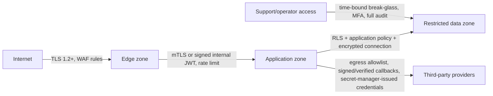
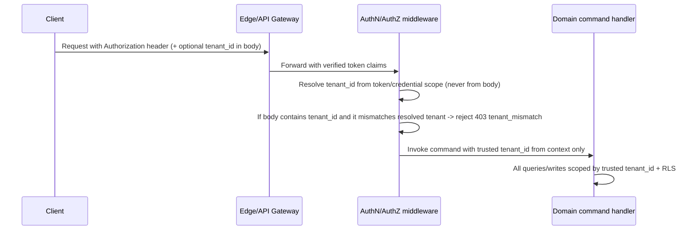

# Security architecture

**Version:** 0.1
**Status:** Proposed MVP baseline; not a compliance certification
**Related:** [System context](04-system-context.md), [Logical architecture](05-logical-architecture.md), [Data model / ERD](07-data-model-erd.md) §8, [API specification](13-api-specification.md), [Multi-tenancy architecture](16-multi-tenancy-architecture.md)

## 1. Statement of scope

This document defines the MVP security architecture: controls, not certification. It states **architectural alignment** with SOC 2, ISO 27001, PCI DSS scope minimization, GDPR, and relevant regional privacy laws, and lists the evidence each would require. No claim of certification, audit completion, or legal compliance determination is made here; those require an external audit, legal review, and organizational controls beyond software architecture.

## 2. Assets, actors, trust zones, entry points

### 2.1 Assets ranked by sensitivity

| Asset class | Examples | Impact if compromised |
|---|---|---|
| Payment credentials / tokens | Provider tokens, mandate references, fingerprint hashes | Fraud, regulatory exposure, irrecoverable customer trust loss |
| Financial records | Invoices, ledger entries, receivables, calculation traces | Incorrect billing, regulatory misstatement, customer disputes |
| Authentication material | Session tokens, API keys, signing secrets, OIDC client secrets | Full account/tenant takeover |
| Tenant configuration | Pricing rules, approval policies, roles | Unauthorized financial exposure, competitive leakage |
| Customer PII | Contacts, addresses, billing history | Privacy violation, regulatory penalty |
| Audit evidence | AuditEvent, ApprovalRequest records | Loss of accountability, undermines every other control |
| AI interaction evidence | Prompts, grounding references, tool invocations | Prompt-injection exploitation, fabricated financial narrative |

### 2.2 Actors and trust levels

Reuses the actor table from deliverable 04 §3 without modification; this document adds the control detail behind "OIDC/SAML, MFA," "workload identity," and "short-lived signed link" already named there.

### 2.3 Trust zones

Reuses the trust-zone diagram from deliverable 04 §6. This document adds the specific controls enforced at each zone boundary:

### 2.4 Entry points and data-flow threat model (STRIDE summary)

| Entry point | Primary threats (STRIDE) | Primary controls |
|---|---|---|
| Public API (`/v1/...`) | Spoofing, tampering, information disclosure, elevation of privilege | OIDC/OAuth2 auth, tenant derivation from credential (§4), RBAC/ABAC (§5), input validation, RLS (§6) |
| Customer Portal | Spoofing (session hijack), tampering (unauthorized subscription change), repudiation | Portal session scoping to one account, signed short-lived links for narrow actions, audit of every self-service mutation |
| Inbound provider webhooks (payment, tax) | Spoofing, tampering, replay | Signature verification, timestamp tolerance, provider-account mapping, dedup by provider event ID (deliverable 10 §5) |
| Outbound merchant webhooks | Tampering in transit, replay by a compromised merchant endpoint | HMAC signing with rotation (deliverable 13 §15.1), timestamp tolerance, TLS-only delivery |
| Admin web / SSO | Spoofing, elevation of privilege | SAML/OIDC SSO, MFA, RBAC, session timeout, device/session visibility |
| Background workers / schedulers | Spoofing (forged internal job), tampering (unauthorized tenant context) | Workload identity, signed/trusted tenant context re-validated per transaction (ADR-LA-008) |
| AI gateway | Prompt injection, information disclosure via tool misuse, elevation of privilege via tool call | Model/tool allowlist, grounding-only context, redaction, no direct financial write path (§10) |
| Support/operator tooling | Elevation of privilege, information disclosure across tenants | Time-bound break-glass, full audit, least-privilege scoped views (deliverable 16 §"support access") |

## 3. Data classification and handling rules

Extends deliverable 04 §6 with explicit handling controls per class.

| Class | Examples | At rest | In transit | In logs/traces | Retention driver |
|---|---|---|---|---|---|
| `SECURITY_SECRET` | API keys, signing secrets, provider credentials | Secrets manager only, envelope-encrypted, never in application DB | TLS 1.2+, never query strings | Never — redacted before any log/trace sink | Rotation policy (§7.3), never "retained" as a record |
| `RESTRICTED_FINANCIAL` | Invoice lines, balances, payment tokens, tax identifiers | Encrypted at rest, tenant-scoped access, RLS + app policy | TLS 1.2+ | Redacted monetary/token values; structural fields only | Legal/financial retention (§9) |
| `CONFIDENTIAL_BUSINESS` | Pricing rules, usage, contracts, contacts | Encrypted at rest, tenant isolation | TLS 1.2+ | Tenant-safe, no high-cardinality PII in metric labels | Tenant retention policy |
| `INTERNAL_OPERATIONAL` | Trace IDs, job state, non-sensitive metrics | Standard encryption | TLS 1.2+ | Freely logged | Operational retention (short) |
| `PUBLIC` | Published docs, SDK examples | N/A | TLS | N/A | N/A |

Every table, event field, and API response field maps to exactly one class (deliverable 14 §3, `data_classification`); classification is set at schema design time and reviewed whenever a new field is added.

## 4. Authentication

| Mechanism | Used for | Controls |
|---|---|---|
| OIDC/OAuth2 (authorization code + PKCE) | Human console/admin login, developer console | Standard OIDC claims, short-lived access token, refresh rotation, MFA enforced by IdP policy |
| SAML SSO | Enterprise merchant workforce identity federation | Signed assertions, clock-skew tolerance, mandatory signature + audience validation |
| MFA | All privileged human sessions (Admin, Finance, Support, Auditor roles) | IdP-enforced; platform additionally requires step-up MFA for maker-checker approval actions and break-glass access |
| Service/workload identity | Internal workers, schedulers, projectors | mTLS or short-lived signed service tokens issued by a workload identity provider; no long-lived static service credentials |
| API keys / OAuth client credentials | Server-to-server merchant integrations | Scoped to one tenant, one or more permission scopes, rotatable, revocable, never accepted over unencrypted transport |
| Session management | Admin web, Customer Portal | Short-lived session token + refresh, idle timeout, device/session listing and revocation, secure/HttpOnly/SameSite cookies where cookie-based |
| Signed payment links | Narrow subscriber actions (pay, confirm method) | Single-purpose JWS, short TTL, one-time or bounded-use, no broader session granted (deliverable 04 §3) |

**Tenant derivation:** repeats deliverable 13 §3 as the authoritative control — tenant is never accepted from an untrusted request body field; see §4.1.

### 4.1 Untrusted-body-cannot-override-tenant control (concrete mechanism)

This is implemented, not merely documented: the domain command handler signature never accepts `tenant_id` as a caller-supplied parameter — it is injected by the authorization middleware from verified context, matching deliverable 16 §1.

## 5. Authorization: RBAC, ABAC, resource authorization, maker-checker, separation of duties

### 5.1 RBAC

- Roles bind to permissions (deliverable 13 §4 table is the canonical example set); roles are tenant-scoped configuration, not global constants, so a tenant can compose roles from a platform-defined permission catalog without code changes (master prompt §61).
- Permission checks are enforced at the domain command boundary, not only at the UI — the API is the actual enforcement point; the UI hides actions a user cannot perform but never relies on that as a control.

### 5.2 ABAC (optional, layered on RBAC)

- Attribute conditions narrow an RBAC grant, e.g., "Collections Agent may execute actions only for cases with `exposure_amount < threshold`" or "Support may view Customer 360 only for tenants in their assigned support queue."
- ABAC policies are versioned and evaluated deterministically; a policy engine failure defaults to deny, never to implicit allow.

### 5.3 Resource-level (object) authorization

- Every domain object fetch/mutation re-validates tenant scope and, where applicable, account/ownership scope (e.g., a Subscriber Admin can act only within their own `account_id`), independent of the RBAC role check. This is the platform's Broken Object Level Authorization (BOLA/IDOR) control — see §8.4.

### 5.4 Maker-checker / separation of duties

- `ApprovalPolicy` (deliverable 07) defines which action types require a second authorized decision, at what threshold, and whether `separation_of_duties` prohibits the same actor from both proposing and approving.
- Enforced examples: pricing activation (Product + Finance), refund/write-off above threshold (Finance Controller), termination and backdating (elevated permission), collection exception approval (separate role from the recommending agent).
- The approval record itself (`ApprovalRequest`) is immutable evidence; a rejected or expired approval cannot be silently reused.

## 6. Tenant isolation controls

Full architecture is deliverable 16; this section states the security-control summary across every data path named in the handover brief.

| Path | Control |
|---|---|
| Database | Non-null `tenant_id` on every tenant-owned row, RLS policy requiring tenant equality (defense in depth behind mandatory application-level filtering), tenant-scoped unique/foreign keys (deliverable 07 §8) |
| Cache (Redis) | Tenant-prefixed keys; a cache failure/eviction never substitutes cross-tenant data (fail-closed on key mismatch) |
| Events/outbox | `tenant_id` mandatory on every envelope (deliverable 14 §3); consumers reject/quarantine an event with missing or mismatched tenant context |
| Search index | Tenant-scoped index/document filter enforced server-side, never trusted from client query parameters |
| Object storage | Tenant-prefixed object paths, short-lived signed URLs scoped to one tenant/object |
| Exports | Every export job is tenant-bound at creation; a platform-wide export requires a distinct, separately audited de-identified pipeline (deliverable 04 §6, deliverable 16) |
| Observability (logs/traces/metrics) | Tenant-safe labels; no free-text log line may embed cross-tenant identifiers without redaction; metric cardinality controls prevent per-tenant PII from becoming a label |
| Support access | Time-bound, audited, scoped to the specific tenant/case under investigation (§11.3) |
| AI gateway | Every model/tool call carries the trusted tenant context; retrieval/grounding is tenant-filtered before assembly, not after (§10) |

## 7. Encryption, key management, secrets management, rotation

### 7.1 Encryption

- **In transit:** TLS 1.2+ everywhere, including internal service-to-service traffic where the network boundary is not otherwise trusted; certificate validation is never disabled, including in adapters.
- **At rest:** database and object storage encryption using provider-managed or platform-managed keys per data class (§3); `RESTRICTED_FINANCIAL` and `SECURITY_SECRET` classes use envelope encryption with tenant- or purpose-scoped data encryption keys where the deployment model requires cryptographic tenant separation (dedicated deployment path, deliverable 16 §"dedicated enterprise deployment").

### 7.2 Key management

- A key management service (KMS) holds root/master keys; application services never handle raw key material, only KMS-mediated encrypt/decrypt/sign operations.
- Key hierarchy: root key (KMS-held) → data encryption keys (rotated independently) → per-record/per-field encryption where classification requires it.
- Signing keys (webhook HMAC secrets, JWT signing keys) are distinct from data encryption keys and have their own rotation schedule (§7.3).

### 7.3 Secrets management and rotation

| Secret type | Storage | Rotation |
|---|---|---|
| Provider credentials (Stripe, tax, email) | Secrets manager, referenced by ID from `Connector` config (deliverable 07) | Scheduled rotation + immediate rotation on suspected compromise |
| Webhook signing secrets | Secrets manager | Dual-secret rotation window (deliverable 13 §15.1) so in-flight deliveries verify against either secret during transition |
| Internal service credentials | Workload identity / short-lived tokens | Automatic, short TTL (minutes-to-hours), no manual rotation needed |
| Database credentials | Secrets manager, least-privilege per service role | Scheduled rotation; break-glass credentials rotate immediately after each use |
| Signing/certificate lifecycle | Certificate manager with expiry alerting | Renewed before expiry with automated monitoring; manual renewal is a documented runbook fallback |

## 8. Payment tokenization, PCI scope minimization, and web application threats

### 8.1 Payment tokenization and PCI DSS scope minimization

- Raw PAN, CVV, and full bank credentials are **never accepted by platform APIs** (deliverable 10 §8, master prompt invariant). Collection happens exclusively through provider-hosted fields/SDKs (e.g., Stripe Elements) that tokenize before reaching platform infrastructure.
- The platform stores only provider tokens, safe display metadata (last 4 digits, brand, expiry month/year where the provider permits display), fingerprint hash, and mandate references.
- **Architectural alignment stated, not certified:** this design is intended to keep the platform's cardholder-data-environment (CDE) footprint at SAQ-A-equivalent scope by never touching raw cardholder data. Actual PCI DSS scope determination requires a Qualified Security Assessor engagement against the final implementation and hosting environment — this document does not substitute for that assessment.

### 8.2 SSRF

- Outbound calls to merchant-configured URLs (webhook endpoints, callback URLs) go through an egress proxy with allowlist/denylist rules blocking internal/link-local address ranges, DNS-rebinding protection (re-resolve and re-validate at connection time), and a request timeout/size ceiling.

### 8.3 Injection

- All database access uses parameterized queries/ORM bindings; no dynamic SQL string construction from user input.
- The pricing rule language (deliverable 12 §14) is a typed AST interpreter, not code execution — this is itself the primary injection control for the platform's most dangerous surface (arbitrary tenant-authored logic).

### 8.4 XSS, CSRF, broken object-level authorization

- **XSS:** Admin web and Customer Portal use a framework with default output encoding/escaping (deliverable 05 §10, React), a strict Content-Security-Policy, and no `dangerouslySetInnerHTML`-equivalent without explicit sanitization review.
- **CSRF:** state-changing requests from browser sessions require same-site cookies plus an anti-CSRF token or exclusively use bearer-token auth (not ambient cookie auth) for API calls, eliminating classic CSRF for the API surface; the portal's cookie-based session (if used) is `SameSite=Strict` with CSRF token double-submit as defense in depth.
- **BOLA/IDOR:** §5.3 resource-level authorization is re-checked on every object fetch — an authenticated, correctly-tenanted user still cannot fetch an object outside their account/permission scope by guessing an adjacent ID.

### 8.5 Replay

- Idempotency keys (deliverable 13 §8) prevent financial replay from *legitimate* retries; inbound provider/webhook signature timestamp tolerance (§2.4) plus provider-event-ID deduplication prevents *malicious* replay of a captured request.

### 8.6 Mass assignment

- Request DTOs are explicit allowlists of settable fields per endpoint; domain aggregates never bind directly from raw request bodies. A field not in the documented request schema (deliverable 13 OpenAPI contract) is rejected (`400`), never silently accepted and applied.

### 8.7 Supply-chain controls

- Dependency provenance and vulnerability scanning gate CI builds; lockfiles are committed and diffed on review.
- Third-party libraries used in the pricing/rating path (financially material) have a higher review bar and pinned versions with documented upgrade cadence.
- Container images are built from minimal, scanned base images; signing/attestation of build artifacts before deployment is a target control for the enterprise horizon.

## 9. Audit integrity, safe logging, privacy, retention

### 9.1 Audit integrity

- `AuditEvent` records (deliverable 07) are append-only; the database role used by application services has no `UPDATE`/`DELETE` grant on the audit table, enforced at the database-privilege level, not only application logic.
- Every material mutation writes its audit reference **in the same transaction** as the domain change (deliverable 05 §4), so a domain effect without a corresponding audit record cannot occur.
- Audit export/read access is itself a permissioned, logged action (`audit:read`), preventing silent bulk exfiltration of audit history.

### 9.2 Safe logging

- Structured logs use tenant-safe labels; `RESTRICTED_FINANCIAL` and `SECURITY_SECRET` values are redacted by a logging middleware applied uniformly, not left to per-call-site discipline.
- Log access is role-scoped; production log search tooling for support/engineering excludes raw monetary values and payment tokens by default, matching deliverable 05 §9 ("Monetary values may be restricted by environment and role").

### 9.3 Privacy, retention, deletion/pseudonymization, legal hold, residency hooks

| Concern | Approach |
|---|---|
| Data classification / purpose limitation | §3, applied consistently from schema design through export |
| Retention | Retention period per record class (deliverable 07 §9); financial/audit records retain per legal minimums even when the associated customer is deleted/anonymized elsewhere |
| Erasure / pseudonymization | A governed workflow (not ad hoc deletion) pseudonymizes separable PII fields on a customer while preserving legally required financial facts (deliverable 00 R-010 resolution) — the workflow itself is audited and reversible only through documented exception process |
| Legal hold | A hold flag suspends any scheduled retention-driven purge for the named records/subject until released, checked before every purge job runs |
| Residency hooks | Tenant configuration reserves a `data_residency_region` field from MVP even though only one region is operated initially (deliverable 04 §"data residency", master prompt §81), so the enterprise regional-deployment path does not require a schema migration later |

## 10. AI threat controls

Extends ADR-LA-009 (deliverable 05) with the specific threat model for the AI gateway.

| Threat | Control |
|---|---|
| Prompt injection (malicious content in usage dimensions, customer notes, or retrieved documents attempting to redirect model behavior) | Untrusted content is passed to the model as clearly delimited **data**, never as instructions; the gateway's system/tool-policy prompt is not overridable by retrieved or user content; tool invocation requires a separate, non-model-controlled authorization check |
| Data exfiltration via model output | Grounding sources are tenant-scoped before retrieval (§6); the gateway redacts `SECURITY_SECRET` and cross-tenant content from any context window by construction, not by asking the model to avoid it |
| Tool authorization bypass | Every tool/action the model can invoke has its own permission scope identical to the equivalent human-initiated API call (§5); the model's "intent" is never itself an authorization grant — a human-authorized policy or explicit approval gate (deliverable 05 §"AI is behind a governed advisory gateway") is required for any financially material action |
| Fabricated grounding | Financial explanations render only from persisted calculation traces and verified Revenue Lifecycle Graph facts (deliverable 06 §9, deliverable 12 §15); the gateway rejects a response that cites unverifiable facts rather than allowing the model to fill gaps |
| Outcome audit gap | Every AI interaction records model/version, prompt/context reference, tool invoked, policy decision, human approval (if any), and outcome (master prompt §60), written to the same audit store as human actions (§9.1) |
| Model/provider compromise | Model calls are isolated to the AI gateway service boundary; a compromised model provider cannot reach the database or invoke domain commands directly — only through the same permissioned tool interface a human integration would use |

## 11. Abuse/rate/fraud controls, incident response, vulnerability management, security testing

### 11.1 Abuse, rate limiting, fraud

- Rate limits per deliverable 13 §14, tiered by endpoint sensitivity and credential trust level.
- Fraud signals (unusual payment-method velocity, geographic mismatch, repeated failed authentication) feed the same deterministic-first risk posture as Collections (deliverable 11 §6) — no undisclosed ML-only fraud block without a documented fallback and explainable factor codes.
- WAF rules at the edge zone (deliverable 04 §6) cover common attack signatures (SQLi, XSS payloads, known bad actor IP reputation) ahead of application-layer controls, as defense in depth rather than the sole control.

### 11.2 Incident response

- A documented incident response runbook (severity classification, escalation path, communication plan, post-incident review) is a required artifact before production launch, owned by Security, cross-referenced from deliverable 05 §9 operational runbooks (provider outage, webhook backlog, stuck billing run, duplicate suspicion, key rotation).
- A security incident affecting `RESTRICTED_FINANCIAL` or `SECURITY_SECRET` data triggers mandatory legal/privacy notification assessment per applicable regional law (jurisdiction-dependent; tracked as an open decision, §14).

### 11.3 Break-glass / support access

- Time-bound, MFA-gated, ticket/reason-linked elevated access; every break-glass session is fully audited (query/action log) and automatically expires; access outside an active break-glass grant is denied even for otherwise-privileged operator roles.

### 11.4 Vulnerability management

- Dependency and container scanning in CI (§8.7); a documented SLA for remediating critical/high findings before release; a responsible-disclosure/bug-bounty intake channel is a target for GA, not required for internal MVP milestones.

### 11.5 Security testing

- Static analysis (SAST) and dependency scanning gate CI.
- Dynamic testing (DAST) and authenticated API fuzzing run against staging before major releases.
- Tenant-isolation negative tests (§6, deliverable 16) are a mandatory, automated, release-blocking suite — not manual/periodic only.
- Independent penetration testing is scheduled at least annually and before the first production launch handling live payment data; findings feed the risk register (§12).

## 12. Threat/risk register

| ID | Threat | Likelihood | Impact | Mitigation | Owner | Residual risk decision |
|---|---|---|---|---|---|---|
| RISK-SEC-001 | Cross-tenant data leakage via missed `tenant_id` filter | Medium (common class of bug) | Critical | RLS defense in depth + mandatory app filter + automated negative isolation tests (§6, deliverable 16) | Architecture | Accepted with continuous automated test coverage; no manual-only mitigation accepted |
| RISK-SEC-002 | Payment credential exposure through logging/tracing | Low–Medium | Critical | Redaction middleware (§9.2), never-accept-raw-PAN API design (§8.1) | Security | Accepted with automated log-content scanning as a release gate |
| RISK-SEC-003 | Prompt injection leading to unauthorized-looking AI recommendation | Medium | High (reputational/financial if acted on) | Grounding isolation, tool authorization identical to human path, mandatory approval for financial actions (§10) | AI/Architecture | Accepted; AI cannot itself cause financial effect without independent authorization |
| RISK-SEC-004 | Webhook signing-secret compromise enabling forged inbound provider events | Low | High | Signature + timestamp + provider-account-mapping validation, secret rotation (§7.3), quarantine on ambiguity (deliverable 10 §5) | Security | Accepted with rotation SLA |
| RISK-SEC-005 | Insider/support over-access to financial data across tenants | Low | High | Time-bound break-glass, least-privilege scoped views, full audit (§11.3) | Security | Accepted with audit review cadence (frequency is an open decision, §14) |
| RISK-SEC-006 | Supply-chain compromise of a pricing/rating dependency | Low | Critical (silent billing corruption) | Pinned versions, higher review bar for financially material dependencies, golden-dataset regression on every dependency bump (deliverable 12 §23) | Engineering | Accepted with mandatory golden-test gate |
| RISK-SEC-007 | SSRF via merchant-configured webhook/callback URL | Medium | Medium–High | Egress allowlist proxy, DNS-rebind protection, timeout/size limits (§8.2) | Security | Accepted |
| RISK-SEC-008 | Idempotency-key or approval-workflow bypass causing duplicate/unauthorized financial effect | Low (well-tested path) | Critical | Idempotency contract tests (deliverable 13 §8), maker-checker enforcement (§5.4), release-blocking financial-invariant test suite | Engineering/Finance | Accepted with mandatory test gate before release |

## 13. Compliance alignment statement (not certification)

| Framework | Architectural alignment stated here | Evidence still required |
|---|---|---|
| SOC 2 | Access control, change management hooks (audit, approvals), encryption, availability design (deliverable 05) | Formal control narrative, operating-effectiveness evidence over an observation period, independent auditor engagement |
| ISO 27001 | Asset classification (§3), risk register (§12), key/secret management (§7) | Formal ISMS documentation, management review cadence, certification audit |
| PCI DSS scope minimization | Tokenization-only design (§8.1), no raw cardholder data storage | QSA scope validation against actual deployed environment and any future direct-integration expansion |
| GDPR / regional privacy laws | Data classification, retention, erasure/pseudonymization workflow, residency hooks (§9.3) | Legal review of lawful basis, DPIA where required, appointed DPO/representative where mandated, jurisdiction-specific launch decisions (deliverable 01 OD-001) |

## 14. Open decisions

| ID | Decision needed | Owner | Needed before |
|---|---|---|---|
| OD-016 | Break-glass audit review cadence and automated anomaly alerting threshold | Security | Support-access rollout |
| OD-017 | Formal incident-response runbook and legal notification thresholds by jurisdiction | Security + Legal | Production launch with live payment data |
| OD-018 | Target certification roadmap (SOC 2 Type I/II timing, ISO 27001 scope) | Security + Executive | Enterprise sales motion requiring attestation |
| OD-019 | Penetration testing cadence and scope (internal vs. third-party) beyond the pre-launch minimum | Security | First production launch |
| OD-020 | Bug-bounty/responsible-disclosure program launch timing | Security | Post-MVP |

## 15. Acceptance criteria

1. Every entry point in §2.4 has a documented control set and at least one automated test covering its primary threat.
2. No `SECURITY_SECRET`- or raw-payment-credential-classified field appears in application logs, traces, events, or audit diffs (automated scan, ties to deliverable 14 §12 acceptance criterion 2).
3. Tenant-isolation negative tests pass for every data path in §6 (ties to deliverable 16).
4. Every maker-checker-governed action type in §5.4 has an automated test proving the maker cannot self-approve.
5. AI gateway cannot invoke a financially material action without a distinct, independently authorized command (ties to deliverable 05 ADR-LA-009 and deliverable 12 §21).
6. The threat/risk register (§12) has an assigned owner and residual-risk decision for every entry before the implementation gate (deliverable 25/README gate item 6).
7. Break-glass access is time-bound, MFA-gated, and fully audited in a demonstrable test scenario.
8. No compliance claim in this document asserts certification; §13 language is reviewed against actual audit status before any external representation is made.
