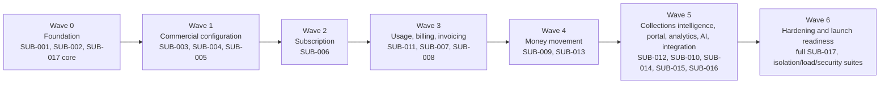

# MVP backlog

**Version:** 0.1
**Status:** Proposed sequencing baseline
**Related:** [Product Requirements Document](01-product-requirements-document.md), master specification §102 (epic list), all deliverables 03–18
**Followed by:** [Epic → Feature → User Story → Acceptance Criteria decomposition](20-epic-feature-story-acceptance-criteria.md), [Technical implementation plan](21-technical-implementation-plan.md)

## 1. Purpose and method

This backlog selects and sequences the MVP-horizon slice of the seventeen epics fixed by the master specification (§102: `SUB-001`–`SUB-017`). It does not invent new epics or rename any. Every backlog item traces to a PRD functional requirement (`FR-*`) and, where financially material, a critical invariant (`INV-*`, PRD §8). Release 2 and Enterprise features of the same epics are listed for continuity but are explicitly out of MVP sequencing (§6).

Sequencing follows the MVP release-acceptance scenario fixed in PRD §11:

`create tenant → create customer → activate price → subscribe → ingest usage → preview/finalize invoice → attempt/fail/retry/succeed payment → allocate cash → explain bill → verify audit and lineage`

## 2. Backlog principles

1. **Traceability, not estimation theater.** Every item cites the requirement(s) and invariant(s) it satisfies. Sizing uses a complexity band (S/M/L/XL), not fabricated story points — precision here would be false confidence before design-level estimation exists.
2. **Foundation before feature.** Tenant context, idempotency, outbox, audit, and RLS (`SUB-001`, `SUB-002`) are prerequisites for every other epic's "done" definition (master prompt §103) and are sequenced first.
3. **Money-adjacent work is never parallel-tracked ahead of its state machine.** Billing/Invoice/Payment/Collections backlog items cannot start implementation until their governing state machine (deliverables 08–11) and pricing specification (deliverable 12) are the versions already approved in this document set — they already are, per the README gate.
4. **The differentiator ships in MVP, not later.** Payment & Collections Intelligence (master prompt §87) is explicitly sequenced inside Wave 4/5, not deferred as a "nice to have."
5. **No epic is entirely MVP or entirely deferred.** Every epic has a genuine MVP slice (§4) and a genuine deferred remainder (§6); this backlog states both so scope creep and scope starvation are equally visible.

## 3. Epic overview

| Epic | Name | MVP slice present? | Primary MVP requirement area |
|---|---|:---:|---|
| `SUB-001` | Platform Foundation | Yes | FR-PLT-*, INV-001–008 (infrastructure for all) |
| `SUB-002` | Identity & Tenant Management | Yes | FR-PLT-001–002, deliverable 16 |
| `SUB-003` | Customer Management | Yes | FR-CUS-* |
| `SUB-004` | Product Catalog | Yes | FR-PRC-001, deliverable 03 §"Product..." |
| `SUB-005` | Pricing Engine | Yes | FR-PRC-002–005, deliverable 12 |
| `SUB-006` | Subscription Lifecycle | Yes | FR-SUB-* |
| `SUB-007` | Billing Engine | Yes | FR-INV-001, deliverable 09 §5–6 |
| `SUB-008` | Invoice Management | Yes | FR-INV-002–006 |
| `SUB-009` | Payments | Yes (Stripe adapter only) | FR-PAY-* |
| `SUB-010` | Customer Portal | Yes | FR-EXP-001–003 |
| `SUB-011` | Usage & Metering | Yes (basic) | FR-USG-* |
| `SUB-012` | Collections | Yes (basic dunning + differentiator) | FR-COL-* |
| `SUB-013` | Notifications | Yes (email first) | FR-EXP-003 |
| `SUB-014` | Analytics | Yes (basic reporting only) | FR-ANA-001 |
| `SUB-015` | AI Revenue Intelligence | Yes (narrow: grounded explain + collection summary) | Master prompt §87, deliverable 15 §10 |
| `SUB-016` | Integration Framework | Yes (narrow: Stripe/tax-evidence/email connector shape) | deliverable 04 §4 |
| `SUB-017` | Audit & Compliance | Yes | FR-PLT-003–004, deliverable 03 §"Audit and Approval" |

## 4. MVP backlog by epic

Complexity bands: **S** = well-understood, low cross-module coordination; **M** = moderate design/coordination; **L** = significant state-machine/financial-control surface; **XL** = foundational, high-risk-if-wrong, blocks many downstream items.

### `SUB-001` Platform Foundation

| ID | Item | Priority | Traceability | Depends on | Band |
|---|---|:---:|---|---|:---:|
| BL-001-01 | Trusted tenant-context propagation (authN boundary → domain command, no body override) | P0 | FR-PLT-001, INV-005, deliverable 16 §1 | — | XL |
| BL-001-02 | Idempotency-record infrastructure (`IdempotencyRecord`, conflict detection) | P0 | FR-PLT-005, INV-001, deliverable 13 §8 | BL-001-01 | L |
| BL-001-03 | Transactional outbox + dispatcher | P0 | ADR-LA-003, deliverable 14 §5 | BL-001-01 | L |
| BL-001-04 | RLS policies + mandatory repository filter + architecture test | P0 | INV-005, deliverable 16 §2, §11 | BL-001-01 | XL |
| BL-001-05 | Canonical problem/error model + correlation/causation propagation | P0 | deliverable 13 §7, §11 | BL-001-01 | M |

### `SUB-002` Identity & Tenant Management

| ID | Item | Priority | Traceability | Depends on | Band |
|---|---|:---:|---|---|:---:|
| BL-002-01 | Tenant provisioning lifecycle (`PROVISIONING→ACTIVE→SUSPENDED→CLOSED`) | P0 | deliverable 03 §5, deliverable 16 §4.1–4.2 | BL-001-01 | L |
| BL-002-02 | OIDC/SAML login, MFA hook, session management (Admin) | P0 | FR-PLT-002, deliverable 15 §4 | BL-002-01 | L |
| BL-002-03 | RBAC role/permission catalog + maker-checker (`ApprovalRequest`) | P0 | FR-PLT-004, deliverable 15 §5 | BL-002-01 | L |
| BL-002-04 | Service/workload identity for internal workers | P0 | deliverable 15 §4 | BL-001-01 | M |
| BL-002-05 | Break-glass / time-bound support access | P1 | deliverable 15 §11.3, deliverable 16 §8 | BL-002-03 | M |

### `SUB-003` Customer Management

| ID | Item | Priority | Traceability | Depends on | Band |
|---|---|:---:|---|---|:---:|
| BL-003-01 | Customer + Account CRUD and lifecycle | P0 | FR-CUS-001 | BL-002-01 | M |
| BL-003-02 | Customer 360 read model (subscriptions, balance, invoices, payments, risk, timeline) | P0 | FR-CUS-002, deliverable 17 §5.2 | BL-003-01 | L |
| BL-003-03 | Deactivation/pseudonymization workflow (no hard delete of financially referenced customers) | P1 | FR-CUS-003, deliverable 15 §9.3 | BL-003-01 | M |

### `SUB-004` Product Catalog

| ID | Item | Priority | Traceability | Depends on | Band |
|---|---|:---:|---|---|:---:|
| BL-004-01 | Product / ProductVersion effective-dated versioning + publish workflow | P0 | FR-PRC-001, deliverable 03 §"Product..." | BL-002-03 | L |
| BL-004-02 | Offer / Plan composition and selection rules | P0 | FR-PRC-001 | BL-004-01 | M |
| BL-004-03 | Catalog Product Catalog admin screen | P0 | deliverable 18 §4 | BL-004-01 | M |

### `SUB-005` Pricing Engine

| ID | Item | Priority | Traceability | Depends on | Band |
|---|---|:---:|---|---|:---:|
| BL-005-01 | Typed pricing AST + compiler (validation, no arbitrary code) | P0 | FR-PRC-003, deliverable 12 §14, ADR-PRC-001 | BL-004-01 | XL |
| BL-005-02 | Flat/per-seat/one-time/volume/graduated tier/allowance charge types | P0 | FR-PRC-002, deliverable 12 §2, §8 | BL-005-01 | XL |
| BL-005-03 | Proration engine (`NONE`/`ACTUAL_DAYS`/`FULL_PERIOD_ONLY`/`IMMEDIATE_FULL`) | P0 | deliverable 12 §11 | BL-005-01 | L |
| BL-005-04 | Discounts, minimum/maximum guardrails, rounding/allocation | P0 | deliverable 12 §12–13 | BL-005-02 | L |
| BL-005-05 | Calculation trace persistence | P0 | INV-006, ADR-PRC-002 | BL-005-02 | L |
| BL-005-06 | Rate-card activation workflow with maker-checker | P0 | FR-PRC-005, INV-007, deliverable 12 §18 | BL-002-03, BL-005-01 | L |
| BL-005-07 | Pricing simulation (preview/quote, non-mutating) | P0 | FR-PRC-004, deliverable 12 §17 | BL-005-06 | M |
| BL-005-08 | Pricing Designer UI (visual canvas + simulator) | P0 | deliverable 18 §5 | BL-005-07 | XL |
| BL-005-09 | Golden dataset + property-based test suite | P0 | deliverable 12 §23 | BL-005-02–05 | L |

### `SUB-006` Subscription Lifecycle

| ID | Item | Priority | Traceability | Depends on | Band |
|---|---|:---:|---|---|:---:|
| BL-006-01 | Subscription aggregate + canonical state machine (all transitions, deliverable 08 §2) | P0 | FR-SUB-001, INV-007 | BL-003-01, BL-005-06 | XL |
| BL-006-02 | Subscription item lifecycle + effective-dated intervals | P0 | FR-SUB-002, deliverable 08 §6 | BL-006-01 | L |
| BL-006-03 | Scheduled changes (`SubscriptionChange`) + idempotent scheduler claim | P0 | FR-SUB-003–004, deliverable 08 §3, §10 | BL-006-01 | L |
| BL-006-04 | Preview-change / proration-impact endpoint | P0 | deliverable 13 §16.3 | BL-006-02, BL-005-03 | M |
| BL-006-05 | Subscription Detail admin screen | P0 | deliverable 18 §3 | BL-006-01 | M |

### `SUB-007` Billing Engine

| ID | Item | Priority | Traceability | Depends on | Band |
|---|---|:---:|---|---|:---:|
| BL-007-01 | Billing schedule (calendar/anniversary, advance/arrears) | P0 | FR-INV-001, deliverable 12 §5 | BL-006-01 | L |
| BL-007-02 | Billing run job (async, restartable, checkpointed) | P0 | deliverable 13 §13.2, deliverable 05 §9 | BL-007-01 | L |
| BL-007-03 | Draft invoice assembly + grouping policy | P0 | deliverable 09 §5 | BL-007-02, BL-005-05 | L |

### `SUB-008` Invoice Management

| ID | Item | Priority | Traceability | Depends on | Band |
|---|---|:---:|---|---|:---:|
| BL-008-01 | Invoice document state machine (`DRAFT→PENDING_APPROVAL→POSTED→VOIDED/CANCELLED`) | P0 | FR-INV-002, INV-003 | BL-007-03 | XL |
| BL-008-02 | Finalization transaction (number allocation, receivable, journal) | P0 | FR-INV-006, deliverable 09 §6 | BL-008-01 | XL |
| BL-008-03 | Receivable state machine + subledger balance | P0 | FR-PAY-004, deliverable 09 §3 | BL-008-02 | L |
| BL-008-04 | Credit note / write-off / void corrective documents | P0 | FR-INV-003, deliverable 09 §8 | BL-008-02 | L |
| BL-008-05 | PDF/HTML/JSON invoice rendering | P0 | FR-INV-005 | BL-008-02 | M |
| BL-008-06 | Invoice Detail admin screen + "Explain invoice" | P0 | deliverable 18 §7 | BL-008-02, BL-005-05 | M |

### `SUB-009` Payments

| ID | Item | Priority | Traceability | Depends on | Band |
|---|---|:---:|---|---|:---:|
| BL-009-01 | Canonical Payment/Attempt state machines (provider-neutral) | P0 | FR-PAY-001, deliverable 10 §2–3 | BL-008-03 | XL |
| BL-009-02 | Stripe adapter (anti-corruption boundary) | P0 | ADR-LA-006, deliverable 04 §4 | BL-009-01 | XL |
| BL-009-03 | Payment method tokenization (provider-hosted collection only) | P0 | FR-PAY-002, deliverable 15 §8.1 | BL-009-02 | L |
| BL-009-04 | Inbound webhook verification, dedup, canonical mapping | P0 | FR-PAY-003, deliverable 10 §5 | BL-009-02 | L |
| BL-009-05 | Allocation engine (payment/credit → receivable) | P0 | deliverable 10 §7 | BL-009-01, BL-008-03 | L |
| BL-009-06 | Refund lifecycle | P0 | deliverable 10 §9 | BL-009-01 | M |
| BL-009-07 | Payment Detail admin screen | P0 | deliverable 18 §8 | BL-009-01 | M |

### `SUB-010` Customer Portal

| ID | Item | Priority | Traceability | Depends on | Band |
|---|---|:---:|---|---|:---:|
| BL-010-01 | Portal auth/session scoped to one account | P0 | deliverable 13 §3, deliverable 17 §4 | BL-002-02 | M |
| BL-010-02 | Portal Home (payment inbox, upcoming amount, bill-shock alert) | P0 | FR-EXP-001, master prompt §28, §30 | BL-008-02 | L |
| BL-010-03 | Bills / Explain-my-bill | P0 | FR-EXP-001, deliverable 12 §15 | BL-008-06 | M |
| BL-010-04 | Self-service subscription/payment-method changes with impact preview | P0 | FR-EXP-002, deliverable 17 §9 | BL-006-04, BL-009-03 | L |
| BL-010-05 | No-dark-pattern cancellation flow | P0 | FR-EXP-002, deliverable 17 §9 | BL-006-01, BL-010-04 | M |

### `SUB-011` Usage & Metering

| ID | Item | Priority | Traceability | Depends on | Band |
|---|---|:---:|---|---|:---:|
| BL-011-01 | Meter definition + usage ingestion API (single/batch) | P0 | FR-USG-001, deliverable 13 §13.1 | BL-006-02 | L |
| BL-011-02 | Deduplication, schema validation, quarantine | P0 | FR-USG-002, INV-002 | BL-011-01 | L |
| BL-011-03 | Aggregation (SUM/COUNT/COUNT_DISTINCT/MAX) + late-event policy | P0 | FR-USG-005, deliverable 12 §7 | BL-011-02 | L |
| BL-011-04 | Rating run (deterministic, replayable) | P0 | FR-USG-004, deliverable 12 §16 | BL-011-03, BL-005-02 | XL |
| BL-011-05 | Usage correction (reference-not-overwrite) | P1 | deliverable 03 §"Meter and Usage" | BL-011-02 | M |
| BL-011-06 | Usage Explorer admin screen | P1 | deliverable 18 §6 | BL-011-04 | M |

### `SUB-012` Collections

| ID | Item | Priority | Traceability | Depends on | Band |
|---|---|:---:|---|---|:---:|
| BL-012-01 | Collection case + stage model | P0 | FR-COL-004, deliverable 11 §2–3 | BL-008-03 | L |
| BL-012-02 | Deterministic risk scorecard (explainable, no protected attributes) | P0 | FR-COL-003, deliverable 11 §6 | BL-012-01 | L |
| BL-012-03 | Next Best Collection Action engine | P0 | master prompt §87, deliverable 11 §7 | BL-012-02 | L |
| BL-012-04 | Basic dunning (configurable retries + email) | P0 | FR-COL-002 | BL-012-01, BL-013-01 | M |
| BL-012-05 | Payment & Collections Intelligence summary API/UI (the MVP differentiator) | P0 | FR-COL-001, master prompt §87 | BL-012-03 | L |
| BL-012-06 | Collections Dashboard admin screen | P0 | deliverable 18 §9 | BL-012-05 | L |

### `SUB-013` Notifications

| ID | Item | Priority | Traceability | Depends on | Band |
|---|---|:---:|---|---|:---:|
| BL-013-01 | Notification template versioning + email adapter | P0 | FR-EXP-003 | BL-001-03 | M |
| BL-013-02 | Delivery status tracking (no provider secrets stored) | P0 | FR-EXP-003, deliverable 15 §3 | BL-013-01 | S |

### `SUB-014` Analytics

| ID | Item | Priority | Traceability | Depends on | Band |
|---|---|:---:|---|---|:---:|
| BL-014-01 | Basic reporting semantic layer (MRR, ARR, active subs, AR, payment success, collection rate, recovered revenue) | P0 | FR-ANA-001 | BL-008-02, BL-009-05 | L |
| BL-014-02 | Revenue Dashboard admin screen | P0 | deliverable 18 §1 | BL-014-01 | M |

### `SUB-015` AI Revenue Intelligence (MVP-narrow)

| ID | Item | Priority | Traceability | Depends on | Band |
|---|---|:---:|---|---|:---:|
| BL-015-01 | AI gateway (allowlist, grounding, redaction, audit) | P0 | ADR-LA-009, deliverable 15 §10 | BL-001-03, BL-017-01 | L |
| BL-015-02 | Grounded "Explain my bill" prose rendering (trace-only, no fabrication) | P0 | master prompt §33, deliverable 12 §15 | BL-015-01, BL-008-06 | M |
| BL-015-03 | Customer 360 AI Revenue Assistant suggested-action panel | P1 | deliverable 18 §2 | BL-015-01, BL-012-05 | M |

### `SUB-016` Integration Framework (MVP-narrow)

| ID | Item | Priority | Traceability | Depends on | Band |
|---|---|:---:|---|---|:---:|
| BL-016-01 | `Connector`/`ExternalMapping`/`WebhookEndpoint` platform primitives | P0 | deliverable 07 §5 (Platform, governance, integration) | BL-001-01 | M |
| BL-016-02 | Outbound signed webhook delivery + replay | P0 | deliverable 13 §15 | BL-016-01, BL-001-03 | L |
| BL-016-03 | Tax-evidence adapter (accept externally derived tax, store evidence) | P0 | deliverable 04 §4, PRD OD-001 | BL-016-01 | M |

### `SUB-017` Audit & Compliance

| ID | Item | Priority | Traceability | Depends on | Band |
|---|---|:---:|---|---|:---:|
| BL-017-01 | Append-only `AuditEvent` write path (same transaction as every material mutation) | P0 | FR-PLT-003, deliverable 15 §9.1 | BL-001-01 | XL |
| BL-017-02 | Audit timeline UI component (reused across screens) | P0 | deliverable 17 §8.6 | BL-017-01 | M |
| BL-017-03 | Tenant-isolation negative test suite (release-blocking) | P0 | deliverable 16 §11.1 | BL-001-04 | L |
| BL-017-04 | Audit export API (permissioned, logged) | P1 | deliverable 15 §9.1 | BL-017-01 | S |

## 5. Release-sequencing waves

Waves are dependency-derived, not calendar-committed (calendar sequencing belongs to deliverable 21).

This ordering reproduces the PRD §11 vertical-slice scenario exactly: a tenant/customer/price/subscription must exist (Waves 0–2) before usage/billing/invoicing (Wave 3) before payment/collection (Waves 4–5) before the platform can claim the end-to-end acceptance scenario.

## 6. Explicitly out of MVP sequencing

Reuses PRD §4 non-goals verbatim as the authoritative scope boundary; restated here per-epic so backlog readers do not need to cross-reference:

| Epic | Deferred (Release 2 / Enterprise) items |
|---|---|
| `SUB-004`/`SUB-005` | Contracts, CPQ, matrix/attribute/time-of-day/dynamic/outcome pricing, prepaid wallets, spend commitments |
| `SUB-006` | Contract-linked subscriptions, entitlement enforcement |
| `SUB-007`/`SUB-008` | Revenue recognition schedules, multi-currency/multi-entity invoicing |
| `SUB-009` | Multi-gateway smart routing, marketplace split settlement, additional rails beyond Stripe |
| `SUB-011` | High-throughput mediation beyond the benchmarked MVP target, rollover allowances |
| `SUB-012` | ML-scored risk beyond the deterministic scorecard, payment arrangements/installments beyond a basic promise-to-pay |
| `SUB-014` | Custom report builder, forecasting, cohort/LTV analytics |
| `SUB-015` | Natural-language configuration, autonomous agents, pricing analyst/leakage/reconciliation agents |
| `SUB-016` | ERP/CRM/CPQ integrations, configuration promotion across environments, migration tooling |
| `SUB-017` | Configuration promotion governance, advanced compliance reporting |

## 7. Definition of ready / definition of done

**Definition of ready** (a backlog item may enter implementation):
1. Traceability row is complete (§4 columns) and any blocking dependency item is done.
2. If the item touches a state machine or pricing arithmetic, the governing deliverable (08–12) section is cited and unchanged since this backlog was drafted.
3. API/event contract impact (if any) is reflected in deliverable 13/14 or flagged as a documented amendment.

**Definition of done** reuses master prompt §103 verbatim: domain rules implemented, API implemented, UI implemented (where applicable), authorization implemented, audit implemented, errors handled, accessibility validated, observability implemented, tests passing, API documented, user workflow documented, financial reconciliation tested where applicable.

## 8. Acceptance criteria

1. Every P0 backlog item traces to at least one `FR-*` requirement; every item touching invoice/payment/ledger state additionally cites the `INV-*` invariant it protects.
2. The dependency graph in §5 contains no cycle and every Wave-N item's dependencies resolve to Wave ≤ N-1 or same-wave items with an explicit intra-wave order note.
3. The MVP vertical-slice scenario (PRD §11) can be constructed entirely from Wave 0–5 backlog items with no forward reference to a §6 deferred item.
4. No backlog item duplicates scope already declared out-of-MVP in §6.
5. Every epic (`SUB-001`–`SUB-017`) has at least one P0 MVP backlog item, confirming no epic is silently dropped from MVP entirely.
