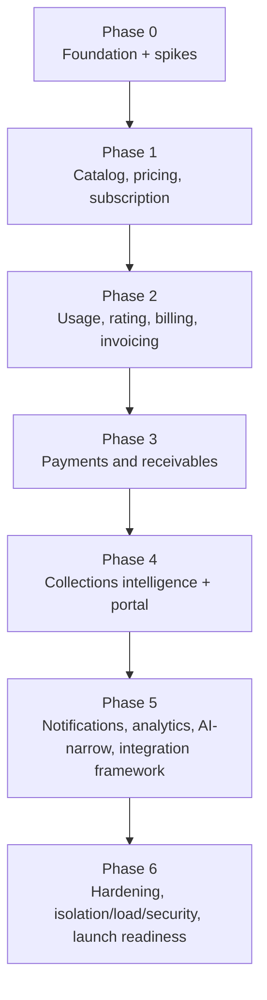
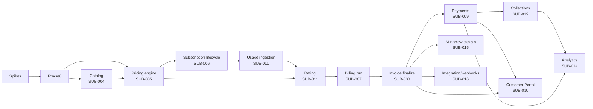

# Technical implementation plan

**Version:** 0.1
**Status:** Proposed sequential delivery plan
**Related:** [MVP backlog](19-mvp-backlog.md), [Epic decomposition](20-epic-feature-story-acceptance-criteria.md), [Logical architecture](05-logical-architecture.md), [Repository structure](22-repository-structure.md)

## 1. Purpose and principles

This plan sequences implementation so the platform can demonstrate the full MVP vertical slice (PRD §11) as early as possible, then hardens breadth and depth around that slice, rather than building every module to completion in isolation before anything connects end-to-end.

1. **Spike before commit.** Every open technology/runtime decision flagged across deliverables 01–18 is resolved by a time-boxed spike with written evidence before the phase that depends on it begins (§2).
2. **Vertical slice before horizontal breadth.** Phase 1–3 deliver one working path from tenant to collected cash before any phase adds parallel pricing models, additional payment methods, or advanced UX polish.
3. **State machines and pricing arithmetic are frozen inputs, not design-as-you-go.** Deliverables 08–12 are implemented as specified; a discovered defect during implementation is fed back as a documented correction to the source deliverable, never silently reinterpreted in code.
4. **No phase ships a financially material capability without its governing test class from deliverable 24.** A phase's exit criteria always include the relevant golden/property/isolation test suite passing, not just "code complete."
5. **Module ownership is assigned per phase**, matching the bounded contexts in deliverable 03 §3 and the repository structure in deliverable 22, so parallel workstreams do not silently violate context boundaries.

## 2. Pre-implementation spikes (block Phase 0 exit)

| Spike | Resolves | Owner | Exit evidence |
|---|---|---|---|
| SPIKE-01 Runtime choice (TypeScript/Node vs. Kotlin) | deliverable 05 §10, ADR-LA pending choice | Architecture + Engineering | Benchmarked decimal-arithmetic correctness, batch-rating throughput, and team-capability assessment against deliverable 12's precision requirements; written ADR |
| SPIKE-02 Decimal/money library selection | deliverable 12 §13 | Engineering | Library survives the full golden dataset (deliverable 12 §23) including JPY/INR/3-decimal-currency cases with zero precision loss |
| SPIKE-03 Primary-key scheme (ULID vs. UUIDv7) | deliverable 07 §1 | Engineering | Benchmark on insert locality/index bloat at representative table sizes |
| SPIKE-04 Usage-table partitioning strategy | deliverable 07 §7, deliverable 05 §11 | Engineering + DBA | Partition layout preserves uniqueness/FK behavior under simulated load |
| SPIKE-05 MVP usage throughput and burst profile | PRD OD-004, deliverable 01 non-goals | Product + Engineering | Written target used to size SPIKE-04 and Phase 3 capacity tests |
| SPIKE-06 Rounding/proration finance sign-off | PRD OD-002/OD-003 | Finance + Architecture | Finance-approved `HALF_UP`/`ACTUAL_DAYS` default confirmed or amended before deliverable 12 is treated as frozen |

No Phase 1 work that depends on a spike's output begins before that spike's exit evidence is recorded.

## 3. Phased delivery plan

### Phase 0 — Foundation (epics `SUB-001`, `SUB-002`, `SUB-017` core)

- **Delivers:** trusted tenant context, idempotency infrastructure, transactional outbox, RLS + mandatory-filter architecture tests, append-only audit write path, tenant provisioning, OIDC/SAML auth, RBAC/maker-checker skeleton.
- **Exit criteria:** a synthetic tenant can be provisioned, an authenticated user can log in, a no-op command demonstrates idempotent replay and produces both an outbox event and an audit record in one transaction; tenant-isolation negative tests for the database layer pass (deliverable 16 §11.1 subset).
- **Owning modules:** Identity & Tenant, Audit & Governance, platform shared packages (deliverable 22 §6).

### Phase 1 — Commercial configuration (epics `SUB-003`, `SUB-004`, `SUB-005`, `SUB-006`)

- **Delivers:** customer/account management, versioned product catalog, the full pricing engine (AST, charge types, proration, discounts, trace, activation, simulation), and the subscription state machine with scheduled changes.
- **Exit criteria:** a pricing manager can author, simulate, and activate a rate card with maker-checker; a subscription can be created and reach `ACTIVE` with a pinned commercial snapshot; the pricing golden dataset (deliverable 12 §23) passes in full.
- **Owning modules:** Customer, Catalog, Pricing, Subscriptions.
- **Critical-path note:** pricing (`SUB-005`) is the highest-risk, highest-blocking-radius phase-1 component (deliverable 19 marks its AST/charge-type items `XL`) — it is staffed first within the phase and other phase-1 work does not block on its full completion, only on its committed interface contract.

### Phase 2 — Usage, rating, billing, invoicing (epics `SUB-011`, `SUB-007`, `SUB-008`)

- **Delivers:** usage ingestion with dedup/quarantine, aggregation, rating runs, billing schedules, billing-run jobs, draft invoice assembly, and the full invoice document/receivable state machine through finalization.
- **Exit criteria:** the sequence `ingest usage → aggregate/rate → billing run → preview → finalize` produces a `POSTED` invoice with a receivable and balanced journal transaction, reproducibly, with the invoice-state-machine acceptance scenarios (deliverable 09 §13) passing.
- **Owning modules:** Metering, Rating, Billing, Receivables.

### Phase 3 — Payments and receivables completion (epic `SUB-009`)

- **Delivers:** canonical payment/attempt state machines, Stripe adapter, tokenized payment methods, webhook verification, allocation engine, refunds.
- **Exit criteria:** the full PRD §11 vertical slice is demonstrable end-to-end for the first time: tenant → customer → active price → subscription → usage → finalized invoice → attempted/failed/retried/succeeded payment → allocated cash → explained bill → verified audit/lineage. All payment-state-machine acceptance scenarios (deliverable 10 §13) pass, including the `UNKNOWN`-state reconciliation case.
- **Owning modules:** Payments, Receivables (allocation completion).
- **Milestone:** this is the first phase boundary at which the platform can be demonstrated to stakeholders as a working, if narrow, product — not merely components.

### Phase 4 — Collections intelligence and Customer Portal (epics `SUB-012`, `SUB-010`)

- **Delivers:** deterministic risk scorecard, Next Best Collection Action, the Payment & Collections Intelligence summary (the MVP differentiator), basic dunning, and the full Customer Portal including no-dark-pattern cancellation and self-service change previews.
- **Exit criteria:** every account exposes upcoming amount/risk/channel/next-action; a subscriber can complete the full self-service journey (view bill → explain → pay → change subscription → cancel) in the Portal with impact previews sourced from live server calculations, not client estimates.
- **Owning modules:** Collections, Communications (notification dependency pulled forward from Phase 5 where needed for dunning).

### Phase 5 — Notifications, analytics, AI-narrow, integration framework (epics `SUB-013`, `SUB-014`, `SUB-015`, `SUB-016`)

- **Delivers:** full notification template/delivery system, basic reporting/Revenue Dashboard, the AI gateway with grounded "Explain my bill" and Customer 360 assistant, connector primitives, outbound signed webhooks with replay.
- **Exit criteria:** Revenue Dashboard KPIs reconcile against the semantic definitions; AI explanations pass the grounding/no-fabrication test cases; a merchant webhook subscriber receives and can replay deliveries.
- **Owning modules:** Communications, Reporting & Graph (partial), AI gateway, Integration framework.

### Phase 6 — Hardening and launch readiness (full `SUB-017`, cross-cutting)

- **Delivers:** complete tenant-isolation test matrix, load/failover/security/reconciliation/accessibility/backup-restore test suites (deliverable 24), operational runbooks, deployment topology validation (deliverable 25), audit export.
- **Exit criteria:** every item in the README's MVP implementation gate is satisfied; deliverable 24's full test suite is green and release-blocking in CI.

## 4. Dependency graph (critical path)

The pricing engine and the invoice finalization transaction are the two structural bottlenecks: nearly every downstream epic depends on one or both. Both are explicitly staffed as `XL`-complexity items early in their respective phases (§3) rather than left to be squeezed in alongside parallel feature work.

## 5. Module ownership model

| Bounded context (deliverable 03 §3) | Phase introduced | Suggested ownership |
|---|---|---|
| Identity & Tenant, Audit & Governance | Phase 0 | Platform team |
| Customer, Catalog | Phase 1 | Commerce team |
| Pricing | Phase 1 | Pricing team (dedicated given `XL` risk) |
| Subscription | Phase 1 | Commerce team |
| Metering, Rating | Phase 2 | Usage/Rating team |
| Billing, Receivables | Phase 2–3 | Billing team |
| Payments | Phase 3 | Payments team |
| Collections | Phase 4 | Collections team |
| Communications | Phase 4–5 | Platform team |
| Reporting & Graph | Phase 5 (basic), ongoing | Analytics team |
| AI gateway | Phase 5 | AI/Platform team |
| Integration framework | Phase 5 | Integrations team |

Team boundaries mirror the repository module boundaries (deliverable 22 §3) so ownership is enforceable in code review and CI, not just in a staffing spreadsheet.

## 6. Risk-driven sequencing rationale

- **Pricing and state machines precede UI** because master prompt §101's own implementation method (requirements → domain model → states → APIs → events → security → UX → database → backend → frontend) is followed literally for the highest-risk modules; building Pricing Designer UI (deliverable 18 §5) against an unstable engine would cause double-rework.
- **Invoice finalization is implemented before any payment work starts** because payments allocate against receivables that only exist once finalization is correct — implementing payments first would require throwaway stub receivables.
- **Collections (the MVP differentiator) is sequenced after, not before, payments** because its risk scoring and Next Best Action depend on real payment-failure/success signals (deliverable 11 §6) — an earlier build would need to fake those signals and risk building the wrong interface.
- **AI-narrow work is deliberately last** because "Explain my bill" and the Customer 360 assistant are additive presentation layers over already-correct calculation traces and RLG facts (deliverable 15 §10) — building them earlier risks masking an underlying data-correctness gap behind AI-generated-sounding prose.

## 7. MVP vertical-slice delivery checkpoint

At the end of Phase 3 (§3), the team runs the exact PRD §11 acceptance scenario against a clean environment as a go/no-go checkpoint before Phase 4 begins:

`create tenant → create customer → activate price → subscribe → ingest usage → preview/finalize invoice → attempt/fail/retry/succeed payment → allocate cash → explain bill → verify audit and lineage`

This checkpoint is a hard gate: Phase 4 staffing does not begin until this scenario passes reproducibly (not once by luck), because Phase 4 and 5 build presentation and intelligence layers on top of exactly this path.

## 8. Acceptance criteria

1. Every spike in §2 has written exit evidence before its dependent phase's Phase-0-adjacent work begins.
2. Each phase's exit criteria (§3) are demonstrable in a clean environment, not only asserted by the owning team.
3. The dependency graph (§4) matches the actual epic/backlog dependency edges recorded in deliverable 19 §4 with no contradiction.
4. The Phase 3 vertical-slice checkpoint (§7) passes before any Phase 4 backlog item (deliverable 19 Wave 5) is started.
5. No phase's exit criteria omit the golden/property/isolation test class deliverable 24 assigns to that phase's financially material capability.
