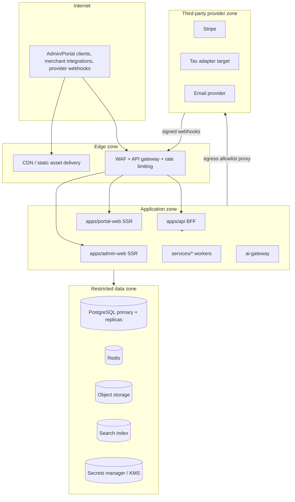

# Deployment architecture

**Version:** 0.1
**Status:** Proposed MVP baseline with enterprise evolution path
**Related:** [System context](04-system-context.md) §6, [Logical architecture](05-logical-architecture.md), [Security architecture](15-security-architecture.md) §7, [Multi-tenancy architecture](16-multi-tenancy-architecture.md) §9, [Testing strategy](24-testing-strategy.md) §9–10, §14

## 1. Purpose and MVP-vs-enterprise framing

This deliverable fixes the deployment topology that realizes the logical architecture (deliverable 05) and the trust zones (deliverable 04 §6) as running infrastructure. It states an MVP baseline sized for the shared-tenancy model (ADR-LA-008, ADR-MT-002) and an explicit evolution path to the enterprise topology (regional deployment, dedicated clusters) without a breaking redesign, consistent with deliverable 16 §9's dedicated-deployment commitment.

## 2. Zones

Extends deliverable 04 §6's trust-zone diagram with concrete deployment placement:

| Zone | Network posture | Contains |
|---|---|---|
| Edge | Public-facing, minimal compute | CDN, WAF, API gateway, TLS termination |
| Application | No direct internet ingress except through Edge; no direct internet egress except through an allowlisted proxy | BFF, Admin/Portal SSR, `services/*` workers, AI gateway |
| Restricted data | No internet ingress or egress at all; reachable only from Application zone | PostgreSQL, Redis, object storage, search index, secrets manager |
| Provider zone (external) | Third-party infrastructure, not platform-operated | Stripe, tax adapter target, email provider — reached only via the egress allowlist proxy (deliverable 15 §8.2) |

## 3. Databases

- **Primary:** one PostgreSQL cluster (ADR-LA-002) for MVP, with synchronous or near-synchronous replication to a standby for failover and asynchronous read replicas for reporting/projector workloads that must not compete with transactional write latency.
- **Partitioning:** usage, audit, and outbox tables are time-partitioned per deliverable 07 §7 and SPIKE-04 (deliverable 21 §2) benchmark evidence; partition maintenance (creation/retirement) is itself an automated, monitored job, not a manual operational task.
- **Connection management:** a connection pooler sits between the Application zone and PostgreSQL, with per-tenant fairness/limits (deliverable 16 §5) preventing one tenant's query pattern from starving others.
- **Redis:** used only for cache, rate limits, and short leases (deliverable 05 §5); it is never a durability requirement for accepted usage, idempotency decisions, or financial state — a Redis outage degrades performance, not correctness.
- **Object storage:** S3-compatible, tenant-prefixed paths (deliverable 16 §3), versioned and immutable for rendered invoices/exports, encrypted at rest.
- **Search:** starts as PostgreSQL full-text/trigram search per deliverable 05 §10 baseline; migrates to a dedicated search service only when relevance/scale evidence justifies it, per the same table's validation-needed column.

## 4. Workers

Each `services/*` directory (deliverable 22 §5) deploys as an independently scalable unit:

| Worker | Scaling driver | Failure mode handling |
|---|---|---|
| `usage-ingress` | Ingestion request rate | Backpressure + durable queue; never drops an acknowledged event (INV-002) |
| `rating-worker` | Aggregation/rating backlog depth | Checkpointed, restartable batch processing (deliverable 05 §9) |
| `billing-worker` | Scheduled billing-run volume | Restartable with control totals (deliverable 21 §3 Phase 2 exit criteria) |
| `payment-worker` | Payment attempt/retry volume | Idempotent attempt creation; `UNKNOWN`-state reconciliation loop |
| `collections-worker` | Case/action volume | Policy revalidation at execution time (deliverable 11 §9), not only at scheduling |
| `notification-worker` | Delivery volume | Retry with backoff; dead-letter visible to operators |
| `outbox-dispatcher` | Outbox backlog depth | At-least-once delivery; consumers dedupe (deliverable 14 §5) |
| `projector` | Search/RLG/analytics rebuild and incremental update load | Rebuildable from source; never authoritative (deliverable 05 §5) |

Workers scale independently of the BFF/Admin/Portal application tier, consistent with ADR-LA-001's "independently scalable workers" half of the modular-monolith decision — this is the concrete infrastructure expression of that ADR, not a contradiction of "monolith."

## 5. Secrets

- All `SECURITY_SECRET`-classified values (deliverable 15 §3) live in a secrets manager/KMS, never in application configuration files, environment-variable dumps committed to source, or the primary database.
- Application services authenticate to the secrets manager via workload identity (deliverable 15 §4), retrieving short-lived credentials rather than long-lived static secrets wherever the secrets manager supports it.
- Provider credentials (`Connector` records, deliverable 07 §5) store only a reference/ID to the secrets manager entry, never the credential value, in the primary database (deliverable 15 §7.3).
- Rotation automation and manual break-glass rotation procedures are defined per deliverable 15 §7.3's table and exercised, not only documented.

## 6. Observability

- OpenTelemetry-instrumented across BFF, workers, and adapters (deliverable 05 §10 baseline), propagating correlation/causation IDs end to end (deliverable 05 §9, deliverable 23 §8.1).
- Metrics, logs, and traces are shipped to a centralized observability platform with tenant-safe access controls (deliverable 15 §9.2) — production log/trace search tooling excludes raw monetary values and payment tokens by default.
- Business-process telemetry (accepted/quarantined usage, rating lag, bill-run progress, invoice finalization rate, payment conversion, outbox lag, notification delivery, ledger reconciliation status) is dashboarded alongside RED/USE technical metrics per deliverable 05 §9, so an operator sees business health, not only infrastructure health.
- Alerting thresholds are defined per the runbooks named in deliverable 05 §9 (provider outage, webhook backlog, stuck billing run, duplicate suspicion, projection rebuild, restore, key rotation) before launch, each with a named on-call owner.

## 7. Backup and disaster recovery

| Target | MVP value | Mechanism |
|---|---|---|
| RPO | ≤ 5 minutes (PRD §9) | Continuous WAL archiving / point-in-time recovery on the primary PostgreSQL cluster |
| RTO | ≤ 60 minutes (PRD §9) | Standby promotion runbook, tested per the restore-drill cadence (deliverable 24 §14) |
| Availability (financial write path) | 99.9% MVP planning target (deliverable 00 R-007 resolution) | Multi-zone deployment of the Application and Data zones; no single point of failure in the request path |
| Backup verification | Quarterly minimum restore drill | Full-cluster and single-tenant logical restore, both verified for isolation preservation (deliverable 16 §4.5, §11.1) |

Enterprise evolution: service-specific availability/RPO/RTO targets (including the master prompt's aspirational 99.99% for critical financial capabilities "where commercially appropriate," deliverable 00 R-007) are approved per-service once business criticality and cost tradeoffs are reviewed — this is an open decision (§10), not silently assumed.

## 8. Deployment strategy

- **MVP:** containerized services deployed via a managed container platform; Kubernetes is adopted only once operational scale justifies its overhead (deliverable 05 §10 "Kubernetes only when operational scale warrants it") — MVP may run on a simpler managed container service if it meets the multi-zone requirement in §7.
- **Progressive delivery:** new versions of the BFF and workers deploy behind health checks and gradual traffic shifting (canary or rolling) with automatic rollback on error-rate/latency regression; financially material workers (`billing-worker`, `payment-worker`) additionally require a manual approval gate before full rollout, given their blast radius.
- **Database migrations deploy separately from and ahead of application code** that depends on the new schema shape, following the expand/migrate/contract sequencing (deliverable 07 §10, deliverable 23 §9) — a deploy never bundles a breaking migration and the code that requires it in one atomic step.
- **Feature flags** gate any new financially material capability (e.g., a new charge type, a new collection policy) so it can be enabled per-tenant and disabled instantly without a redeploy if a defect is found in production.

## 9. Rollback

1. **Application rollback:** the previous container image is redeployed via the same progressive-delivery mechanism; because migrations are expand/contract-sequenced (§8), a prior application version continues to function against the current (expanded, not yet contracted) schema.
2. **Migration rollback:** every migration's reversibility is declared explicitly (deliverable 23 §9.5); a reversible migration has a tested down-migration, an irreversible one is never deployed in the same window as an application rollback that would depend on its absence.
3. **Financial-effect rollback is never a database rollback.** A financial mistake found after deployment is corrected through the domain's own adjustment/reversal/correction mechanisms (deliverables 08–12), never by rolling back the database to a prior point in time while newer legitimate transactions exist — that would violate INV-003/INV-004 (never silently mutate posted invoices/ledger history).
4. **Rollback runbooks are rehearsed**, not only written, as part of the failover test schedule (deliverable 24 §10).

## 10. MVP-to-enterprise evolution path

| Dimension | MVP | Enterprise evolution trigger and target |
|---|---|---|
| Tenancy | Shared cluster, RLS + application isolation (ADR-MT-002) | Dedicated database cluster or full dedicated deployment per tenant (deliverable 16 §9), triggered by contractual/regulatory/scale need |
| Regions | Single region | Additional regional deployments once `data_residency_region` (deliverable 16 §6) is exercised for a real tenant requirement; regional topology decision is an open item (§11 OD-021) |
| Availability | 99.9% financial-write planning target | Per-service 99.99% topology for capabilities where business case justifies the added multi-zone/multi-region cost (deliverable 00 R-007) |
| Search/analytics | PostgreSQL-native | Dedicated search/analytics store (OpenSearch/columnar warehouse) once scale/relevance evidence from deliverable 05 §10 validation is collected |
| Orchestration | Database-backed jobs (ADR-LA-004) | Temporal-style workflow engine once workflow volume/complexity crosses the measured threshold in ADR-LA-004 |
| Container platform | Managed containers | Kubernetes once operational scale warrants the added complexity (deliverable 05 §10) |

No enterprise-evolution row requires a breaking change to the domain model, API contracts, or event schemas — every trigger in this table is a deployment-topology change, which is precisely the design property ADR-LA-008, ADR-MT-002, and ADR-RLG-001 were chosen to preserve.

## 11. Open decisions

| ID | Decision needed | Owner | Needed before |
|---|---|---|---|
| OD-021 | Enterprise regional deployment topology and target countries | Architecture + Product + Legal | First tenant with a hard residency requirement |
| OD-022 | Per-service availability/RPO/RTO targets beyond the MVP 99.9% financial-write baseline | Architecture + Executive | Any SLA commitment above the MVP default |
| OD-023 | Managed container platform vs. self-operated Kubernetes decision point (specific scale threshold) | Engineering + Architecture | Approaching documented operational-scale trigger |
| OD-024 | Financially material worker manual-approval-gate rollout process (who approves, what evidence) | Engineering + Finance | First production `payment-worker`/`billing-worker` deploy |

## 12. Acceptance criteria

1. Every zone in §2 has a concrete deployment placement with no service crossing a zone boundary except through the documented ingress/egress control.
2. RPO/RTO targets in §7 are demonstrated, not only configured, by a passing restore drill (ties to deliverable 24 §14).
3. A migration cannot deploy in the same release as application code that would break against the pre-migration schema shape (expand/contract discipline verified by a release-pipeline check).
4. Every financially material worker's progressive-delivery rollout includes the manual approval gate described in §8 before reaching 100% traffic.
5. A rollback runbook has been rehearsed at least once per §9 before the first production launch handling live payment data.
6. No item in the MVP-to-enterprise evolution table (§10) requires a domain-model, API, or event-schema breaking change — verified by architecture review at the time each evolution trigger is actually exercised.
